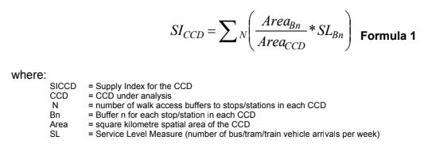

```{r setup, include = FALSE}
library(tufte)
library(tidyverse)
library(dplyr)
library(tidytransit)
library(sp)
library(absmapsdata)
library(ptinpoly)
library(magrittr)
library(ggplot2)
library(sf)
library(ASGS.foyer)
library(raster)
library(ggmap)
library(units)
library(janitor)
library(mapview)
library(ggstatsplot)
library(gtsummary)
library(moments)
library(scales)


knitr::opts_chunk$set(echo = FALSE)
```


# Introduction
There are many metrics used to assess and compare transit service levels. These include those in the  Transit Capacity and Quality of Service Manual (TCQSM) [@TCQSM:2013], which specifies Levels of Service (LOS) on a scale of A to F across a wide range of measures such as service span, frequency, speed, proportion of population serviced and many more. Transit Score instead provides a single rating out of 100, ranging from "Rider's Paradise" for those places scoring above 90, all the way down to places with a score below 25 where it (may) "be possible to get on a bus"[@WalkScore:2023tg]. 

Practitioners and researchers seeking to use such metrics may face two inter-related challenges. Firstly, there is the problem of calculating the metrics themselves for a specific transit system or location. Secondly, there may be the challenge of explaining the metrics and their meaning to others, who may not be transit-specialists and might include politicians, other decision-makers and the general public. The TCQSM and Transit Score metrics may provide contrasting examples of these challenges.   The TCQSM metrics may be time consuming and challenging to calculate, given the amount of population, network and other data that needs to be assembled and included in calculation. Yet, @TCQSM:2013 provides detailed explanations of how each score is calculated and what might need to be done to improve service levels. This set of metrics would appear to be suitable for use amongst practitioners and researchers, and perhaps in some instances for interactions with politicians and the general public.  However, it may be challenging to use TCQSM metrics in a press release or for public advocacy given the level of detail each addresses. 

In contract, the Transit Score metric, provides a single and simple score out of 100, which might be relatively easy to use in public communications or advocacy. It is also already provided on the @WalkScore:2023tg website for locations with a published GTFS feed, eliminating the need for any calculations. However, the Transit Score is calculated by a patented algorithm, and so it may not be easy to understand or explain the connection between real-world conditions and the score, or what might need to be done to improve the score and service levels. Nor does it appear to be possible for Transit Scores to be generated for proposed changes to networks. 

Previous research by @Wong:2013aa overcame some of the limitations of the TCQSM using Python, PostgreSQL and R software and GTFS feeds as input. Outputs included daily average headways, route length and stop numbers, and as the code is opensource this might be adaptable to further GTFS feeds and purposes. These three metrics may  be particularly useful in communication about the amount of transit service to a broader audience, as they appear relatively simple to understand. However, they are route based, and so do not include any consideration of geographic or population coverage. 

@currie2007identifying developed a Supply Index, representing the amount of transit supplied for a Census Collection District (CCD) of interest. This takes into account service coverage through the inclusion of a buffer zone around each stop to account for typical walk access distances to stops. This index appears to have the advantage of being relatively easy to calculate, and easy to explain and understand.  However, as yet this measure has not been calculated directly from GTFS data. 

This paper reports research undertaken to fill this gap by developing R code to calculate the Supply Index of @currie2007identifying directly from GTFS data. The code is developed using data from a single case: the GTFS for Victoria in Australia, which includes Greater Melbourne. Cross-case comparison to Toronto, Canada, and Washington DC, USA, is also undertaken to test the results and gain understanding of how the Supply Index might be useful for practitioners, researchers and advocates. The motivation for this research is to better understand how transit service levels and changes might benchmarked for non-technical audiences. 

# Research context
## General Transit Feed Specification (GTFS)

## Social needs and the Suppy Index

^[]


he SI~CCD~ can then be compared between different CCDs to give an indication of the relative supply of transit, adjusted for accessibility. 

An advantage of the Supply Index is that it is a relatively simple number to calculate, understand and explain. It is based on the number of bus/tram/train arrivals per week at stops within the CCD, which is multiplied by a factor allowing for the amount of the CCD that is within walking distance of each stop ^[This is the Area~Bn~ divided by Area~CCD~ part of the calculation. Thresholds for access of 400m for bus and tram stops, and 800m for railway stations are used in the calculation of the Area~Bn~ variable.]. 

@currie2007identifying calculated the SI for various CCDs in Melbourne using a timetable database provided by the Victorian Public Transport Authority (PTA). This predated the widespread availability of GTFS data, which provides a standardised format for timetable data that is produced by many transit systems. A question, therefore, is how to calculate the SI using GTFS data so that SI~CCD~s can be calculated for current services in Melbourne or other places. 


# Methodology


# Results


# Discussion


# Conclusions


# Author Contribution Statement

The authors confirm contribution to the paper as follows: study conception and
design: A. Anonymous, D. Zoolander; data collection: B. Security; analysis and
interpretation of results: A. Anonymous, B. Security; draft manuscript
preparation: A. Anonymous. All authors reviewed the results and approved
the final version of the manuscript.

# Acknowledgements
This document was prepared using the `rticles` template, created by Gregory Macfarlane, which is based on the \LaTeX originally posted by David Pritchard in 2009 and updated it in 2011, soon after TRB began allowing PDF submissions. Gregory Macfarlane and Ross Wang made adjustments to the template, and Ross Wang now maintains the \LaTeX template at <https://github.com/chiehrosswang/TRB_LaTeX_tex>. Gregory Macfarlane created the `rticles` template in 2021.


# References {#references }

```{r, include=FALSE}
knitr::write_bib(file = 'packages.bib')
```


