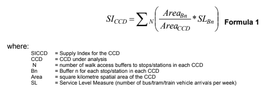

```{r setup, include = FALSE}
library(tufte)
library(tidyverse)
library(dplyr)
library(tidytransit)
library(sp)
library(absmapsdata)
library(ptinpoly)
library(magrittr)
library(ggplot2)
library(sf)
library(ASGS.foyer)
library(raster)
library(ggmap)
library(units)
library(janitor)
library(mapview)
library(ggstatsplot)
library(gtsummary)
library(moments)
library(scales)


knitr::opts_chunk$set(echo = FALSE)
```


# Introduction
Transit service level indicators include those in the Transit Capacity and Quality of Service Manual (TCQSM) [@TCQSM:2013], the Transit Score metric and many more. Practitioners, researchers and advocates seeking to use such metrics may face two inter-related challenges: firstly, there is the problem of calculating the metrics themselves for a specific location; secondly, is the challenge of explaining the metrics, their meaning and importance those who are not specialists in transit, such as politicians, other decision-makers or the general public. 

The TCQSM specifies Levels of Service (LOS) between A and F across a range of factors including service span, frequency, speed, and the proportion of population serviced. Previous research by @Wong:2013aa overcame some challenges of using the TCQSM, by using Python, PostgreSQL and R software and GTFS feeds as input to automate the calculation of daily average headways, route length and stop numbers. This indicators, however, are route based and so do not include any consideration of geographic or population coverage. Further metrics addressing these topics and much detail about their calculation and meaning are included in the TCQSM, such as the Service Coverage Area (pp. 5-8 to 5-21). However, these appear highly detailed, may required bespoke GIS or other analysis, and it might be challenging to explain these measures (beyond the fact at A is good and F is bad) to non-technical decision-makers, stakeholders or others who might be involved. Transit Score provides a similarly easily understood rating scale, scoring locations out of 100 [@WalkScore:2023tg]. However, the algorithm is patented and effectively a black box, meaning that it is not possible to calculate scores independently to understand how the metric might change with cahnges to the transit system or surrounding environment. 

The Supply Index developed by @currie2007identifying may provide a metric that is relatively easy to calculate, open (rather than a black box), and relatively simple for a non-technical audience to understand, engage with and use. This Index is based on calculating the number of transit arrivals at stops within an area of interest, with an adjustment made for the amount of the area of interest that is within a typical walk access distance of each stop.  However, it does not appear to have been widely used, perhaps in part because it still required an analyst to obtain sources of timetable and geographic data. Since the publication of @currie2007identifying such data has become much easier to obtain with more than 10,000 agencies now providing timetable and network data using the General Transit Feed Specification (GTFS) format [@GTFS]. A gap, however, is that there is not yet a method for calculating the @currie2007identifying Supply Index directly from GTFS data. 

This paper reports the development of R code to calculate the Supply Index of @currie2007identifying directly from GTFS data. The code is developed using data from a single case: the GTFS for Victoria in Australia, which includes Greater Melbourne. Cross-case comparison to Toronto, Canada, and Washington DC, USA, is also undertaken to test the results and gain understanding of how the Supply Index might be useful for practitioners, researchers and advocates. The motivation for this research is to better understand how GTFS data might be used to produce benchmarking metrics that can be calculated using open-source code, that can be used to access proposed network changes and which may be relatively easy for non-technical specialists to understand. 

# Research context
Even a brief search shows that there is a very large number of metrics available for benchmarking transit services, for example: the Transit Cooperative Research Program (TCRP) Report 88 provides an extensive guidebook on developing a performance-measurement system [@Ryus:2003aa]; online databases are provided by the Florida Transit Information System (FTIS) [@Florida-Transit-Information-System:2018aa] and the International Association of Public Transport (UITP) [@UITP:2015aa] have online databases, while the Transport Strategy Centre of Imperial College London runs extensive annual benchmarking programmes across over 100 transit provides around the world [@Imperial-College-London:2023aa]. The Fielding Triangle [@FieldingGordonJ1987Mpts] provides a framework for understanding how such metrics combine service inputs, service outputs and service consumption to describe cost efficiency, cost effectiveness or service effectiveness measures. At a larger scale, @Litman:2003ab and @Litman:2016aa discuss some of the traffic, mobility, accessibility, social equity, strategic planning and other rational decision-making frames that might underlie such transit metrics, while @Reynolds:2017ah extends this into models of how institutionalism, incrementalism and other public policy models might apply to decision-making processes. Further examples are provided by @GuzmanLuisA.2017Aeit, who develop a measure of accessibility in the context of policy development and social equity for Latin American Bus Rapid Transit (BRT) based networks,  and the street space allocation metrics based around 10 ethical principles from @Creutzig2020streetspaceallocation. 

However, many of these metrics are difficult to calculate, complex to explain or understand, and likely not well suited to communication with those who are not transit planners or engineers, or otherwise technical specialists. However, where pre-calculated metrics are immediately available it may not be possible for  generate metrics for proposed system changes or know exactly how scores are calculated. The TCQSM and Transit Score may provide contrasting examples:  with respect to the first challenge, TCQSM metrics may require large amounts of network, service, population and other data to be assembled before the  indicators can be calculated; whereas Transit Scores are readily available on the @WalkScore:2023tg website for locations with a published GTFS feed  (eliminating the need for any calculations). With respect to the second challenge,  the meaning of the Transit Score appears easy to explain (the closer to 100, the better), but as the score is calculated by a patented algorithm (effectively a black-box) it may not be easy to understand or explain the connection between real-world conditions and the score, or what might need to be done to improve the score and service levels. Nor does it appear to be possible for Transit Scores to be generated for proposed changes to networks. The TCQSM, in contrast is open-source, in that @TCQSM:2013 provide a manual describing all the metrics and how to calculate them.  However, the calculations themselves appear to be complex, which may be a barrier to use by practitioners, researchers, advocates or others who are not transit scheduling specialists. While @Wong:2013aa 


https://github.com/transitland/transitland-processing-animation


## General Transit Feed Specification (GTFS)

## Social needs and the Suppy Index

^[]


he SI~CCD~ can then be compared between different CCDs to give an indication of the relative supply of transit, adjusted for accessibility. 

An advantage of the Supply Index is that it is a relatively simple number to calculate, understand and explain. It is based on the number of bus/tram/train arrivals per week at stops within the CCD, which is multiplied by a factor allowing for the amount of the CCD that is within walking distance of each stop ^[This is the Area~Bn~ divided by Area~CCD~ part of the calculation. Thresholds for access of 400m for bus and tram stops, and 800m for railway stations are used in the calculation of the Area~Bn~ variable.]. 

@currie2007identifying calculated the SI for various CCDs in Melbourne using a timetable database provided by the Victorian Public Transport Authority (PTA). This predated the widespread availability of GTFS data, which provides a standardised format for timetable data that is produced by many transit systems. A question, therefore, is how to calculate the SI using GTFS data so that SI~CCD~s can be calculated for current services in Melbourne or other places. 


# Methodology


# Results

## R code


## Case studies

### Melbourne
Overall

Wheelchair accessibility?

The metro tunnel - adding services

### Toronto

### Washington DC

### Cross-case comparison


# Discussion


# Conclusions


# Author Contribution Statement

The authors confirm contribution to the paper as follows: study conception and
design: A. Anonymous, D. Zoolander; data collection: B. Security; analysis and
interpretation of results: A. Anonymous, B. Security; draft manuscript
preparation: A. Anonymous. All authors reviewed the results and approved
the final version of the manuscript.

# Acknowledgements
This document was prepared using the `rticles` template, created by Gregory Macfarlane, which is based on the \LaTeX originally posted by David Pritchard in 2009 and updated it in 2011, soon after TRB began allowing PDF submissions. Gregory Macfarlane and Ross Wang made adjustments to the template, and Ross Wang now maintains the \LaTeX template at <https://github.com/chiehrosswang/TRB_LaTeX_tex>. Gregory Macfarlane created the `rticles` template in 2021.


# References {#references }

```{r, include=FALSE}
knitr::write_bib(file = 'packages.bib')
```


