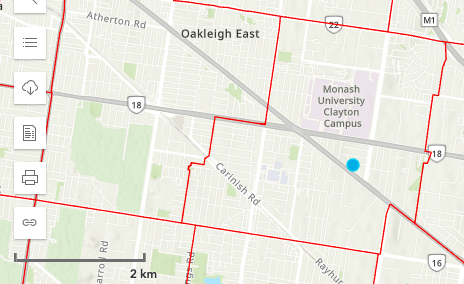
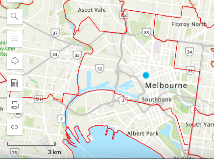
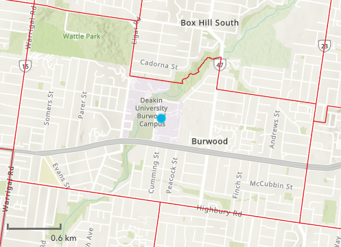

---
title: "Preliminary SA1_2021 SI scores (one day only) for 2018, 2019, 2020, 2021, 2022 and 2023"
runningheader: "Reynolds and Currie" # only for pdf output
author: "James Reynolds and Graham Currie"
date: "`r Sys.Date()`"
output:
  tufte::tufte_html:
    marin_references: false
    citation_package: natbib
    latex_engine: xelatex
bibliography: [packages.bib, References.bib]
link-citations: no
---

```{r setup, include=FALSE}
library(tufte)

library(tidyverse)
library(tidytransit)
library(sp)
library(absmapsdata)
library(ptinpoly)
library(magrittr)
library(ggplot2)
library(sf)
library(ASGS.foyer)
library(raster)
library(ggmap)
library(units)
library(janitor)
library(mapview)
#library(ggstatsplot)
library(gtsummary)
library(moments)
library(scales)
library(gtfstools)
library(lubridate)
library(kableExtra)
library(knitr)
library(readxl)
library(dplyr)

# invalidate cache when the tufte version changes
knitr::opts_chunk$set(cache.extra = packageVersion('tufte'))
```
    
# Introduction

Previous research  [@currie2007identifying] developed a transit Supply Index (SI) based on calculating the number of transit arrivals at stops within an area of interest for an entire week, adjusted to account for the typical walk-access catchment for each stop. This document is part of a project to develop R code to calculate the SI directly from GTFS data. Researchers from Deakin University have requested that PTRG provide SI scores for all of Victoria^[Specifically, Deakin researchers are seeking SI values for all Statistical Area Level 1 (SA1) zones in Victoria, with the SI calculated using a week's worth of timetable data from each of the years 2018 to 2023 (inclusive).].

The status of this project is that SI scores can currently be calculated directly from GTFS data using the developed R code, but the calculation takes approximately one day for every day of input timetable data on a standard personal computer.  PTRG are seeking to improve this performance^[Options being explored include improving the code's efficiency, and seeking ways to run the code on more powerful hardware.]. PTRG has completed a run of the code calculations for a single day of service in the years 2018 through 2023^[It specifically reports on the calculation of SI scores for Statistical Area Level 1 zones from the 2021 census (SA1_2021) for the years 2018, 2019, 2020, 2021, 2022 and 2023. Those results are are included in a branch of the overall project on github at https://github.com/James-Reynolds/Transit_Supply_Index_GTFS/tree/Deakin_1_day_2018_to_2023]. 

This document, however, is part of a branch seeking to calculate the 7-day scores, using the (inefficient) code that has been completed to date. It generates the SI scores for the remaining 6 days in each of the weeks in the years 2018 through 2023 inclusive, such that these results can be combined with the preliminary results.  


This rest of this document is structured as follows: the next section briefly discusses the research context of transit metrics and the SI.  In the third section the methodology for the code development is outlined, including discussion of the cases used to test and verify the code output. In the fourth section results are presented,  starting with verification of the code output through hand-calculation of SI scores for a SA1 area in the Victorian Alps. SI scores across Clayton, Melbourne City and Burwood are also presented, comparing transit service levels through 2018 to 2023. The document then closes with a brief discussion and conclusion. 

# Research context
Even a brief search shows that there is a very large number of metrics available for benchmarking transit services^[For example: the Transit Cooperative Research Program (TCRP) Report 88 provides an extensive guidebook on developing a performance-measurement system: the Transit Capacity and Quality of Service Manual (TCQSM)[@Ryus:2003aa]; online databases are provided by the Florida Transit Information System (FTIS) [@Florida-Transit-Information-System:2018aa] and the International Association of Public Transport (UITP) [@UITP:2015aa]; while the Transport Strategy Centre of Imperial College London runs extensive annual benchmarking programmes across over 100 transit provides around the world [@Imperial-College-London:2023aa].]. However, many of these metrics appear difficult to calculate, complex to explain or understand, and developed around the needs of transit specialists. Where pre-calculated metrics are immediately available it may not be possible for  practitioners, researchers or advocates to independently generate metrics for proposed system changes or to even know exactly how scores for the existing services levels are calculated^[The TCQSM and Transit Score may provide contrasting examples: TCQSM metrics may require large amounts of network, service, population and other data to be assembled before the  indicators can be calculated; whereas Transit Scores are readily available (the @WalkScore:2023tg website shows scores for locations with a published GTFS feed, eliminating the need for any calculations.).The meaning of the Transit Score appears easy to explain (the closer to 100, the better), but as the score is calculated by a patented algorithm it may not be easy to understand or explain the connection between real-world conditions and the score, or what might need to be done to improve the score and service levels. Nor does it appear to be possible for Transit Scores to be generated for proposed changes to networks. The TCQSM, in contrast is open-source, being a manual describing all the metrics and how to calculate them.]. @Wong:2013aa) provides open-source code for calculating some TCQSM metrics^[See https://github.com/jcwong86/GTFS_Explore_Tool. However, this is now 11 years old and the code does not appear to be currently maintained. Future research may involve reviewing this code and using it to analyse modern GTFS feeds.] 


## The Suppy Index

```{marginfigure}
\begin{equation}
\label{eq:supply_index}
  SI_{area, time} = \sum{\frac{Area_{Bn}}{Area_{area}}*SL_{n, time}}
\end{equation}
```

The SI developed by @currie2007identifying  is open-source, comparatively easy to understand, and can be calculated independently. Its equation is shown in the right margin^[$SI_{area, time}$ is the Supply Index score for the area of interest and a given period of time. $Area_{Bn}$ is the buffer area for each stop (n) within the area of interest. In the original formulation this was based on a radius of 400 metres for bus and tram stops, and 800 metres for railway stations. $Area_area$ is the area of the area of interest, and $SL_{n,time}$ is the number of transit arrivals for each stop for a given time period. Minor adjustments have been made to generalise the equation, as the orignial version focused on the context of Melbourne's Census Collection Districts (CCD) and calculations based on a week of transit service.]. The SI describes the number of transit arrivals at stops within an area of interest and time frame, multiplied by a factor accounting for the proportion of the area of interest that is within typical walking distance of each stop. Hence, more services, more stops and higher frequencies would all result in increased SI scores. Additionally, the SI is additive, in that $SI_{area, time}$ scores can be aggregated to calculate an overall score across multiple time periods or for a region encompassing multiple areas of interest^[For example, if the SI for an entire SA2 area is desired this could be obtained by adding the SI scores for all SA1 zones within the SA2 area. Likewise, the SI score for all of Victoria is simply the sum of SI scores for all SA1s within Victoria.]. 

@currie2007identifying calculated the $SI_{area, time}$  for various Census Collection Districts (CCDs)^[CCDs predate the introduction of Statistical Areas 1, 2, 3, and 4 (SA1, SA2, SA3, SA4), and other geographical divisions currently used by the Australian Bureau of Statistics (ABS), which may be more familiar to readers.] in Melbourne using a timetable database provided by the Victorian Public Transport Authority (PTA). This was before the widespread availability of General Transit Feed Specification (GTFS) data.  A question, therefore, is how to calculate the SI using GTFS data so that $SI_{area, time}$ scores can be calculated and compared for any area of interest where transit service information is available in that format. 

# Methodology
This study adopts a case research approach by developing code to calculate SIs for zones within Victoria, Australia.

## Code development
This document has been prepared using Rmarkdown, which allows the intermingling of written text, code segments and code outputs^[The Rmarkdown file is available at https://github.com/James-Reynolds/Transit_Supply_Index_GTFS/blob/Deakin_1_day_2018_to_2023/Reynolds_Currie_2024_transit_supply_index_GTFS.Rmd and this can be read in a plain-text editor to view the code snippets themselves. If you are reading this in an HTML format you are seeing just the descriptive text, and outputs from the code where it has been run to produce maps, charts etc.]. The developed code is included within the Rmarkdown file used to typeset this document^[See the .rmd file].

Various analysis tools are available that make use of GTFS data, including the tidytransit package [@R-tidytransit] for the R statistical programming language [@R-base]. @tidytransit_departure_timetable provides code to calculate a departure timetable from a GTFS feed, and this was adapted to calculate arrivals at a stop and the SL~Bn~ term in the @currie2007identifying SI equation. 


```{r arrival_timetable_as_a_function, echo=FALSE, cache=TRUE}

#This was code was developed for another project (https://github.com/James-Reynolds/DEAKIN-housing-and-transit-accessibility),  based on the tidytransit vignette on producing a departure timetable (@tidytransit_departure_timetable.  There is back history availlble at at that github repository  for further details, but basically I wrote a departure_timetable_function and fixed up a bit where it wasn't accounting for through-running services.  This was then directly adjusted to create an arrival_timetable function (below) --- However, I did not adjust all the variable names in the function to reflect that it is about arrivals, not departures. 
#---also, something broke in the first few lines where it adds the trip_origins to the gtfs$trips data.  Not quite sure what broke, but the first 15 lines of the below function fixes it. 

library(tidytransit)
#gtfs <- read_gtfs("data/1google_transit.zip")
#stop_to_show <- "Wallan Railway Station (Wallan)"
#date_to_show <- "2023-04-27"

arrival_timetable_function <- function(gtfs, stop_to_show, date_to_show){
  # get the id of the first stop in the trip's stop sequence

  first_stop_id <- gtfs$stop_times %>% 
    group_by(trip_id) 

  first_stop_id <- first_stop_id %>%
      filter(stop_sequence == which.min(stop_sequence)) %>%
      summarise(trip_id, stop_id)

  # join with the stops table to get the stop_name
  first_stop_names <- left_join(first_stop_id, gtfs$stops, by="stop_id")

  # rename the first stop_name as trip_origin
  trip_origins <- first_stop_names %>% select(trip_id, trip_origin = stop_name)

  # join the trip origins back onto the trips
  gtfs$trips <- left_join(gtfs$trips, trip_origins, by = "trip_id")
  
  #### get the id of the last stop in the trip's stop sequence
  last_stop_id <- gtfs$stop_times %>% 
    group_by(trip_id) %>% 
    summarise(stop_id = stop_id[which.max(stop_sequence)])

  # join with the stops table to get the stop_name
  last_stop_names <- left_join(last_stop_id, gtfs$stops, by="stop_id")

  # rename the last stop_name as trip_destination
  trip_destinations <- last_stop_names %>% dplyr::select(trip_id, trip_destination = stop_name)

  # join the trip destinations back onto the trips
  gtfs$trips <- left_join(gtfs$trips, trip_destinations, by = "trip_id")

  
  #gtfs$trips %>%
  #  dplyr::select(route_id, trip_origin) %>%
  #  head()

  if(!exists("trip_headsign", where = gtfs$trips)) {
    # get the last id of the trip's stop sequence
    trip_headsigns <- gtfs$stop_times %>% 
      group_by(trip_id) %>% 
      summarise(stop_id = stop_id[which.max(stop_sequence)]) %>% 
      left_join(gtfs$stops, by="stop_id") %>% dplyr::select(trip_id, trip_headsign.computed = stop_name)

  #create a new field with 
  trip_destination <- gtfs$stop_times %>% 
      group_by(trip_id) %>% 
      summarise(stop_id = stop_id[which.max(stop_sequence)]) %>% 
      left_join(gtfs$stops, by="stop_id") %>% dplyr::select(trip_id, trip_headsign.computed = stop_name)

    
    
    # assign the headsign to the gtfs object 
    gtfs$trips <- left_join(gtfs$trips, trip_headsigns, by = "trip_id")
  }

  stop_ids <- gtfs$stops %>% 
    filter(stop_name == stop_to_show) %>% 
    dplyr::select(stop_id)

  departures <- stop_ids %>% 
    inner_join(gtfs$stop_times %>% 
                 dplyr::select(trip_id, arrival_time, 
                        departure_time, stop_id), 
               by = "stop_id")
  
  departures <- departures %>% 
    left_join(gtfs$trips %>% 
                dplyr::select(trip_id, route_id, 
                       service_id, trip_headsign, 
                       trip_origin, 
                       trip_destination), 
              by = "trip_id") 
  
  departures <- departures %>% 
    left_join(gtfs$routes %>% 
                dplyr::select(route_id, 
                       route_short_name), 
              by = "route_id")

  #remove trips where first stop is equal to the stop_to_show, as these stops originate at this stop and so do not depart
  departures <- departures %>% 
      filter(trip_origin != stop_to_show)
  
  
  #departures %>% 
  #  dplyr::select(arrival_time,
  #         departure_time,
  #         trip_headsign,trip_origin,
  #         route_id) %>%
  #  head() %>%
  #  knitr::kable()

  #head(gtfs$.$dates_services)


  services_on_180823 <- gtfs$.$dates_services %>% 
    filter(date == date_to_show) %>% dplyr::select(service_id)

  departures_180823 <- departures %>% 
    inner_join(services_on_180823, by = "service_id")

#  departures_180823 %>%
 #   arrange(departure_time, stop_id, route_short_name) %>% 
  #  dplyr::select(departure_time, stop_id, route_short_name, trip_headsign) %>% 
   # filter(departure_time >= hms::hms(hours = 7)) %>% 
   # filter(departure_time < hms::hms(hours = 7, minutes = 10)) %>% 
  #  knitr::kable()

  route_colors <- gtfs$routes %>% dplyr::select(route_id, route_short_name, route_color)
  route_colors$route_color[which(route_colors$route_color == "")] <- "454545"
  route_colors <- setNames(paste0("#", route_colors$route_color), route_colors$route_short_name)

  #No need for list of outputs anymore, as the graphs are no longer needed
  #output <- list(
   #   ggplot(departures_180823) + theme_bw() +
    #  geom_point(aes(y=trip_origin, x=arrival_time, color = route_short_name), size = 0.2) +
     # scale_x_time(breaks = seq(0, max(as.numeric(departures$departure_time)), 3600), 
      #             labels = scales::time_format("%H:%M")) +
      #theme(axis.text.x = element_text(angle = 90, hjust = 1)) +
      #theme(legend.position = "bottom") +
      #scale_color_manual(values = route_colors) 
  #    labs(title = paste("Departures from", stop_to_show, "on", date_to_show))
  #add a return value to provide the number of services shown in the graph as an output
       #   , nrow(departures_180823)
    #  )
  #return list with graph and the number of services. 
  return(departures_180823)
  
}
#arrivals_southern_cross_230427 <- arrival_timetable_function(gtfs=mel1, stop_to_show="Southern Cross Railway Station (Melbourne City)", date_to_show="2023-04-27")
#head(arrivals_southern_cross_230427)
```

The gtfstools R package [@R-gtfstools] was used to split input GTFS feeds by mode to facilitate the buffer zone calculation.  Buffer zones of 400 metres for bus and Light Rail Transit (LRT) services and 800 metres for heavy rail were adopted, as per @currie2007identifying^[There is an extended mode definition that includes modes beyond the 10 in the GTFS standard [@filter_GTFS_by_mode], but these are not dealt with by the gtfstools package. Further research may seek to extend this such that other modes can be included, but for the purposes of this study the coded buffer zone was set at 400 metres for cable trams, aerial lifts such a gondolas and trolleybuses, and at 800 metres for ferries, funiculars and monorails.].  

```{r read_buffer_zone, echo=FALSE, cache=TRUE}

buffer_zone_definitions <- as_tibble(read.csv ("buffer_zones.csv"))

class(buffer_zone_definitions$code) <- "character"
buffer_zone_definitions$mode <- noquote(buffer_zone_definitions$mode)
buffer_zone_definitions$description_examples <- noquote(buffer_zone_definitions$description_examples)
class(buffer_zone_definitions$mode) <- "character"
class(buffer_zone_definitions$description_examples) <- "character"
#set buffer zone units to metres
buffer_zone_definitions$buffer <- as_units(buffer_zone_definitions$buffer, "m")

```

```{r split_gtfs_function, echo=FALSE, cache=TRUE}

split_gtfs_into_modes_and_put_in_list <- function(gtfs){ 
  gtfs_LRT <- as_tidygtfs(filter_by_route_type(gtfs, route_type = 0))
  gtfs_subway <- as_tidygtfs(filter_by_route_type(gtfs, route_type = 1))
  gtfs_rail <- as_tidygtfs(filter_by_route_type(gtfs, route_type = 2))
  gtfs_bus <- as_tidygtfs(filter_by_route_type(gtfs, route_type = 3))
  gtfs_ferry <- as_tidygtfs(filter_by_route_type(gtfs, route_type = 4))
  gtfs_cable_tram <- as_tidygtfs(filter_by_route_type(gtfs, route_type = 5))
  gtfs_aerial_lift <- as_tidygtfs(filter_by_route_type(gtfs, route_type = 6))
  gtfs_funicular <- as_tidygtfs(filter_by_route_type(gtfs, route_type = 7))
  gtfs_trolleybus <- as_tidygtfs(filter_by_route_type(gtfs, route_type = 11))
  gtfs_monorail <- as_tidygtfs(filter_by_route_type(gtfs, route_type = 12))
 

  gtfs_into_modes_and_put_in_list <- list(
    LRT = gtfs_LRT, 
    subway = gtfs_subway,
    rail = gtfs_rail,
    bus = gtfs_bus,
    ferry = gtfs_ferry, 
    cable_tram = gtfs_cable_tram, 
    aerial_lift = gtfs_aerial_lift, 
    funicular = gtfs_funicular, 
    trolleybus = gtfs_trolleybus,
    monorail = gtfs_monorail 
  )

  return(gtfs_into_modes_and_put_in_list)
}

```

Where transit stops are located close to boundaries their catchment areas may fall into multiple areas of interest. The sp package [@R-sf] provides tools for manipulating geographic data and shape files in R. This was used to calculate the proportion of each stop's catchment area that falls into each geographical area of interest^[GTFS files define stop locations based on latitude and longitude [@GTFS], whereas the Area~Bn~ calculation needs to be provided in the same units as the Area~area~ variable, necessitating the use of a geographic transform as part of the code.].   


The SI~area~ term in the SI equation was calculated on a mode-by-mode and stop-by-stop basis, by first determining the amount of the catchment area (Area~Bn~) that falls into each geographical area of interest for the stop in question. This is then combined with the area for each geographical area of interest (Area~area~) and the number of stop arrivals (SL~Bn~) to calculate the contribution to the SI scores made by just that single stop for every area of interest. These are then added to a cumulative total field for each area of interest, and the calculations are repeated until all stops and modes in the GTFS file have been included. 


```{r SICCD_calc_as_functions, echo=FALSE, warning=FALSE, message=FALSE, cache=TRUE}

###Temporary variables to help with writing the function
#areas_of_interest <- sa1_map_data %>%
#  filter(gcc_name_2021 == "Greater Melbourne") 
#mel3 <- read_gtfs("data/3google_transit.zip")
#mel3_list_by_mode <- split_gtfs_into_modes_and_put_in_list(mel3)
#gtfs_list_by_mode <- mel3_list_by_mode
#start_date = "2023-04-27"
#period_in_days = 2
#EPSG_for_transform = 28355
#areas_of_interest_id_field = "sa1_code_2021"

#### The function ________
SI_calc_function <- function(areas_of_interest = areas_of_interest, areas_of_interest_id_field = areas_of_interest_id_field, gtfs_list_by_mode = gtfs_list_by_mode, start_date = start_date, period_in_days = period_in_days, EPSG_for_transform = EPSG_for_transform){

  ##Initialise variables used in function
  #the top level list. First element is a tibble of areas_of_interest_id_field. The remainder of the list has one element for each day of analysis, with each element containing a tibble with the SI scores for each mode.   
  SI_list_by_date_and_mode <- list((tibble(areas_of_interest %>% select(as.character(areas_of_interest_id_field))) %>% select(!"geometry")))
  names(SI_list_by_date_and_mode) <- as.character(areas_of_interest_id_field)

  # convert to sf format and project
  areas_of_interest_sf <- areas_of_interest %>%
  # convert to simple features
  sf::st_as_sf() %>%
    st_transform(crs = EPSG_for_transform) 
  # add Area_area value to areas_of_interest_sf 
  areas_of_interest_sf <- areas_of_interest_sf %>% 
    dplyr::mutate(Area_area = st_area(areas_of_interest_sf))
  # Add SI column to areas_of_interest_sf
  areas_of_interest_sf <- areas_of_interest_sf %>% 
    dplyr::mutate(SI = 0)
    
#2-level list to put the SI results in, with each element representing one of the days that is being analysed. 
    # This becomes a list (of lists), with one element for each mode for the day_of_analysis in question (j)
    SI_for_day_of_analysis_list_by_mode <- list()
  
  #for loop that drives the first level of the list, recording the day of analysis
  for (j in seq(1, period_in_days, 1)) {
    
    ##Initialise variables used in first level of the list
    day_of_analysis = as.character(ymd(start_date) - days(1) + days(j))
    
    #dataframe to store the SIs for each area of interest by mode for day j
       SI_for_day_of_analysis_by_mode_k <- (tibble(areas_of_interest %>% select(as.character(areas_of_interest_id_field))) %>% select(!"geometry"))
    
    ##for loop that drives the second level of the list, recording SI by mode
      for (k in seq(1, length(names(gtfs_list_by_mode)), 1)){   
        #look up the buffer distance for mode k
        buffer_distance <- buffer_zone_definitions %>% filter(short_name == as.character(names(gtfs_list_by_mode[k]))) %>% select(buffer) %>% as.numeric()
     
        #add zero-ed column to store SIs for mode k
        SI_for_day_of_analysis_by_mode_k <- SI_for_day_of_analysis_by_mode_k %>% tibble::add_column(a = 0)
        #change name of added column to match mode k
names(SI_for_day_of_analysis_by_mode_k) <- c( names(SI_for_day_of_analysis_by_mode_k[,1:ncol(SI_for_day_of_analysis_by_mode_k)-1]), eval(names(gtfs_list_by_mode[k])))                         
        
        #check if the gtfs mode in question has any stops - many of the modes (e.g. Monorail) will typically have zero services or stops.  If the mode in question (k) does not have any stops, then there is no further calculation required, and the existing column of zeros can be left as is. 
        if(nrow(gtfs_list_by_mode[[as.character(names(gtfs_list_by_mode[k]))]][["stops"]]) > 0) { 
         SI_return_value_for_that_mode <- rep(0,nrow(areas_of_interest))
         #which is calculated in the following for loop, which passes over all of the stops in the gtfs file for the mode in question
          for (i in seq(1, nrow(gtfs_list_by_mode[[ as.character(names(gtfs_list_by_mode[k]))]][["stops"]]), 1)) {
      
            #create dataframe with stop i lat and lon value
            dat_sim <- data.frame(lat = gtfs_list_by_mode[[as.character(names(gtfs_list_by_mode[k]))]][["stops"]]$stop_lat[i],
            long = gtfs_list_by_mode[[as.character(names(gtfs_list_by_mode[k]))]][["stops"]]$stop_lon[i])
            # Convert that dataframe (with stop i latitude and longitude) into a sf object, with the crs set to EPSG:4326 (which is the CRS for lat/long values), 
           # and then transform to be expressed as per the EPSG that is being used for the analysis (ie. shift to metres)
            dat_sf <- st_as_sf(dat_sim, coords = c("long", "lat"), crs = 4326) %>% 
            st_transform(crs = EPSG_for_transform)
  
            # make a circle with the buffer distance as the radius around stop i    
            dat_circles <- st_buffer(dat_sf, dist = buffer_distance)
            # Intersect the circle with the polygons
            int_circles <- st_intersection(areas_of_interest_sf, dat_circles)

            ##TEST CODE Map to check that it is working the way it is expect to.
            #map <- int_circles %>%
              #ggplot() +
              #geom_sf(aes(geometry = geometry,  # use the geometry variable
                  #fill = eval(parse(text=areas_of_interest_id_field))),     # fill by SA1_code
                #lwd = 0,                  # remove borders
                #show.legend = TRUE) +    # keep legend
              #theme_void() +                    # clears other plot elements
              #coord_sf()
              
            #map

            #calculate Area Bn 
            int_circles$area_bn <- st_area(int_circles)
            
            #drop_geometry
            int_circles <- as.tibble(int_circles[, !(colnames(int_circles) %in% "geometry")])
  
            ##Retrieve number of arrivals for that mode and day by...
            #first moving the gtfs for that mode out of gtfs_list_by_mode
            gtfs_k <- as_tidygtfs(eval(parse(text = paste("gtfs_list_by_mode$",names(gtfs_list_by_mode)[k],sep = ""))))
            # then add the number of arrivals at stop i to all rows of the int_circles dataframe. 
            int_circles$SL_Bn <- rep(
              nrow(arrival_timetable_function(gtfs = gtfs_k, stop_to_show = gtfs_list_by_mode[[
                as.character(names(gtfs_list_by_mode[k]))]]$stops$stop_name[i], date_to_show = day_of_analysis)), 
              nrow(int_circles))
    
            #Calculate SI for stop i and drop units
            int_circles$add_to_SI <- as.numeric(int_circles$area_bn / int_circles$Area_area * int_circles$SL_Bn)
  
            
            #Create ordinary tibble with Area of Interest identification code and SIs from stop i to add to the running totals
            export_to_SI_for_day_of_analysis_by_mode_k <- int_circles %>% select(c(as.character(areas_of_interest_id_field), add_to_SI)) 
            
            #drop add_SI column from dataframe reporting SI_by_mode scores up to the date loop (SI_for_day_of_analysis_by_mode_k)
            SI_for_day_of_analysis_by_mode_k <- SI_for_day_of_analysis_by_mode_k[, !(colnames(SI_for_day_of_analysis_by_mode_k) %in% "add_to_SI")]
  
            #merge based on eval(parse(text=areas_of_interest_id_field))
            SI_for_day_of_analysis_by_mode_k <- left_join(SI_for_day_of_analysis_by_mode_k, export_to_SI_for_day_of_analysis_by_mode_k)
  
            #convert add_to_SI to non-unit numbers
            SI_for_day_of_analysis_by_mode_k$add_to_SI <- as.vector(SI_for_day_of_analysis_by_mode_k$add_to_SI)
  
            #replace NA with 0 
            SI_for_day_of_analysis_by_mode_k[is.na(SI_for_day_of_analysis_by_mode_k)] = 0
  
            #add the SIs for stop i to the running total of SI for the mode in question
            SI_for_day_of_analysis_by_mode_k[,eval(names(gtfs_list_by_mode[k]))] <- SI_for_day_of_analysis_by_mode_k[,eval(names(gtfs_list_by_mode[k]))] + SI_for_day_of_analysis_by_mode_k$add_to_SI
          
            print(c("stop", i, "mode", k, "day", j))
            #close (i) loop for calculating SIs for stop i and adding to the running total of SI
            }
        
        #close the if(no stops in gtfs for that mode) test 
        }
       
       #close for (k) loop for calculating SI for a single mode on a single day
      }  
       
      #drop area of interest id code from dataframe of SI by mode for the day of analysis
      SI_for_day_of_analysis_by_mode_k <- SI_for_day_of_analysis_by_mode_k[,2:ncol(SI_for_day_of_analysis_by_mode_k)]
      
      #drop add_to_SI column from dataframe of SI by mode for the day of analysis
      SI_for_day_of_analysis_by_mode_k <- SI_for_day_of_analysis_by_mode_k[,!names(SI_for_day_of_analysis_by_mode_k) %in% "add_to_SI"]
       
            #add new element to the list_by_date for the date_of_analysis
      SI_list_by_date_and_mode <- append(SI_list_by_date_and_mode, list(SI_for_day_of_analysis_by_mode_k), after = length(SI_list_by_date_and_mode))
    
      #update name of new element to match date
      names(SI_list_by_date_and_mode) <- c(names(SI_list_by_date_and_mode)[1:length(names(SI_list_by_date_and_mode))-1], as.character(day_of_analysis))

    #close for (j) loop for creating the list of days
    }        

 return(SI_list_by_date_and_mode)    

#close function     
}
  


#function to combine all days together. Outputs a dataframe with a row for each area_of_interest and a column for each mode
convert_SI_list_by_date_and_mode_to_SI_df_by_mode.function <- function(SI_list_by_date_and_mode = SI_list_by_date_and_mode) {
  SI_df_by_mode <- SI_list_by_date_and_mode[2:length(names(SI_list_by_date_and_mode))] %>%
  map_dfr(~setNames(.x, paste0("A", 1:ncol(.x))), .id = "Group") %>%
  group_by(Group) %>%
  mutate(ID = 1:n()) %>%
  group_by(ID) %>%
  summarize(across(-Group, .fns = sum, na.rm = TRUE)) %>%
  select(-ID)

  #update column names to match modes
  names(SI_df_by_mode) <- colnames(SI_list_by_date_and_mode[[2]])
  
  #add back area_of_interest_id_ column
  SI_df_by_mode <- cbind(SI_list_by_date_and_mode[1], SI_df_by_mode)
  
  return(SI_df_by_mode)
}


```


## Case research approach

Results were generated for a single case: Victoria, Australia, as per the request of researchers from Deakin University. Results were processed using the ggmaps [@R-ggmap], ggplot [@R-ggplot2], ggstatsplot [@R-ggstatsplot] and kable [@R-kableExtra; @R-knitr] packages, with data processing leveraging the tidyverse approach [@R-tidyverse].

Victoria is the southern-most state on the Australian mainland. The state capital is in Melbourne, which has a similar metropolitan area to of Paris or London^[Greater Melbourne is the term used to describe the larger metropolitan area, encompassing 30 LGAs. The City of Melbourne LGA covers only a small portion of the inner city.]. However, with only around 5 million people Melbourne has about one-third the population density of Paris and London. Melbourne has an inner Central Business District (CBD) with apartments, commercial skyscrapers and extensive sporting facilities nearby; surrounded by low-density, predominately single-family-housing-dominated, inner, middle and outer suburbs. 

The Australian Bureau of Statistics (ABS) provides a range of shape files and other resources. This study made use of the absmapsdata R package [@R-absmapsdata] to access the 2021 SA1 boundaries for Victoria.  The EPSG:28355 transform [@EPSG_28355] was used to shift longitude and latitude into metres, as per the Geocentric Datum of Australia 1994 (GDA95 / MGA zone 55) coordinates. 

```{r load_abs_data, messages = FALSE, warnings = FALSE, echo=FALSE, fig.fullwidth=TRUE, fig.cap="Melbourne SA1 map", cache=TRUE}
#Load SA1 data
sa1_map_data <- sa12021


```


There are train and tram networks radiating from the CBD, but for most of the suburban areas the reality is that transit is provided by circuitious bus routes that are mostly used by those who cannot otherwise drive. An extensive freeway (and tollway) network provides connections across the Greater Melbourne area, further around Port Phillip Bay to Geelong (south-west) and the Mornington Penninsula (south-east) as well as to regional centres elsewhere in Victoria. There is a state-wide regional train and bus network (VLine), which also provides connections into South Australia, New South Wales and the Australian Capital Territory (Canberra) and local bus services in many regional towns and cities. However, accessibility to most of the city and state tends to be car-dominated. The Overland train service to Adelaide and the XPT to Sydney are provided seperately to VLine services.  Victoria's GTFS feed is published by Public Transport Victoria (PTV)^[There are over 400 historical releases of the  available on the transitfeeds.com website, with the first dating from March 2015 [@transitfeeds_victoria:2023aa].]. 

The Australian census is undertaken in early August every 5 years. GTFS feeds were therefore selected for the first week of August of each year. Code output was produced for the day of the census itself in 2021^[Tuesday, 10th August. GTFS feed dated August 5]. The second Tuesday in August was selected as the input timetable for generating results for 2018^[Feed 13/8, run for 14/8], 2019^[Feed 12/8, run for 13/8], 2020^[Feed 7/8, run for 11/8], 2022^[Feed 4/8, run for 9/8] and 2023^[Feed 4/8, run for 8/8]. Minor corrections were made to the GTFS files to remove duplicate stop_ids^[These involved minor discrepancies in either the stop name, latitude or longitude.]. 


```{r Victoria_2018, echo=FALSE, warning=FALSE, message=FALSE, cache=TRUE}

victoria_2018 <- read_gtfs("data/Melbourne/2018/180813/gtfs.zip")

##deal with issue to do with missing route_color information
victoria_2018$routes$route_color <- "Blue"


##identify duplicate stops
victoria_2018_duplicated_stops <- tabyl(victoria_2018$stops$stop_id) %>% filter (n>1)
names(victoria_2018_duplicated_stops) <- c("stop_id", "n", "percent")
victoria_2018_duplicated_stops <- left_join(victoria_2018_duplicated_stops, victoria_2018$stops)

##discard duplicates
victoria_2018$stops <- victoria_2018$stops[!duplicated(victoria_2018$stops$stop_id),]

##split modes
victoria_2018_list_by_mode <- split_gtfs_into_modes_and_put_in_list(victoria_2018)

##set inputs to SI_calc function
victoria_areas_of_interest <- sa1_map_data %>% filter(state_name_2021 == "Victoria")
start_date = "2018-08-15"
period_in_days = 6
EPSG_for_transform = 28355
areas_of_interest_id_field = "sa1_code_2021"


##run SI_calc function
victoria_2018_SI_list_by_date_and_mode <- SI_calc_function(areas_of_interest =  victoria_areas_of_interest, areas_of_interest_id_field = areas_of_interest_id_field, gtfs_list_by_mode = victoria_2018_list_by_mode, start_date = start_date, period_in_days = period_in_days, EPSG_for_transform = EPSG_for_transform)


##write to csv
write_csv(victoria_2018_SI_list_by_date_and_mode$`2018-08-15`, "results/victoria_2018_SI_list_by_date_and_mode_SA12021_180815.csv")
write_csv(victoria_2018_SI_list_by_date_and_mode$`2018-08-16`, "results/victoria_2018_SI_list_by_date_and_mode_SA12021_180816.csv")
write_csv(victoria_2018_SI_list_by_date_and_mode$`2018-08-17`, "results/victoria_2018_SI_list_by_date_and_mode_SA12021_180817.csv")
write_csv(victoria_2018_SI_list_by_date_and_mode$`2018-08-18`, "results/victoria_2018_SI_list_by_date_and_mode_SA12021_180818.csv")
write_csv(victoria_2018_SI_list_by_date_and_mode$`2018-08-19`, "results/victoria_2018_SI_list_by_date_and_mode_SA12021_180819.csv")
write_csv(victoria_2018_SI_list_by_date_and_mode$`2018-08-20`, "results/victoria_2018_SI_list_by_date_and_mode_SA12021_180820.csv")


#run aggregation function to create df by mode for all 7 days
#victoria_2018_SI_df_by_mode <-  convert_SI_list_by_date_and_mode_to_SI_df_by_mode.function(victoria_2018_SI_list_by_date_and_mode)


##write to csv
#write_csv(victoria_2018_SI_df_by_mode, "results/Victoria_2018_SI_df_by_mode_SA12021_180815_to_20.csv")


#load pre-calculated df by mode (for just one day)
#victoria_2018_SI_df_by_mode <- read.csv("results/Victoria_2018_SI_df_by_mode_SA12021_180814.csv")
#victoria_2018_SI_df_by_mode$sa1_code_2021 <- as.character(victoria_2018_SI_df_by_mode$sa1_code_2021)


#Join SI to SA1 map data
#victoria_2018_SI_df_by_mode_sf <- left_join(victoria_2018_SI_df_by_mode, sa1_map_data)

```


```{r Victoria_2019, echo=FALSE, warning=FALSE, message=FALSE, cache=TRUE}
victoria_2019 <- read_gtfs("data/Melbourne/2019/190812/gtfs.zip")

#deal with issue to do with missing route_color information
victoria_2019$routes$route_color <- "Blue"

#identify duplicate stops
victoria_2019_duplicated_stops <- tabyl(victoria_2019$stops$stop_id) %>% filter (n>1)
names(victoria_2019_duplicated_stops) <- c("stop_id", "n", "percent")
victoria_2019_duplicated_stops <- left_join(victoria_2019_duplicated_stops, victoria_2019$stops)

#discard duplicates
victoria_2019$stops <- victoria_2019$stops[!duplicated(victoria_2019$stops$stop_id),]

#split modes
victoria_2019_list_by_mode <- split_gtfs_into_modes_and_put_in_list(victoria_2019)


#set inputs to SI_calc function
victoria_areas_of_interest <- sa1_map_data %>% filter(state_name_2021 == "Victoria")
start_date = "2019-08-14"
period_in_days = 6
EPSG_for_transform = 28355
areas_of_interest_id_field = "sa1_code_2021"

##run SI_calc function
victoria_2019_SI_list_by_date_and_mode <- SI_calc_function(areas_of_interest =  victoria_areas_of_interest, areas_of_interest_id_field = areas_of_interest_id_field, gtfs_list_by_mode = victoria_2019_list_by_mode, start_date = start_date, period_in_days = period_in_days, EPSG_for_transform = EPSG_for_transform)

##write to csv
write_csv(victoria_2019_SI_list_by_date_and_mode$`2019-08-14`, "results/victoria_2019_SI_list_by_date_and_mode_SA12021_190814.csv")
write_csv(victoria_2019_SI_list_by_date_and_mode$`2019-08-15`, "results/victoria_2019_SI_list_by_date_and_mode_SA12021_190815.csv")
write_csv(victoria_2019_SI_list_by_date_and_mode$`2019-08-16`, "results/victoria_2019_SI_list_by_date_and_mode_SA12021_190816.csv")
write_csv(victoria_2019_SI_list_by_date_and_mode$`2019-08-17`, "results/victoria_2019_SI_list_by_date_and_mode_SA12021_190817.csv")
write_csv(victoria_2019_SI_list_by_date_and_mode$`2019-08-18`, "results/victoria_2019_SI_list_by_date_and_mode_SA12021_190818.csv")
write_csv(victoria_2019_SI_list_by_date_and_mode$`2019-08-19`, "results/victoria_2019_SI_list_by_date_and_mode_SA12021_190819.csv")

##run aggregation function to create df by mode for all 7 days
#victoria_2019_SI_df_by_mode <-  convert_SI_list_by_date_and_mode_to_SI_df_by_mode.function(victoria_2019_SI_list_by_date_and_mode)

##write to csv
#write_csv2(victoria_2019_SI_df_by_mode, "results/Victoria_2019_SI_df_by_mode_SA12021_190814_to_21.csv")

##load pre-calculated df by mode (for just one day)
#victoria_2019_SI_df_by_mode <- read.csv("results/Victoria_2019_SI_df_by_mode_SA12021_190813.csv")
#victoria_2019_SI_df_by_mode$sa1_code_2021 <- as.character(victoria_2019_SI_df_by_mode$sa1_code_2021)


##Join SI to SA1 map data
#victoria_2019_SI_df_by_mode_sf <- left_join(victoria_2019_SI_df_by_mode, sa1_map_data)

```

```{r victoria_2020, echo=FALSE, warning=FALSE, message=FALSE, cache=TRUE}
victoria_2020 <- read_gtfs("data/Melbourne/2020/200807/gtfs.zip")

#deal with issue to do with missing route_color information
victoria_2020$routes$route_color <- "Blue"


##identify duplicate stops
victoria_2020_duplicated_stops <- tabyl(victoria_2020$stops$stop_id) %>% filter (n>1)
names(victoria_2020_duplicated_stops) <- c("stop_id", "n", "percent")
victoria_2020_duplicated_stops <- left_join(victoria_2020_duplicated_stops, victoria_2020$stops)

##discard duplicates
victoria_2020$stops <- victoria_2020$stops[!duplicated(victoria_2020$stops$stop_id),]

##split modes
victoria_2020_list_by_mode <- split_gtfs_into_modes_and_put_in_list(victoria_2020)


##set inputs to SI_calc function
victoria_areas_of_interest <- sa1_map_data %>% filter(state_name_2021 == "Victoria")
start_date = "2020-08-12"
period_in_days = 6
EPSG_for_transform = 28355
areas_of_interest_id_field = "sa1_code_2021"

#run SI_calc function
victoria_2020_SI_list_by_date_and_mode <- SI_calc_function(areas_of_interest =  victoria_areas_of_interest, areas_of_interest_id_field = areas_of_interest_id_field, gtfs_list_by_mode = victoria_2020_list_by_mode, start_date = start_date, period_in_days = period_in_days, EPSG_for_transform = EPSG_for_transform)


#write to csv
write_csv(victoria_2020_SI_list_by_date_and_mode$`2000-08-12`, "results/victoria_2020_SI_list_by_date_and_mode_SA12021_200812.csv")
write_csv(victoria_2020_SI_list_by_date_and_mode$`2000-08-13`, "results/victoria_2020_SI_list_by_date_and_mode_SA12021_200813.csv")
write_csv(victoria_2020_SI_list_by_date_and_mode$`2000-08-14`, "results/victoria_2020_SI_list_by_date_and_mode_SA12021_200814.csv")
write_csv(victoria_2020_SI_list_by_date_and_mode$`2000-08-15`, "results/victoria_2020_SI_list_by_date_and_mode_SA12021_200815.csv")
write_csv(victoria_2020_SI_list_by_date_and_mode$`2000-08-16`, "results/victoria_2020_SI_list_by_date_and_mode_SA12021_200816.csv")
write_csv(victoria_2020_SI_list_by_date_and_mode$`2000-08-17`, "results/victoria_2020_SI_list_by_date_and_mode_SA12021_200817.csv")

#run aggregation function to create df by mode for all 7 days
#victoria_2020_SI_df_by_mode <-  convert_SI_list_by_date_and_mode_to_SI_df_by_mode.function(victoria_2020_SI_list_by_date_and_mode)


#write to csv
#write_csv2(victoria_2020_SI_df_by_mode, "results/Victoria_2020_SI_df_by_mode_SA12021_200812_to_17.csv")

#load pre-calculated df by mode (for just one day)
#victoria_2020_SI_df_by_mode <- read.csv("results/Victoria_2020_SI_df_by_mode_SA12021_200811.csv")
#victoria_2020_SI_df_by_mode$sa1_code_2021 <- as.character(victoria_2020_SI_df_by_mode$sa1_code_2021)

##Join SI to SA1 map data
#victoria_2020_SI_df_by_mode_sf <- left_join(victoria_2020_SI_df_by_mode, sa1_map_data)

```


```{r victoria_2021, echo=FALSE, warning=FALSE, message=FALSE, cache=TRUE}
victoria_2021 <- read_gtfs("data/Melbourne/2021/210810/gtfs.zip")

#deal with issue to do with missing route_color information
#victoria_2021$routes$route_color <- "Blue"

#identify duplicate stops
victoria_2021_duplicated_stops <- tabyl(victoria_2021$stops$stop_id) %>% filter (n>1)
names(victoria_2021_duplicated_stops) <- c("stop_id", "n", "percent")
victoria_2021_duplicated_stops <- left_join(victoria_2021_duplicated_stops, victoria_2021$stops)

#discard duplicates
victoria_2021$stops <- victoria_2021$stops[!duplicated(victoria_2021$stops$stop_id),]

#split modes
victoria_2021_list_by_mode <- split_gtfs_into_modes_and_put_in_list(victoria_2021)

#set inputs to SI_calc function
victoria_areas_of_interest <- sa1_map_data %>% filter(state_name_2021 == "Victoria")
start_date = "2021-08-11"
period_in_days = 6
EPSG_for_transform = 28355
areas_of_interest_id_field = "sa1_code_2021"

#run SI_calc function
victoria_2021_SI_list_by_date_and_mode <- SI_calc_function(areas_of_interest =  victoria_areas_of_interest, areas_of_interest_id_field = areas_of_interest_id_field, gtfs_list_by_mode = victoria_2021_list_by_mode, start_date = start_date, period_in_days = period_in_days, EPSG_for_transform = EPSG_for_transform)


#write to csv
write_csv(victoria_2021_SI_list_by_date_and_mode$`2021-08-11`, "results/victoria_2021_SI_list_by_date_and_mode_SA12021_210811.csv")
write_csv(victoria_2021_SI_list_by_date_and_mode$`2021-08-12`, "results/victoria_2021_SI_list_by_date_and_mode_SA12021_210812.csv")
write_csv(victoria_2021_SI_list_by_date_and_mode$`2021-08-13`, "results/victoria_2021_SI_list_by_date_and_mode_SA12021_210813.csv")
write_csv(victoria_2021_SI_list_by_date_and_mode$`2021-08-14`, "results/victoria_2021_SI_list_by_date_and_mode_SA12021_210814.csv")
write_csv(victoria_2021_SI_list_by_date_and_mode$`2021-08-15`, "results/victoria_2021_SI_list_by_date_and_mode_SA12021_210815.csv")
write_csv(victoria_2021_SI_list_by_date_and_mode$`2021-08-16`, "results/victoria_2021_SI_list_by_date_and_mode_SA12021_210816.csv")

#run aggregation function to create df by mode for all 7 days
#victoria_2021_SI_df_by_mode <-  convert_SI_list_by_date_and_mode_to_SI_df_by_mode.function(victoria_2021_SI_list_by_date_and_mode)


#write to csv
#write_csv2(victoria_2021_SI_df_by_mode, "results/Victoria_2021_SI_df_by_mode_SA12021_210811_to_16.csv")

#load pre-calculated df by mode (for just one day)
#victoria_2021_SI_df_by_mode <- read.csv("results/Victoria_2021_SI_df_by_mode_SA12021_210810.csv")
#victoria_2021_SI_df_by_mode$sa1_code_2021 <- as.character(victoria_2021_SI_df_by_mode$sa1_code_2021)


##Join SI to SA1 map data
#victoria_2021_SI_df_by_mode_sf <- left_join(victoria_2021_SI_df_by_mode, sa1_map_data)

```


```{r victoria_2022, echo=FALSE, warning=FALSE, message=FALSE, cache=TRUE}
victoria_2022 <- read_gtfs("data/Melbourne/2022/220804/gtfs.zip")


#deal with issue to do with missing route_color information
victoria_2022$routes$route_color <- "Blue"

#identify duplicate stops
victoria_2022_duplicated_stops <- tabyl(victoria_2022$stops$stop_id) %>% filter (n>1)
names(victoria_2022_duplicated_stops) <- c("stop_id", "n", "percent")
victoria_2022_duplicated_stops <- left_join(victoria_2022_duplicated_stops, victoria_2022$stops)

##discard duplicates
victoria_2022$stops <- victoria_2022$stops[!duplicated(victoria_2022$stops$stop_id),]

##split modes
victoria_2022_list_by_mode <- split_gtfs_into_modes_and_put_in_list(victoria_2022)

###set inputs to SI_calc function
victoria_areas_of_interest <- sa1_map_data %>% filter(state_name_2021 == "Victoria")
start_date = "2022-08-010"
period_in_days = 6
EPSG_for_transform = 28355
areas_of_interest_id_field = "sa1_code_2021"

#run SI_calc function
victoria_2022_SI_list_by_date_and_mode <- SI_calc_function(areas_of_interest =  victoria_areas_of_interest, areas_of_interest_id_field = areas_of_interest_id_field, gtfs_list_by_mode = victoria_2022_list_by_mode, start_date = start_date, period_in_days = period_in_days, EPSG_for_transform = EPSG_for_transform)

#write to csv
write_csv(victoria_2022_SI_list_by_date_and_mode$`2022-08-10`, "results/victoria_2022_SI_list_by_date_and_mode_SA12021_220810.csv")
write_csv(victoria_2022_SI_list_by_date_and_mode$`2022-08-11`, "results/victoria_2022_SI_list_by_date_and_mode_SA12021_220811.csv")
write_csv(victoria_2022_SI_list_by_date_and_mode$`2022-08-12`, "results/victoria_2022_SI_list_by_date_and_mode_SA12021_220812.csv")
write_csv(victoria_2022_SI_list_by_date_and_mode$`2022-08-13`, "results/victoria_2022_SI_list_by_date_and_mode_SA12021_220813.csv")
write_csv(victoria_2022_SI_list_by_date_and_mode$`2022-08-14`, "results/victoria_2022_SI_list_by_date_and_mode_SA12021_220814.csv")
write_csv(victoria_2022_SI_list_by_date_and_mode$`2022-08-15`, "results/victoria_2022_SI_list_by_date_and_mode_SA12021_220815.csv")

#run aggregation function to create df by mode for all 7 days
#victoria_2022_SI_df_by_mode <-  convert_SI_list_by_date_and_mode_to_SI_df_by_mode.function(victoria_2022_SI_list_by_date_and_mode)


#write to csv
#write_csv2(victoria_2022_SI_df_by_mode, "results/Victoria_2022_SI_df_by_mode_SA12021_220810_to_15.csv")


#load pre-calculated df by mode (for just one day)
#victoria_2022_SI_df_by_mode <- read.csv("results/Victoria_2022_SI_df_by_mode_SA12021_220814.csv")
#victoria_2022_SI_df_by_mode$sa1_code_2021 <- as.character(victoria_2022_SI_df_by_mode$sa1_code_2021)


#Join SI to SA1 map data
#victoria_2022_SI_df_by_mode_sf <- left_join(victoria_2022_SI_df_by_mode, sa1_map_data)

```


```{r victoria_2023, echo=FALSE, warning=FALSE, message=FALSE, cache=TRUE}
victoria_2023 <- read_gtfs("data/Melbourne/2023/230804/gtfs.zip")

#deal with issue to do with missing route_color information
#victoria_2023$routes$route_color <- "Blue"

##identify duplicate stops
victoria_2023_duplicated_stops <- tabyl(victoria_2023$stops$stop_id) %>% filter (n>1)
names(victoria_2023_duplicated_stops) <- c("stop_id", "n", "percent")
victoria_2023_duplicated_stops <- left_join(victoria_2023_duplicated_stops, victoria_2023$stops)

#discard duplicates
victoria_2023$stops <- victoria_2023$stops[!duplicated(victoria_2023$stops$stop_id),]

#split modes
victoria_2023_list_by_mode <- split_gtfs_into_modes_and_put_in_list(victoria_2023)

#set inputs to SI_calc function
victoria_areas_of_interest <- sa1_map_data %>% filter(state_name_2021 == "Victoria")
start_date = "2023-08-09"
period_in_days = 6
EPSG_for_transform = 28355
areas_of_interest_id_field = "sa1_code_2021"

#run SI_calc function
victoria_2023_SI_list_by_date_and_mode <- SI_calc_function(areas_of_interest =  victoria_areas_of_interest, areas_of_interest_id_field = areas_of_interest_id_field, gtfs_list_by_mode = victoria_2023_list_by_mode, start_date = start_date, period_in_days = period_in_days, EPSG_for_transform = EPSG_for_transform)

#write to csv
write_csv(victoria_2023_SI_list_by_date_and_mode$`2023-08-09`, "results/victoria_2023_SI_list_by_date_and_mode_SA12021_230809.csv")
write_csv(victoria_2023_SI_list_by_date_and_mode$`2023-08-10`, "results/victoria_2023_SI_list_by_date_and_mode_SA12021_230810.csv")
write_csv(victoria_2023_SI_list_by_date_and_mode$`2023-08-11`, "results/victoria_2023_SI_list_by_date_and_mode_SA12021_230811.csv")
write_csv(victoria_2023_SI_list_by_date_and_mode$`2023-08-12`, "results/victoria_2023_SI_list_by_date_and_mode_SA12021_230812.csv")
write_csv(victoria_2023_SI_list_by_date_and_mode$`2023-08-13`, "results/victoria_2023_SI_list_by_date_and_mode_SA12021_230813.csv")
write_csv(victoria_2023_SI_list_by_date_and_mode$`2023-08-14`, "results/victoria_2023_SI_list_by_date_and_mode_SA12021_230814.csv")

#run aggregation function to create df by mode for all 7 days
#victoria_2023_SI_df_by_mode <-  convert_SI_list_by_date_and_mode_to_SI_df_by_mode.function(victoria_2023_SI_list_by_date_and_mode)


#write to csv
#write_csv2(victoria_2023_SI_df_by_mode, "results/Victoria_2023_SI_df_by_mode_SA12021_230809_to_14.csv")


#load pre-calculated df by mode (for just one day)
#victoria_2023_SI_df_by_mode <- read.csv("results/Victoria_2023_SI_df_by_mode_SA12021_230808.csv")
#victoria_2023_SI_df_by_mode$sa1_code_2021 <- as.character(victoria_2023_SI_df_by_mode$sa1_code_2021)


##Join SI to SA1 map data
#victoria_2023_SI_df_by_mode_sf <- left_join(victoria_2023_SI_df_by_mode, sa1_map_data)

```

<!----

```{r load_vic_pre_calc, echo=FALSE, warning=FALSE, message=FALSE, cache=TRUE}

#load pre-calculated df by mode 
victoria_2018_SI_df_by_mode <- read.csv2("results/Victoria_2018_SI_df_by_mode_SA12021_180814.csv")
victoria_2018_SI_df_by_mode$sa1_code_2021 <- as.character(victoria_2018_SI_df_by_mode$sa1_code_2021)
#add total column
victoria_2018_SI_df_by_mode <- victoria_2018_SI_df_by_mode %>% adorn_totals(where = "col")
#Join SI to SA1 map data
victoria_2018_SI_df_by_mode_sf <- left_join(victoria_2018_SI_df_by_mode, sa12021)


#load pre-calculated df by mode 
victoria_2019_SI_df_by_mode <- read.csv2("results/Victoria_2019_SI_df_by_mode_SA12021_190813.csv")
victoria_2019_SI_df_by_mode$sa1_code_2021 <- as.character(victoria_2019_SI_df_by_mode$sa1_code_2021)
#add total column
victoria_2019_SI_df_by_mode <- victoria_2019_SI_df_by_mode %>% adorn_totals(where = "col")#Join SI to SA1 map data
victoria_2019_SI_df_by_mode_sf <- left_join(victoria_2019_SI_df_by_mode, sa12021)


#load pre-calculated df by mode 
victoria_2020_SI_df_by_mode <- read.csv2("results/Victoria_2020_SI_df_by_mode_SA12021_200811.csv")
victoria_2020_SI_df_by_mode$sa1_code_2021 <- as.character(victoria_2020_SI_df_by_mode$sa1_code_2021)
#add total column
victoria_2020_SI_df_by_mode <- victoria_2020_SI_df_by_mode %>% adorn_totals(where = "col")
#Join SI to SA1 map data
victoria_2020_SI_df_by_mode_sf <- left_join(victoria_2020_SI_df_by_mode, sa12021)


#load pre-calculated df by mode 
victoria_2021_SI_df_by_mode <- read.csv2("results/Victoria_2021_SI_df_by_mode_SA12021_210810.csv")
victoria_2021_SI_df_by_mode$sa1_code_2021 <- as.character(victoria_2021_SI_df_by_mode$sa1_code_2021)
#add total column
victoria_2021_SI_df_by_mode <- victoria_2021_SI_df_by_mode %>% adorn_totals(where = "col")#Join SI to SA1 map data
victoria_2021_SI_df_by_mode_sf <- left_join(victoria_2021_SI_df_by_mode, sa12021)


#load pre-calculated df by mode 
victoria_2022_SI_df_by_mode <- read.csv2("results/Victoria_2022_SI_df_by_mode_SA12021_220809.csv")
victoria_2022_SI_df_by_mode$sa1_code_2021 <- as.character(victoria_2022_SI_df_by_mode$sa1_code_2021)
#add total column
victoria_2022_SI_df_by_mode <- victoria_2022_SI_df_by_mode %>% adorn_totals(where = "col")#Join SI to SA1 map data
victoria_2022_SI_df_by_mode_sf <- left_join(victoria_2022_SI_df_by_mode, sa12021)


#load pre-calculated df by mode 
victoria_2023_SI_df_by_mode <- read.csv2("results/Victoria_2023_SI_df_by_mode_SA12021_230808.csv")
victoria_2023_SI_df_by_mode$sa1_code_2021 <- as.character(victoria_2023_SI_df_by_mode$sa1_code_2021)
#add total column
victoria_2023_SI_df_by_mode <- victoria_2023_SI_df_by_mode %>% adorn_totals(where = "col")
#Join SI to SA1 map data
victoria_2023_SI_df_by_mode_sf <- left_join(victoria_2023_SI_df_by_mode, sa12021)


```

### Verifying the results
Code output results were verified by comparison to by-hand calculations for a single SA1 area: 20403106915. This SA1 covers Running Creek and Morgans Bridge, two localities in the Victorian Alps. This SA1 was selected for the purposes of verifying the code output as it is relatively easy to calculate the relevant SI values as a cross-check, because there is only one bus service and two stops^[Stop:ID 45125, Running Creek Rd/Kiewa Valley Hwy (Running Creek) and Stop ID: 45124, Kiewa Valley Hwy (Mongans Bridge).]   to include. The location of the SA1 20403106915 is shown in the following figure. Relevant geographic statistics are shown in the following.  


```{r Running_Creek_SA1_2021, echo=FALSE, warning=FALSE, message=FALSE, fig.fullwidth = TRUE, fig.cap= "$SI_{LGA2021, 10/8/21}$", fig.show="hold", out.width="50%", cache=TRUE}
kbl(st_drop_geometry(sa1_map_data %>% filter(sa1_code_2021 == "20403106915")))
```

The area of SA1 20403106915 is `r st_drop_geometry(sa1_map_data %>% filter(sa1_code_2021 == "20403106915"))$areasqkm_2021`km^2^.  By inspection, the entire 400m radius catchment area of both of the bus stops lie entirely within the SA1 20403106915 boundaries. Hence the $Area_{Bn}/ Area_{SA1_Area}$ term for each of the bus stops is equal to $(\pi 400^2) / 284598000 =$ `r (pi * 400 * 400 / 284598000) %>% label_scientific(digits = 3)()`.  

No printed timetable has been located for the Albury - Mt Beauty via Baranduda and Tawonga South route that services these stops, but stop times are provided on the PTV website^[See https://tinyurl.com/5n83ryhy.]. This indicates services on Tuesday August 8, 2023 to Albury at 7:25am, 9:25am and 9:30am and to Mt Beauty at 2:50pm, 4:20pm and 4:40pm.  In general, this appears to be a school bus service pattern, with three services in each direction.Therefore the total $SI_{20403106915, 8/8/23}$ score is equal to $(2*(6* pi * 400 * 400 / 284598000))$ which is equal to `r (2*(6* pi * 400 * 400 / 284598000))`.  This result is compared to the output SI score generated by the code in the Results section below.  

### Exploring the results
To further review the quality of the output, the calculated scores were briefly explored as follows: 

- SI scores for SA1s within the Clayton (North) - Notting Hill Statistical Area Level 2 (SA2), in the vicinity of the Monash Clayton campus, were mapped and reviewed.  This sub-unit of the case was selected as the area is familiar to members of the PTRG, and so could be relatively easily reviewed for any unexpected or anomalous results. 

- Output results for SA1 zones within the Melbourne City Statistical Area Level 3 (SA3) were also examined.  This SA3 includes Melbourne CBD, north Melbourne, Royal Park, Carlton, East Melbourne. parts of South Yarra and Prahan, and Southbank. Again, it has been selected for familiarity so as to help assess the accuracy of the reported SI results.   



- SI scores for SA1s within the Burwood (Vic.) SA2 area were also examined.  This sub-unit of the case was selected as it contains the Burwood campus, and so the area is likely to be familiar to researchers from Deakin University. Hence it should provide a location where it is relatively easy for them to (also) review the SI scores for any unexpected or anomalous results. 




# Results

## Verifing the code output - Running Creek

The $SI_{20403106915, 8/8/23}$ score calculated by the developed code is shown in the following table.  
```{r Running_Creek_SI_calc_SA1_2021, echo=FALSE, warning=FALSE, message=FALSE, fig.fullwidth = TRUE, fig.cap= "$SI_{LGA2021, 10/8/21}$", fig.show="hold", out.width="50%", cache=TRUE}


kbl(victoria_2023_SI_df_by_mode %>% filter(sa1_code_2021 == "20403106915"), caption = "Developed code output for SA1 20403106915, August 8, 2023")

```

The hand-calculated^[See hand calculations in Methodology:Verifying the results section above.] $SI_{20403106915, 8/8/23}$ matches that produced by the developed code, suggesting that the developed code is providing the expected output. The results for the same zone for 2018 to 2022 are shown in the following tables. 


```{r Running_Creek_SI_calc_SA1_2018_2022, echo=FALSE, warning=FALSE, message=FALSE, fig.fullwidth = TRUE, fig.cap= "$SI_{LGA2021, 10/8/21}$", fig.show="hold", out.width="50%", cache=TRUE}


kbl(victoria_2018_SI_df_by_mode %>% filter(sa1_code_2021 == "20403106915"), caption = "Developed code output for SA1 20403106915, August 14, 2018")


kbl(victoria_2019_SI_df_by_mode %>% filter(sa1_code_2021 == "20403106915"), caption = "Developed code output for SA1 20403106915, August 13, 2019")


kbl(victoria_2020_SI_df_by_mode %>% filter(sa1_code_2021 == "20403106915"), caption = "Developed code output for SA1 20403106915, August 11, 2020")

kbl(victoria_2021_SI_df_by_mode %>% filter(sa1_code_2021 == "20403106915"), caption = "Developed code output for SA1 20403106915, August 10, 2021")

kbl(victoria_2022_SI_df_by_mode %>% filter(sa1_code_2021 == "20403106915"), caption = "Developed code output for SA1 20403106915, August 14, 2022")


```

The SI scores for the Running Creek SA1 in each year match the hand calculated score. 


## Clayton (North) - Notting Hill SA2: Supply Index results for SA1s
This section briefly reviews the SI scores for SA1 zones within the Clayton SA2 area. SI scores for the day of analysis in 2018 and 2023 are compared in the following

```{r Clayton_SI_2021, echo=FALSE, warning=FALSE, message=FALSE, fig.fullwidth = FALSE, fig.cap= "SI scores for SA1 zones within the Clayton SA2 area, 2018 (left) and 2023 (right)", fig.show="hold", out.width="50%", cache=TRUE}

map <- victoria_2018_SI_df_by_mode_sf %>%
  filter(sa2_name_2021 == "Clayton (North) - Notting Hill") %>%
  ggplot() +
  geom_sf(aes(geometry = geometry,  # use the geometry variable
             fill = Total),     # fill by TOtal SI
          lwd = 0,                  # remove borders
         show.legend = TRUE) +   # keep legend
  scale_fill_gradient2() +    # fill colours on log scale
# geom_point(aes(cent_long,
    #           cent_lat),        # use the centroid long (x) and lats (y)
   #          colour = "white") +    # make the points white
  # theme_void() +                    # clears other plot elements
 coord_sf()

map


map <- victoria_2023_SI_df_by_mode_sf %>%
  filter(sa2_name_2021 == "Clayton (North) - Notting Hill") %>%
  ggplot() +
  geom_sf(aes(geometry = geometry,  # use the geometry variable
             fill = Total),     # fill by TOtal SI
          lwd = 0,                  # remove borders
         show.legend = TRUE) +   # keep legend
  scale_fill_gradient2() +    # fill colours on log scale
# geom_point(aes(cent_long,
    #           cent_lat),        # use the centroid long (x) and lats (y)
   #          colour = "white") +    # make the points white
  # theme_void() +                    # clears other plot elements
 coord_sf()

map


```

The SI scores for SA1 zones within the Clayton SA2 area appear to meet expectations.  Higher scores are reported for SA1 zones that are close to the Monash University bus loop (centre of the Clayton SA2 area) and near the Clayton railway station (south-west of Clayton SA2 area).  In general there appear to have been little changes in SI between 2018 and 2023.  


```{r Compare_2018_to_2023_Clayton_within_stats, echo=FALSE, warning=FALSE, message=FALSE, cache=TRUE, fig.height = 3.5, fig.fullwidth = TRUE, fig.cap= "SI scores for SA1 zones in the Clayton SA2 area, 2018 to 2023: violin and box plot generated using ggstatsplot package"}

#create summary table of all years' totals
victoria_total_SI_by_year <- tibble(sa1_code_2021 = victoria_2018_SI_df_by_mode$sa1_code_2021, "2018" = victoria_2018_SI_df_by_mode$Total)
victoria_total_SI_by_year <- left_join(victoria_total_SI_by_year, (victoria_2019_SI_df_by_mode %>% dplyr::select(sa1_code_2021, Total)))
names(victoria_total_SI_by_year) <- c("sa1_code_2021", "2018", "2019")
victoria_total_SI_by_year <- left_join(victoria_total_SI_by_year, (victoria_2020_SI_df_by_mode %>% dplyr::select(sa1_code_2021, Total)))
names(victoria_total_SI_by_year) <- c("sa1_code_2021", "2018", "2019", "2020")
victoria_total_SI_by_year <- left_join(victoria_total_SI_by_year, (victoria_2021_SI_df_by_mode %>% dplyr::select(sa1_code_2021, Total)))
names(victoria_total_SI_by_year) <- c("sa1_code_2021", "2018", "2019", "2020", "2021")
victoria_total_SI_by_year <- left_join(victoria_total_SI_by_year, (victoria_2022_SI_df_by_mode %>% dplyr::select(sa1_code_2021, Total)))
names(victoria_total_SI_by_year) <- c("sa1_code_2021", "2018", "2019", "2020", "2021", 
                                      "2022")
victoria_total_SI_by_year <- left_join(victoria_total_SI_by_year, (victoria_2023_SI_df_by_mode %>% dplyr::select(sa1_code_2021, Total)))
names(victoria_total_SI_by_year) <- c("sa1_code_2021", "2018", "2019", "2020", "2021", "2022", "2023")

victoria_total_SI_by_year_longer <- pivot_longer(victoria_total_SI_by_year, cols = c(2:7), names_to = "year", values_to = "total_SI")

victoria_total_SI_by_year_longer <- left_join(victoria_total_SI_by_year_longer, (sa1_map_data %>% dplyr::select(sa1_code_2021, sa2_name_2021)))


ggwithinstats(
  data = victoria_total_SI_by_year_longer %>% filter(sa2_name_2021 == "Clayton (North) - Notting Hill"), ## data frame from which variables are taken
  x = "year", ## predictor/independent variable
  y = "total_SI", ## dependent variable
  pairwise.comparisons = TRUE,
  xlab = "Year", ## label for the x-axis
  ylab = "Total SI on day of analysis", ## label for the y-axis
  caption = "Analysis using ggstatsplot package"
)


```

The box and violin plot above indicates a  significant difference across the 2018 to 2023  scores for SA1s in the Clayton North SA2 area. However, the differences appear to be small, with scores in 2019, 2020, 2021 and 2022 generally lower than in 2018 and 2023. Perhaps this may relate to reductions in services during the pandemic^[The 601 Huntingdale to Clayton shuttle would appear likely to have had reduced service levels during lockdowns and prior to the resumption of on-campus teaching activity. However, this would not explain the low score in 2019, which predates the pandemic itself. Regardless, however, the changes appear to be generally small, so likely just to do with day-to-day operational variation.]. 

## Melbourne City SA3: Supply Index results for SA1s

This section briefly reviews the SI scores for SA1 zones within the Melbourne City SA3 area. SI scores for 2018 and 2023 are compared below.


```{r Melbourne_City_SI, echo=FALSE, warning=FALSE, message=FALSE, cache=TRUE, fig.fullwidth = FALSE, fig.cap= "SI scores for SA1 zones within the Melbourne City SA3 area, 2018 (left) and 2023 (right)", fig.show="hold", out.width="50%"}

map <- victoria_2018_SI_df_by_mode_sf %>%
  filter(sa3_name_2021 == "Melbourne City") %>%   
  ggplot() +
  geom_sf(aes(geometry = geometry,  # use the geometry variable
             fill = Total),     # fill by TOtal SI
          lwd = 0,                  # remove borders
         show.legend = TRUE) +   # keep legend
  scale_fill_gradient2() +    # fill colours on log scale
# geom_point(aes(cent_long,
    #           cent_lat),        # use the centroid long (x) and lats (y)
   #          colour = "white") +    # make the points white
  # theme_void() +                    # clears other plot elements
 coord_sf()

map


map <- victoria_2023_SI_df_by_mode_sf %>%
  filter(sa3_name_2021 == "Melbourne City") %>%   
  ggplot() +
  geom_sf(aes(geometry = geometry,  # use the geometry variable
             fill = Total),     # fill by TOtal SI
          lwd = 0,                  # remove borders
         show.legend = TRUE) +   # keep legend
  scale_fill_gradient2() +    # fill colours on log scale
# geom_point(aes(cent_long,
    #           cent_lat),        # use the centroid long (x) and lats (y)
   #          colour = "white") +    # make the points white
  # theme_void() +                    # clears other plot elements
 coord_sf()

map


```

The SI scores for SA1 zones within the Melbourne City SA3 area appear to meet expectations.  Higher scores are reported for SA1 zones in the Melbourne CBD. In general there appear to have been little changes in SI between 2018 and 2023.  


```{r Compare_2018_2023_Melbourne_City_within_stats, echo=FALSE, warning=FALSE, message=FALSE, cache=TRUE, fig.height = 3.5, fig.fullwidth = TRUE, fig.cap= "2018 through 2023 SI scores for SA1 zones in the Melbourne City SA3 area: violin and box plot generated using ggstatsplot package"}


victoria_total_SI_by_year_longer <- left_join(victoria_total_SI_by_year_longer, (sa1_map_data %>% dplyr::select(sa1_code_2021, sa3_name_2021)))


ggwithinstats(
  data = victoria_total_SI_by_year_longer  %>% filter(sa3_name_2021 == "Melbourne City"), ## data frame from which variables are taken
 x = "year", ## predictor/independent variable
  y = "total_SI", ## dependent variable
  pairwise.comparisons = FALSE,
  xlab = "Year", ## label for the x-axis
  ylab = "Total SI on day of analysis", ## label for the y-axis
  caption = "Analysis using ggstatsplot package"
)


```

The box and violin plot shown above indicates significant differences across the 2018 through 2023 scores. However, the differences appear to be small, and likely reflect minor changes to services for operational reasons^[The Melbourne Metro tunnel project has been ongoing through this time period, and has likely impacted on services along the Swanston Street tram corridor (especially with the works down at the Domain Interchange), around Flinders Street station and Melbourne Central Station.].  


## Burwood (Vic.) SA2: Supply Index results for SA1s


This section briefly reviews the SI scores for SA1 zones within the Burwood (Vic.) SA2 area. SI scores for 2018 and 2023 are compared in the below figure.


```{r Burwood_SI, echo=FALSE, warning=FALSE, message=FALSE, cache=TRUE, fig.fullwidth = FALSE, fig.cap= "SI scores for SA1 zones within the Burwood (Vic.) SA2 area, 2018 (left) and 2023 (right)", fig.show="hold", out.width="50%"}

map <- victoria_2018_SI_df_by_mode_sf %>%
  filter(sa2_name_2021 == "Burwood (Vic.)") %>%   
  ggplot() +
  geom_sf(aes(geometry = geometry,  # use the geometry variable
             fill = Total),     # fill by TOtal SI
          lwd = 0,                  # remove borders
         show.legend = TRUE) +   # keep legend
  scale_fill_gradient2() +    # fill colours on log scale
# geom_point(aes(cent_long,
    #           cent_lat),        # use the centroid long (x) and lats (y)
   #          colour = "white") +    # make the points white
  # theme_void() +                    # clears other plot elements
 coord_sf()

map


map <- victoria_2023_SI_df_by_mode_sf %>%
  filter(sa2_name_2021 == "Burwood (Vic.)") %>%   
  ggplot() +
  geom_sf(aes(geometry = geometry,  # use the geometry variable
             fill = Total),     # fill by TOtal SI
          lwd = 0,                  # remove borders
         show.legend = TRUE) +   # keep legend
  scale_fill_gradient2() +    # fill colours on log scale
# geom_point(aes(cent_long,
    #           cent_lat),        # use the centroid long (x) and lats (y)
   #          colour = "white") +    # make the points white
  # theme_void() +                    # clears other plot elements
 coord_sf()

map


```

The SI scores for SA1 zones within the Burwood (Vic.) SA2 area appear to meet expectations.  Higher scores are reported for SA1 zones along the Burwood Highway corridor^[The Burwood Highway runs east-west through centre of the maps.] and the SA1 zone to the north-west^[Tram route 70 runs along Riversdale Road to the north, which is likely the reason for the higher scores in the NW.] In general there appear to have been little changes in SI between 2018 and 2023.  


```{r Compare_2018_2023_Burwood_within_stats, echo=FALSE, warning=FALSE, message=FALSE, cache=TRUE, fig.height = 3.5, fig.fullwidth = TRUE, fig.cap= "2018 through 2023 SI scores for SA1 zones in the Burwood (Vic.) SA2 area: violin and box plot generated using ggstatsplot package"}


ggwithinstats(
  data = victoria_total_SI_by_year_longer  %>% filter(sa2_name_2021 == "Burwood (Vic.)"), ## data frame from which variables are taken
 x = "year", ## predictor/independent variable
  y = "total_SI", ## dependent variable
  pairwise.comparisons = FALSE,
  xlab = "Year", ## label for the x-axis
  ylab = "Total SI on day of analysis", ## label for the y-axis
  caption = "Analysis using ggstatsplot package"
)


```

The box and violin plot above indicates significant differences across the 2018 through 2023 scores. The mean scores are lower in 2019 to 2021 than in 2018, 2022 and 2023. Some of this may be related to minor service level alterations because of the COVID-19 pandemic, but in general the changes appear to be small and hence likely to be associated with day-to-day operational variation across the years. 


# Discussion and Conclusions

This document presents preliminary results from the development of code to calculate the @currie2007identifying transit Supply Index (SI) directly from GTFS data. The developed code is available within the Rmarkdown file used to typeset this document, and available on github.  

The code output has been verified by performing hand calculations for an SA1 in the Victorian Alps (Running Creek). This verification check resulted in a match between the hand- and code-calculated values. 

Transit SI scores were compared for SA1s across areas of Clayton, the City of Melbourne and Burwood. Results appear to meet expectations, and indicate significant changes in service levels across 2018 to 2023, but that these changes are generally small. 

The detailed SA1 results are included on the github page for this branch of the SI calculation project^[See the results subdirectory. However, note that the results have inadvertantly been saved in the European standard csv format, with the decimal point indicated by a comma rather than a full stop.]. Further research may involve improving the calculation speed of the developed code, as it is expected that the current code might take around one and a half months of run time to output the 5 full weeks of SI scores requested.  In the meantime, however, the results provided and discussed here appear to provide a useful set of preliminary values for downstream research. 

# References {#references }

```{r, include=FALSE}
knitr::write_bib(file = 'packages.bib')
```


---->