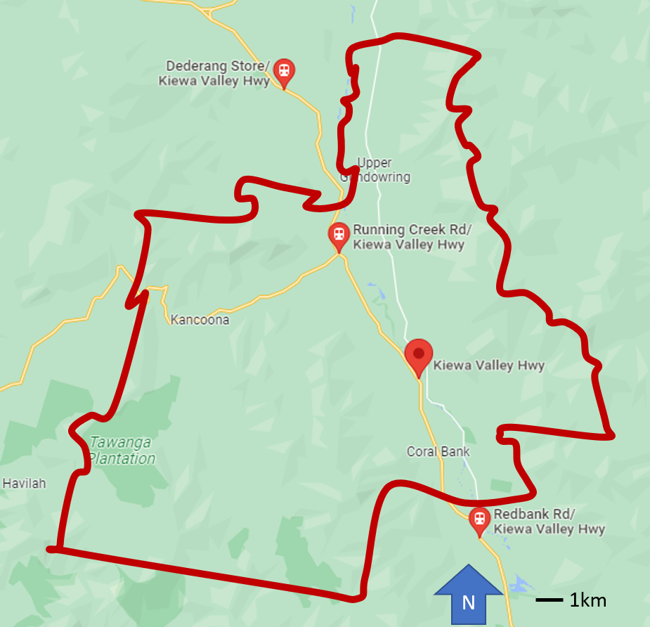
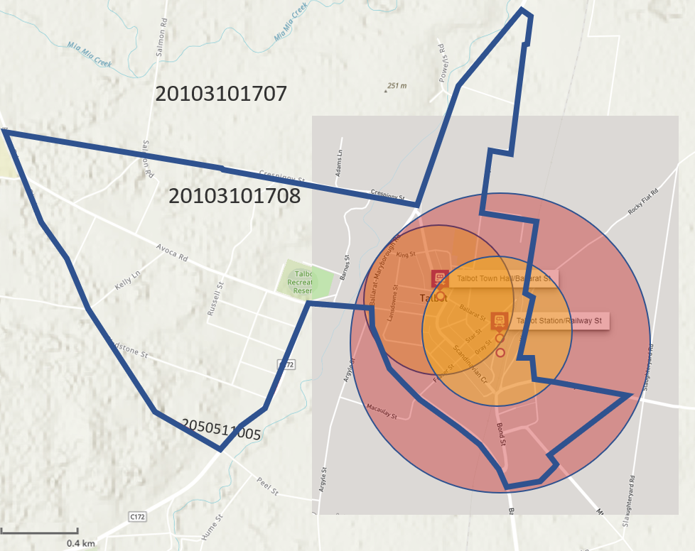

---
title: "Preliminary SA1_2021 SI scores (one day only) for 2018, 2019, 2020, 2021, 2022 and 2023"
runningheader: "Reynolds and Currie" # only for pdf output
author: "James Reynolds and Graham Currie"
date: "`r Sys.Date()`"
output:
  tufte::tufte_book:
    citation_package: natbib
    latex_engine: xelatex
    includes:
      in_header: "preamble.tex"
bibliography: [packages.bib, References.bib]
link-citations: yes
header-includes:
  - \usepackage{titling}
  - \pretitle{\begin{center}
    \includegraphics[width=2in,height=2in]{ptrg-logo-s.png}\LARGE\\}
  - \posttitle{\end{center}}
---

```{r setup, include=FALSE}
library(tufte)

library(tidyverse)
library(tidytransit)
library(sp)
library(absmapsdata)
library(ptinpoly)
library(magrittr)
library(ggplot2)
library(sf)
library(ASGS.foyer)
library(raster)
library(ggmap)
library(units)
library(janitor)
library(mapview)
library(ggstatsplot)
library(gtsummary)
library(moments)
library(scales)
library(gtfstools)
library(lubridate)
library(kableExtra)
library(knitr)
library(readxl)
library(dplyr)

# invalidate cache when the tufte version changes
knitr::opts_chunk$set(cache.extra = packageVersion('tufte'))
```

# Introduction

Previous research by @currie2007identifying developed a transit Supply Index (SI) that is relatively easy to calculate and understand, and which is open^[Rather than a black box, closed-source or otherwise secret algorithm.]. This Index is based on calculating the number of transit arrivals at stops within an area of interest for an entire week, adjusted to account for the typical walk-access catchment for each stop.  Unfortunately, the index does not appear to have been widely used, perhaps in part because it still required an analyst to obtain timetable and geographic data and undertake the calculation themselves. Since the publication of @currie2007identifying, however, such data has become much easier to obtain with more than 10,000 agencies now providing GTFS data [@GTFS]. A gap, however, is that there is not yet a method for calculating the @currie2007identifying SI directly from GTFS data. 

This paper is part of a project to develop R code to calculate the SI directly from GTFS data. The code is developed using data from a single case: the GTFS for Victoria in Australia, which includes Greater Melbourne. Researchers from Deakin University and Monash Univerity are seeking to use the outputs from the developed code as inputs to other studies.  

Unfortunately, the SI score calculation currently takes approximately one day to calculate on a standard personal compute for every day of input timetable data. Monash University's PTRG is seeking to improve this performance^[Options being explored include improving the code's efficiency, and seeking ways to run the code on more powerful hardware.], but in the meantime this paper reports preliminary outputs for researchers at Deakin University. It specifically reports on the calculation of SI scores for Statistical Area Level 1 zones from the 2021 census (SA1_2021) for the years 2018, 2019, 2020, 2021, 2022 and 2023. However, the SI scores presented here are for only one day^[The requested data is SI scores for the years 2018 to 2023, with one week of timetable data as an input. Under the current code performance and availability of resources this might take around 35 days of processing time, hence the provision of preliminary (one-day) data here. This document, and the results, are included in a branch of the overall project on github. The branch can be found at https://github.com/James-Reynolds/Transit_Supply_Index_GTFS/tree/Deakin_1_day_2018_to_2023], being a Tuesday in the first week of August^[So as to match the 2021 census date.]. 

This rest of this document is structured as follows: the next section discusses the research context of transit metrics and the the Supply Index. The Transport Needs Index used in @currie2007identifying^[Being the other part of a needs-gap assessment.] is also briefly discussed.  In the third section the methodology for the code development is outlined, including discussion of the case study GTFS for Victoria, Australia, that was used to test and verify the code output. This includes presentation and mapping of the Australian Bureau of Statistics (ABS) Index of Relative Socio-economic Advantage and Disadvantage (IRSAD) scores from the 2021 censuses, which are used later in the paper to explore the needs-gaps for SA1 zones. In the fourth section results are presented,  starting with verification of the code output through hand-calculation of SI scores for SA1 areas in the Victorian Alps and Talbot. SI scores across Greater Melbourne and Victoria are also presented, comparing transit service levels across 2018 to 2023. Mode-by-mode SI scores are also explored, followed by an examination of needs-gaps across the IRSAD scores, ranks and population levels.  The document then closes with a brief discussion and conclusion section. 

# Research context
Even a brief search shows that there is a very large number of metrics available for benchmarking transit services^[For example: the Transit Cooperative Research Program (TCRP) Report 88 provides an extensive guidebook on developing a performance-measurement system [@Ryus:2003aa]; online databases are provided by the Florida Transit Information System (FTIS) [@Florida-Transit-Information-System:2018aa] and the International Association of Public Transport (UITP) [@UITP:2015aa]; while the Transport Strategy Centre of Imperial College London runs extensive annual benchmarking programmes across over 100 transit provides around the world [@Imperial-College-London:2023aa].].The Fielding Triangle [@FieldingGordonJ1987Mpts] provides a framework for understanding how such metrics combine service inputs, service outputs and service consumption to describe cost efficiency, cost effectiveness or service effectiveness measures. At a larger scale, @Litman:2003ab and @Litman:2016aa discuss some of the traffic, mobility, accessibility, social equity, strategic planning and other rational decision-making frames that might underlie such transit metrics, while @Reynolds:2017ah extends this into models of how institutionalism, incrementalism and other public policy models might apply to decision-making processes. Further examples are provided by @GuzmanLuisA.2017Aeit, who develop a measure of accessibility in the context of policy development and social equity for Latin American Bus Rapid Transit (BRT) based networks,  and the street space allocation metrics based around 10 ethical principles introduced by @Creutzig2020streetspaceallocation. 

However, many of these metrics appear difficult to calculate, complex to explain or understand, and likely not well suited to communication with those who are not transit planners or engineers, or otherwise technical specialists. Where pre-calculated metrics are immediately available it may not be possible for  practitioners, researchers or advocates to independently generate metrics for proposed system changes or to even know exactly how scores for the existing services levels are calculated^{The TCQSM and Transit Score may provide contrasting examples:  with respect to the first challenge, TCQSM metrics may require large amounts of network, service, population and other data to be assembled before the  indicators can be calculated; whereas Transit Scores are readily available (the @WalkScore:2023tg website shows scores for locations with a published GTFS feed, eliminating the need for any calculations.). With respect to the second challenge,  the meaning of the Transit Score appears easy to explain (the closer to 100, the better), but as the score is calculated by a patented algorithm it may not be easy to understand or explain the connection between real-world conditions and the score, or what might need to be done to improve the score and service levels. Nor does it appear to be possible for Transit Scores to be generated for proposed changes to networks. The TCQSM, in contrast is open-source (In that @TCQSM:2013 provide a manual describing all the metrics and how to calculate them).].  @Wong:2013aa provides open-source code for calculating some TCQSM metrics ^[https://github.com/jcwong86/GTFS_Explore_Tool] this is now 11 years old and does not appear to be currently maintained. Future research may involve reviewing this code and using it to analyse modern GTFS feeds. However, in this paper the aim is more modest, with the objective being to develop code to calculate the Suppy Index metric from @currie2007identifying.  


## The Suppy Index

```{marginfigure}
\begin{equation}
\label{eq:supply_index}
  SI_{area, time} = \sum{\frac{Area_{Bn}}{Area_{area}}*SL_{n, time}}
\end{equation}
```

Equation \ref{eq:supply_index}^[In Equation \ref{eq:supply_index} $SI_{area, time}$ is the Supply Index for the area of interest and a given period of time. $Area_{Bn}$ is the buffer area for each stop (n) within the area of interest. In  @currie2007identifying this was based on a radius of 400 metres for bus and tram stops, and 800 metres for railway stations. $Area_area$ is the area of the area of interest, and $SL_{n,time}$ is the number of transit arrivals for each stop for a given time period.] shows the Supply Index^[Minor adjustments have been made to generalise the equation, as @currie2007identifying focused on the context of Melbourne's Census Collection Districts (CCD) and calculations based on a week of transit service.]. An advantage of the Supply Index is that it is a relatively simple number to calculate, understand and explain. It describes the number of transit arrivals at stops within an area of interest and time frame, multiplied by a factor accounting for the proportion of the area of interest that is within typical walking distance of each stop. Hence, more services, more stops and higher frequencies would all result in an increase in Supply Index score. 
The Supply Index does not incorporate further aspects, such as service span,  off-peak share of service or service speed, which are a feature of the TQCSM. However, including such metrics may increase the complexity of calculating and describing the index to non-transit specialists. Such simplicity is also helped by the way that the Index is additive, in that $SI_{area, time}$ scores can be aggregated to calculate an overall score across multiple time periods or for a region encompassing multiple areas of interest. 

@currie2007identifying calculated the $SI_{area, time}$  for various Census Collection Districts (CCDs)^[CCDs predate the introduction of Statistical Areas 1, 2, 3, and 4 (SA1, SA2, SA3, SA4), and other geographical divisions currently used by the Australian Bureau of Statistics (ABS), which may be more familiar to readers.] in Melbourne using a timetable database provided by the Victorian Public Transport Authority (PTA). This predated the widespread availability of GTFS data.  A question, therefore, is how to calculate the SI using GTFS data so that $SI_{area, time}$ scores can be calculated and compared for any area of interest where transit service information is available in that format. 

## Transport Needs Index(es)
@currie2007identifying also adopted the ABS Index for Relative Socio-Economic Advantage/Disadvantage (IRSAD), and developed a Transport Needs index. This Transport Needs index was based on combining standardised indicators^[Set as relative scores between 0 and 100 for all areas in the analysis.] of: adults without cars^[Based on census data for the number of cars per household and number of people aged 18 or over, weighted at 19\% of the Transport Needs Index.]; accessibility^[Being the straight line distance to the Central Business District (CBD), weighted at 15\%.]; persons aged over 60 years^[Weighted at 14\%.]; the number of people on a disability pension^[Wrighted at 12\%.]; the number of low income households^[Weighted at 10\%.]; the number of adults not in the labour force^[Based on the number of people over 15 not in the labour force, weigthed at 9\%.]; the number of students^[Weighted at 9\%.]; and the number of people aged 5 to 9 years^[Weighted at 12\%.]. 

Four separate indicators provided input to the @currie2007identifying assessment, reflecting different approaches to understanding the scale of the need for transit services. These are: 1) the Total Need IRSAD Index, based on the ABS ISRAD, weighted by the size of the population in each area of interest; 2) the Relative Need IRSAD Index, based on weighting the indicators by the proportion of the area of interest population in the social need component groups; 3) the Total Transport Need Index; and 4) the Relative Transport Need Index. These four indicators were combined in @currie2007identifying, with equal weighting^[i.e. 25\% each.] to provide a single, unified needs index (standardised to provide a combined relative score out of 100). 
Later in this document a similar needs-gap analysis is presented for Victorian SA1s.  However, in the needs-gap analysis here only the IRSAD scores and population data are reported. Calculating the combined Transport Needs index as per @currie2007identifying may be a direction for future research. 


# Methodology
This study adopts a case research approach by developing code to calculate Supply Indexes for Greater Melbourne and Victoria, Australia.

## Code development
This document has been prepared using Rmarkdown, which allows the intermingling of written text, code segments and code outputs. Code segements developed in this research are shown in the following, together with the relevant descriptive text^[The Rmarkdown file is available at https://github.com/James-Reynolds/Transit_Supply_Index_GTFS/blob/Deakin_1_day_2018_to_2023/Reynolds_Currie_2024_transit_supply_index_GTFS.Rmd and this can be read in a plain-text editor to view the code snippets themselves. If you are reading this in a PDF document you are seeing just the descriptive text, and outputs from the code where it has been run to produce maps, charts etc.]

Various analysis tools are available that make use of GTFS data, including the tidytransit package [@R-tidytransit] for the R statistical programming language [@R-base]. @tidytransit_departure_timetable provides code to calculate a departure timetable from a GTFS feed, and this was adapted to calculate arrivals at a stop and the SL~Bn~ term in the @currie2007identifying SI equation. 


```{r arrival_timetable_as_a_function, echo=FALSE, cache=TRUE}

#This was code was developed for another project (https://github.com/James-Reynolds/DEAKIN-housing-and-transit-accessibility),  based on the tidytransit vignette on producing a departure timetable (@tidytransit_departure_timetable.  There is back history availlble at at that github repository  for further details, but basically I wrote a departure_timetable_function and fixed up a bit where it wasn't accounting for through-running services.  This was then directly adjusted to create an arrival_timetable function (below) --- However, I did not adjust all the variable names in the function to reflect that it is about arrivals, not departures. 
#---also, something broke in the first few lines where it adds the trip_origins to the gtfs$trips data.  Not quite sure what broke, but the first 15 lines of the below function fixes it. 

library(tidytransit)
#gtfs <- read_gtfs("data/1google_transit.zip")
#stop_to_show <- "Wallan Railway Station (Wallan)"
#date_to_show <- "2023-04-27"

arrival_timetable_function <- function(gtfs, stop_to_show, date_to_show){
  # get the id of the first stop in the trip's stop sequence

  first_stop_id <- gtfs$stop_times %>% 
    group_by(trip_id) 

  first_stop_id <- first_stop_id %>%
      filter(stop_sequence == which.min(stop_sequence)) %>%
      summarise(trip_id, stop_id)

  # join with the stops table to get the stop_name
  first_stop_names <- left_join(first_stop_id, gtfs$stops, by="stop_id")

  # rename the first stop_name as trip_origin
  trip_origins <- first_stop_names %>% select(trip_id, trip_origin = stop_name)

  # join the trip origins back onto the trips
  gtfs$trips <- left_join(gtfs$trips, trip_origins, by = "trip_id")
  
  #### get the id of the last stop in the trip's stop sequence
  last_stop_id <- gtfs$stop_times %>% 
    group_by(trip_id) %>% 
    summarise(stop_id = stop_id[which.max(stop_sequence)])

  # join with the stops table to get the stop_name
  last_stop_names <- left_join(last_stop_id, gtfs$stops, by="stop_id")

  # rename the last stop_name as trip_destination
  trip_destinations <- last_stop_names %>% dplyr::select(trip_id, trip_destination = stop_name)

  # join the trip destinations back onto the trips
  gtfs$trips <- left_join(gtfs$trips, trip_destinations, by = "trip_id")

  
  #gtfs$trips %>%
  #  dplyr::select(route_id, trip_origin) %>%
  #  head()

  if(!exists("trip_headsign", where = gtfs$trips)) {
    # get the last id of the trip's stop sequence
    trip_headsigns <- gtfs$stop_times %>% 
      group_by(trip_id) %>% 
      summarise(stop_id = stop_id[which.max(stop_sequence)]) %>% 
      left_join(gtfs$stops, by="stop_id") %>% dplyr::select(trip_id, trip_headsign.computed = stop_name)

  #create a new field with 
  trip_destination <- gtfs$stop_times %>% 
      group_by(trip_id) %>% 
      summarise(stop_id = stop_id[which.max(stop_sequence)]) %>% 
      left_join(gtfs$stops, by="stop_id") %>% dplyr::select(trip_id, trip_headsign.computed = stop_name)

    
    
    # assign the headsign to the gtfs object 
    gtfs$trips <- left_join(gtfs$trips, trip_headsigns, by = "trip_id")
  }

  stop_ids <- gtfs$stops %>% 
    filter(stop_name == stop_to_show) %>% 
    dplyr::select(stop_id)

  departures <- stop_ids %>% 
    inner_join(gtfs$stop_times %>% 
                 dplyr::select(trip_id, arrival_time, 
                        departure_time, stop_id), 
               by = "stop_id")
  
  departures <- departures %>% 
    left_join(gtfs$trips %>% 
                dplyr::select(trip_id, route_id, 
                       service_id, trip_headsign, 
                       trip_origin, 
                       trip_destination), 
              by = "trip_id") 
  
  departures <- departures %>% 
    left_join(gtfs$routes %>% 
                dplyr::select(route_id, 
                       route_short_name), 
              by = "route_id")

  #remove trips where first stop is equal to the stop_to_show, as these stops originate at this stop and so do not depart
  departures <- departures %>% 
      filter(trip_origin != stop_to_show)
  
  
  #departures %>% 
  #  dplyr::select(arrival_time,
  #         departure_time,
  #         trip_headsign,trip_origin,
  #         route_id) %>%
  #  head() %>%
  #  knitr::kable()

  #head(gtfs$.$dates_services)


  services_on_180823 <- gtfs$.$dates_services %>% 
    filter(date == date_to_show) %>% dplyr::select(service_id)

  departures_180823 <- departures %>% 
    inner_join(services_on_180823, by = "service_id")

#  departures_180823 %>%
 #   arrange(departure_time, stop_id, route_short_name) %>% 
  #  dplyr::select(departure_time, stop_id, route_short_name, trip_headsign) %>% 
   # filter(departure_time >= hms::hms(hours = 7)) %>% 
   # filter(departure_time < hms::hms(hours = 7, minutes = 10)) %>% 
  #  knitr::kable()

  route_colors <- gtfs$routes %>% dplyr::select(route_id, route_short_name, route_color)
  route_colors$route_color[which(route_colors$route_color == "")] <- "454545"
  route_colors <- setNames(paste0("#", route_colors$route_color), route_colors$route_short_name)

  #No need for list of outputs anymore, as the graphs are no longer needed
  #output <- list(
   #   ggplot(departures_180823) + theme_bw() +
    #  geom_point(aes(y=trip_origin, x=arrival_time, color = route_short_name), size = 0.2) +
     # scale_x_time(breaks = seq(0, max(as.numeric(departures$departure_time)), 3600), 
      #             labels = scales::time_format("%H:%M")) +
      #theme(axis.text.x = element_text(angle = 90, hjust = 1)) +
      #theme(legend.position = "bottom") +
      #scale_color_manual(values = route_colors) 
  #    labs(title = paste("Departures from", stop_to_show, "on", date_to_show))
  #add a return value to provide the number of services shown in the graph as an output
       #   , nrow(departures_180823)
    #  )
  #return list with graph and the number of services. 
  return(departures_180823)
  
}
#arrivals_southern_cross_230427 <- arrival_timetable_function(gtfs=mel1, stop_to_show="Southern Cross Railway Station (Melbourne City)", date_to_show="2023-04-27")
#head(arrivals_southern_cross_230427)
```


The gtfstools R package [@R-gtfstools] was used to split input GTFS feeds by mode to facilitate the buffer zone calculation.  Buffer zones of 400 metres for bus and Light Rail Transit (LRT) services and 800 metres for heavy rail were adopted, as per @currie2007identifying^[There is an extended mode definition that includes modes beyond the 10 in the GTFS standard [@filter_GTFS_by_mode], but these are not dealt with by the gtfstools package. Further research may seek to extend this such that other modes can be included, but for the purposes of this study the coded buffer zone was set at 400 metres for cable trams, aerial lifts such a gondolas and trolleybuses, and at 800 metres for ferries, funiculars and monorails.].  

```{r read_buffer_zone, echo=FALSE}

buffer_zone_definitions <- as_tibble(read.csv ("buffer_zones.csv"))

class(buffer_zone_definitions$code) <- "character"
buffer_zone_definitions$mode <- noquote(buffer_zone_definitions$mode)
buffer_zone_definitions$description_examples <- noquote(buffer_zone_definitions$description_examples)
class(buffer_zone_definitions$mode) <- "character"
class(buffer_zone_definitions$description_examples) <- "character"
#set buffer zone units to metres
buffer_zone_definitions$buffer <- as_units(buffer_zone_definitions$buffer, "m")

```

```{r split_gtfs_function, echo=FALSE}

split_gtfs_into_modes_and_put_in_list <- function(gtfs){ 
  gtfs_LRT <- as_tidygtfs(filter_by_route_type(gtfs, route_type = 0))
  gtfs_subway <- as_tidygtfs(filter_by_route_type(gtfs, route_type = 1))
  gtfs_rail <- as_tidygtfs(filter_by_route_type(gtfs, route_type = 2))
  gtfs_bus <- as_tidygtfs(filter_by_route_type(gtfs, route_type = 3))
  gtfs_ferry <- as_tidygtfs(filter_by_route_type(gtfs, route_type = 4))
  gtfs_cable_tram <- as_tidygtfs(filter_by_route_type(gtfs, route_type = 5))
  gtfs_aerial_lift <- as_tidygtfs(filter_by_route_type(gtfs, route_type = 6))
  gtfs_funicular <- as_tidygtfs(filter_by_route_type(gtfs, route_type = 7))
  gtfs_trolleybus <- as_tidygtfs(filter_by_route_type(gtfs, route_type = 11))
  gtfs_monorail <- as_tidygtfs(filter_by_route_type(gtfs, route_type = 12))
 

  gtfs_into_modes_and_put_in_list <- list(
    LRT = gtfs_LRT, 
    subway = gtfs_subway,
    rail = gtfs_rail,
    bus = gtfs_bus,
    ferry = gtfs_ferry, 
    cable_tram = gtfs_cable_tram, 
    aerial_lift = gtfs_aerial_lift, 
    funicular = gtfs_funicular, 
    trolleybus = gtfs_trolleybus,
    monorail = gtfs_monorail 
  )

  return(gtfs_into_modes_and_put_in_list)
}

```

Where transit stops are located close to boundaries their catchment areas may fall into multiple areas of interest. The sp package [@R-sf] provides tools for manipulating geographic data and shape files in R. This was used to calculate the proportion of each stop's catchment area that falls into each geographical area of interest^[GTFS files define stop locations based on latitude and longitude [@GTFS], whereas the Area~Bn~ calculation needs to be provided in the same units as the Area~area~ variable, necessitating the use of a geographic transform as part of the code.].   


The SI~area~ term in the SI equation was calculated on a mode-by-mode and stop-by-stop basis, by first determining the amount of the catchment area (Area~Bn~) that falls into each geographical area of interest for the stop in question. This is then combined with the area for each geographical area of interest (Area~area~) and the number of stop arrivals (SL~Bn~) to calculate the contribution to the SI scores made by just that single stop for every area of interest. These are then added to a cumulative total field for each area of interest, and the calculations are repeated until all stops and modes in the GTFS file have been included. 


```{r SICCD_calc_as_functions, echo=FALSE, warning=FALSE, message=FALSE}

###Temporary variables to help with writing the function
#areas_of_interest <- sa1_map_data %>%
#  filter(gcc_name_2021 == "Greater Melbourne") 
#mel3 <- read_gtfs("data/3google_transit.zip")
#mel3_list_by_mode <- split_gtfs_into_modes_and_put_in_list(mel3)
#gtfs_list_by_mode <- mel3_list_by_mode
#start_date = "2023-04-27"
#period_in_days = 2
#EPSG_for_transform = 28355
#areas_of_interest_id_field = "sa1_code_2021"

#### The function ________
SI_calc_function <- function(areas_of_interest = areas_of_interest, areas_of_interest_id_field = areas_of_interest_id_field, gtfs_list_by_mode = gtfs_list_by_mode, start_date = start_date, period_in_days = period_in_days, EPSG_for_transform = EPSG_for_transform){

  ##Initialise variables used in function
  #the top level list. First element is a tibble of areas_of_interest_id_field. The remainder of the list has one element for each day of analysis, with each element containing a tibble with the SI scores for each mode.   
  SI_list_by_date_and_mode <- list((tibble(areas_of_interest %>% select(as.character(areas_of_interest_id_field))) %>% select(!"geometry")))
  names(SI_list_by_date_and_mode) <- as.character(areas_of_interest_id_field)

  # convert to sf format and project
  areas_of_interest_sf <- areas_of_interest %>%
  # convert to simple features
  sf::st_as_sf() %>%
    st_transform(crs = EPSG_for_transform) 
  # add Area_area value to areas_of_interest_sf 
  areas_of_interest_sf <- areas_of_interest_sf %>% 
    dplyr::mutate(Area_area = st_area(areas_of_interest_sf))
  # Add SI column to areas_of_interest_sf
  areas_of_interest_sf <- areas_of_interest_sf %>% 
    dplyr::mutate(SI = 0)
    
#2-level list to put the SI results in, with each element representing one of the days that is being analysed. 
    # This becomes a list (of lists), with one element for each mode for the day_of_analysis in question (j)
    SI_for_day_of_analysis_list_by_mode <- list()
  
  #for loop that drives the first level of the list, recording the day of analysis
  for (j in seq(1, period_in_days, 1)) {
    
    ##Initialise variables used in first level of the list
    day_of_analysis = as.character(ymd(start_date) - days(1) + days(j))
    
    #dataframe to store the SIs for each area of interest by mode for day j
       SI_for_day_of_analysis_by_mode_k <- (tibble(areas_of_interest %>% select(as.character(areas_of_interest_id_field))) %>% select(!"geometry"))
    
    ##for loop that drives the second level of the list, recording SI by mode
      for (k in seq(1, length(names(gtfs_list_by_mode)), 1)){   
        #look up the buffer distance for mode k
        buffer_distance <- buffer_zone_definitions %>% filter(short_name == as.character(names(gtfs_list_by_mode[k]))) %>% select(buffer) %>% as.numeric()
     
        #add zero-ed column to store SIs for mode k
        SI_for_day_of_analysis_by_mode_k <- SI_for_day_of_analysis_by_mode_k %>% tibble::add_column(a = 0)
        #change name of added column to match mode k
names(SI_for_day_of_analysis_by_mode_k) <- c( names(SI_for_day_of_analysis_by_mode_k[,1:ncol(SI_for_day_of_analysis_by_mode_k)-1]), eval(names(gtfs_list_by_mode[k])))                         
        
        #check if the gtfs mode in question has any stops - many of the modes (e.g. Monorail) will typically have zero services or stops.  If the mode in question (k) does not have any stops, then there is no further calculation required, and the existing column of zeros can be left as is. 
        if(nrow(gtfs_list_by_mode[[as.character(names(gtfs_list_by_mode[k]))]][["stops"]]) > 0) { 
         SI_return_value_for_that_mode <- rep(0,nrow(areas_of_interest))
         #which is calculated in the following for loop, which passes over all of the stops in the gtfs file for the mode in question
          for (i in seq(1, nrow(gtfs_list_by_mode[[ as.character(names(gtfs_list_by_mode[k]))]][["stops"]]), 1)) {
      
            #create dataframe with stop i lat and lon value
            dat_sim <- data.frame(lat = gtfs_list_by_mode[[as.character(names(gtfs_list_by_mode[k]))]][["stops"]]$stop_lat[i],
            long = gtfs_list_by_mode[[as.character(names(gtfs_list_by_mode[k]))]][["stops"]]$stop_lon[i])
            # Convert that dataframe (with stop i latitude and longitude) into a sf object, with the crs set to EPSG:4326 (which is the CRS for lat/long values), 
           # and then transform to be expressed as per the EPSG that is being used for the analysis (ie. shift to metres)
            dat_sf <- st_as_sf(dat_sim, coords = c("long", "lat"), crs = 4326) %>% 
            st_transform(crs = EPSG_for_transform)
  
            # make a circle with the buffer distance as the radius around stop i    
            dat_circles <- st_buffer(dat_sf, dist = buffer_distance)
            # Intersect the circle with the polygons
            int_circles <- st_intersection(areas_of_interest_sf, dat_circles)

            ##TEST CODE Map to check that it is working the way it is expect to.
            #map <- int_circles %>%
              #ggplot() +
              #geom_sf(aes(geometry = geometry,  # use the geometry variable
                  #fill = eval(parse(text=areas_of_interest_id_field))),     # fill by SA1_code
                #lwd = 0,                  # remove borders
                #show.legend = TRUE) +    # keep legend
              #theme_void() +                    # clears other plot elements
              #coord_sf()
              
            #map

            #calculate Area Bn 
            int_circles$area_bn <- st_area(int_circles)
            
            #drop_geometry
            int_circles <- as.tibble(int_circles[, !(colnames(int_circles) %in% "geometry")])
  
            ##Retrieve number of arrivals for that mode and day by...
            #first moving the gtfs for that mode out of gtfs_list_by_mode
            gtfs_k <- as_tidygtfs(eval(parse(text = paste("gtfs_list_by_mode$",names(gtfs_list_by_mode)[k],sep = ""))))
            # then add the number of arrivals at stop i to all rows of the int_circles dataframe. 
            int_circles$SL_Bn <- rep(
              nrow(arrival_timetable_function(gtfs = gtfs_k, stop_to_show = gtfs_list_by_mode[[
                as.character(names(gtfs_list_by_mode[k]))]]$stops$stop_name[i], date_to_show = day_of_analysis)), 
              nrow(int_circles))
    
            #Calculate SI for stop i and drop units
            int_circles$add_to_SI <- as.numeric(int_circles$area_bn / int_circles$Area_area * int_circles$SL_Bn)
  
            
            #Create ordinary tibble with Area of Interest identification code and SIs from stop i to add to the running totals
            export_to_SI_for_day_of_analysis_by_mode_k <- int_circles %>% select(c(as.character(areas_of_interest_id_field), add_to_SI)) 
            
            #drop add_SI column from dataframe reporting SI_by_mode scores up to the date loop (SI_for_day_of_analysis_by_mode_k)
            SI_for_day_of_analysis_by_mode_k <- SI_for_day_of_analysis_by_mode_k[, !(colnames(SI_for_day_of_analysis_by_mode_k) %in% "add_to_SI")]
  
            #merge based on eval(parse(text=areas_of_interest_id_field))
            SI_for_day_of_analysis_by_mode_k <- left_join(SI_for_day_of_analysis_by_mode_k, export_to_SI_for_day_of_analysis_by_mode_k)
  
            #convert add_to_SI to non-unit numbers
            SI_for_day_of_analysis_by_mode_k$add_to_SI <- as.vector(SI_for_day_of_analysis_by_mode_k$add_to_SI)
  
            #replace NA with 0 
            SI_for_day_of_analysis_by_mode_k[is.na(SI_for_day_of_analysis_by_mode_k)] = 0
  
            #add the SIs for stop i to the running total of SI for the mode in question
            SI_for_day_of_analysis_by_mode_k[,eval(names(gtfs_list_by_mode[k]))] <- SI_for_day_of_analysis_by_mode_k[,eval(names(gtfs_list_by_mode[k]))] + SI_for_day_of_analysis_by_mode_k$add_to_SI
          
            print(c("stop", i, "mode", k, "day", j))
            #close (i) loop for calculating SIs for stop i and adding to the running total of SI
            }
        
        #close the if(no stops in gtfs for that mode) test 
        }
       
       #close for (k) loop for calculating SI for a single mode on a single day
      }  
       
      #drop area of interest id code from dataframe of SI by mode for the day of analysis
      SI_for_day_of_analysis_by_mode_k <- SI_for_day_of_analysis_by_mode_k[,2:ncol(SI_for_day_of_analysis_by_mode_k)]
      
      #drop add_to_SI column from dataframe of SI by mode for the day of analysis
      SI_for_day_of_analysis_by_mode_k <- SI_for_day_of_analysis_by_mode_k[,!names(SI_for_day_of_analysis_by_mode_k) %in% "add_to_SI"]
       
            #add new element to the list_by_date for the date_of_analysis
      SI_list_by_date_and_mode <- append(SI_list_by_date_and_mode, list(SI_for_day_of_analysis_by_mode_k), after = length(SI_list_by_date_and_mode))
    
      #update name of new element to match date
      names(SI_list_by_date_and_mode) <- c(names(SI_list_by_date_and_mode)[1:length(names(SI_list_by_date_and_mode))-1], as.character(day_of_analysis))

    #close for (j) loop for creating the list of days
    }        

 return(SI_list_by_date_and_mode)    

#close function     
}
  


#function to combine all days together. Outputs a dataframe with a row for each area_of_interest and a column for each mode
convert_SI_list_by_date_and_mode_to_SI_df_by_mode.function <- function(SI_list_by_date_and_mode = SI_list_by_date_and_mode) {
  SI_df_by_mode <- SI_list_by_date_and_mode[2:length(names(SI_list_by_date_and_mode))] %>%
  map_dfr(~setNames(.x, paste0("A", 1:ncol(.x))), .id = "Group") %>%
  group_by(Group) %>%
  mutate(ID = 1:n()) %>%
  group_by(ID) %>%
  summarize(across(-Group, .fns = sum, na.rm = TRUE)) %>%
  select(-ID)

  #update column names to match modes
  names(SI_df_by_mode) <- colnames(SI_list_by_date_and_mode[[2]])
  
  #add back area_of_interest_id_ column
  SI_df_by_mode <- cbind(SI_list_by_date_and_mode[1], SI_df_by_mode)
  
  return(SI_df_by_mode)
}


```


## Case research approach

To test the developed code results were generated for a single case: Victoria, Australia. This case was selected primarily for convenience, as the authors are familiar with the Victorian transit network and so well placed to assess whether output results are correct.  Results were processed using the ggmaps [@R-ggmap], ggplot [@R-ggplot2], ggstatsplot [@R-ggstatsplot] and kable [@R-kableExtra; @R-knitr] packages, with data processing leveraging the tidyverse approach [@R-tidyverse].

### Victoria, Australia
Victoria is the southern-most state on the Australian mainland. The state capital is in Melbourne, which has a similar metropolitan area to of Paris or London^[Greater Melbourne is the term used to describe the larger metropolitan area, encompassing 30 LGAs. The City of Melbourne LGA covers only a small portion of the inner city.] However, with only around 5 million people Melbourne has about one-third of the population density. It has an inner Central Business District (CBD) with apartments, commercial skyscrapers and extensive sporting facilities nearby; surrounded by low-density, predominately single-family-housing-dominated, inner, middle and outer suburbs. 

The Australian Bureau of Statistics (ABS) provides a range of shape files and other resources. This study made use of the absmapsdata R package [@R-absmapsdata] to access the 2021 SA1 boundaries for Victoria.  The EPSG:28355 transform [@EPSG_28355] was used to shift longitude and latitude into metres, as per the Geocentric Datum of Australia 1994 (GDA95 / MGA zone 55) coordinates. 

```{r load_abs_data, messages = FALSE, warnings = FALSE, echo=FALSE, fig.fullwidth=TRUE, fig.cap="Melbourne SA1 map"}
#Load SA1 data
sa1_map_data <- sa12021


```


There are train and tram networks radiating from the CBD, but for most of the suburban areas the reality is that transit is provided by circuitious bus routes that are mostly used by those who cannot otherwise drive. An extensive freeway (and tollway) network provides connections across the Greater Melbourne area, further around Port Phillip Bay to Geelong (south-west) and the Mornington Penninsula (south-east) as well as to regional centres elsewhere in Victoria. There is a state-wide regional train and bus network (VLine), which also provides connections into South Australia, New South Wales and the Australian Capital Territory (Canberra) and local bus services in many regional towns and cities. However, accessibility to most of the city and state tends to be car-dominated. The Overland train service to Adelaide and the XPT to Sydney are provided seperately to VLine services.  Victoria's GTFS feed is published by Public Transport Victoria (PTV)^[There are over 400 historical releases of the  available on the transitfeeds.com website, with the first dating from March 2015 [@transitfeeds_victoria:2023aa].]. 

The Australian census is undertaken in early August every 5 years. GTFS feeds were therefore selected for the first week of August of each year, with code output produced for only the day of the census itself in 2021^[Tuesday, 10th August. GTFS feed dated August 5]. The second Tuesday in August was selected as the input timetable for 2018^[Feed 13/8, run for 14/8], 2019^[Feed 12/8, run for 13/8], 2020^[Feed 7/8, run for 11/8], 2022^[Feed 4/8, run for 9/8] and 2023^[Feed 4/8, run for 8/8]. Minor corrections were made to the GTFS files to remove duplicate stop_ids^[These involved minor discrepancies in either the stop name, latitude or longitude.]. 


```{r Victoria_2018, echo=FALSE, warning=FALSE, message=FALSE}

victoria_2018 <- read_gtfs("data/Melbourne/2018/180813/gtfs.zip")

#deal with issue to do with missing route_color information
victoria_2018$routes$route_color <- "Blue"


##identify duplicate stops
victoria_2018_duplicated_stops <- tabyl(victoria_2018$stops$stop_id) %>% filter (n>1)
names(victoria_2018_duplicated_stops) <- c("stop_id", "n", "percent")
victoria_2018_duplicated_stops <- left_join(victoria_2018_duplicated_stops, victoria_2018$stops)

##discard duplicates
victoria_2018$stops <- victoria_2018$stops[!duplicated(victoria_2018$stops$stop_id),]

##split modes
victoria_2018_list_by_mode <- split_gtfs_into_modes_and_put_in_list(victoria_2018)


##set inputs to SI_calc function
victoria_areas_of_interest <- sa1_map_data %>% filter(state_name_2021 == "Victoria")
start_date = "2018-08-14"
period_in_days = 1
EPSG_for_transform = 28355
areas_of_interest_id_field = "sa1_code_2021"


##run SI_calc function
victoria_2018_SI_list_by_date_and_mode <- SI_calc_function(areas_of_interest =  victoria_areas_of_interest, areas_of_interest_id_field = areas_of_interest_id_field, gtfs_list_by_mode = victoria_2018_list_by_mode, start_date = start_date, period_in_days = period_in_days, EPSG_for_transform = EPSG_for_transform)

#run aggregation function to create df by mode for all 7 days
victoria_2018_SI_df_by_mode <-  convert_SI_list_by_date_and_mode_to_SI_df_by_mode.function(victoria_2018_SI_list_by_date_and_mode)

##write to csv
write_csv2(victoria_2018_SI_df_by_mode, "results/Victoria_2018_SI_df_by_mode_SA12021_180814.csv")


#load pre-calculated df by mode (for just one day)
#victoria_2018_SI_df_by_mode <- read.csv("results/Victoria_2018_SI_df_by_mode_SA12021_180814.csv")
#victoria_2018_SI_df_by_mode$sa1_code_2021 <- as.character(victoria_2018_SI_df_by_mode$sa1_code_2021)


#Join SI to SA1 map data
victoria_2018_SI_df_by_mode_sf <- left_join(victoria_2018_SI_df_by_mode, sa1_map_data)

```


```{r Victoria_2019, echo=FALSE, warning=FALSE, message=FALSE}


victoria_2019 <- read_gtfs("data/Melbourne/2019/190812/gtfs.zip")


#deal with issue to do with missing route_color information
victoria_2019$routes$route_color <- "Blue"


##identify duplicate stops
victoria_2019_duplicated_stops <- tabyl(victoria_2019$stops$stop_id) %>% filter (n>1)
names(victoria_2019_duplicated_stops) <- c("stop_id", "n", "percent")
victoria_2019_duplicated_stops <- left_join(victoria_2019_duplicated_stops, victoria_2019$stops)

##discard duplicates
victoria_2019$stops <- victoria_2019$stops[!duplicated(victoria_2019$stops$stop_id),]

##split modes
victoria_2019_list_by_mode <- split_gtfs_into_modes_and_put_in_list(victoria_2019)


##set inputs to SI_calc function
victoria_areas_of_interest <- sa1_map_data %>% filter(state_name_2021 == "Victoria")
start_date = "2019-08-13"
period_in_days = 1
EPSG_for_transform = 28355
areas_of_interest_id_field = "sa1_code_2021"

##run SI_calc function
victoria_2019_SI_list_by_date_and_mode <- SI_calc_function(areas_of_interest =  victoria_areas_of_interest, areas_of_interest_id_field = areas_of_interest_id_field, gtfs_list_by_mode = victoria_2019_list_by_mode, start_date = start_date, period_in_days = period_in_days, EPSG_for_transform = EPSG_for_transform)

#run aggregation function to create df by mode for all 7 days
victoria_2019_SI_df_by_mode <-  convert_SI_list_by_date_and_mode_to_SI_df_by_mode.function(victoria_2019_SI_list_by_date_and_mode)


##write to csv
write_csv2(victoria_2019_SI_df_by_mode, "results/Victoria_2019_SI_df_by_mode_SA12021_190813.csv")


#load pre-calculated df by mode (for just one day)
#victoria_2019_SI_df_by_mode <- read.csv("results/Victoria_2019_SI_df_by_mode_SA12021_190813.csv")
#victoria_2019_SI_df_by_mode$sa1_code_2021 <- as.character(victoria_2019_SI_df_by_mode$sa1_code_2021)


#Join SI to SA1 map data
victoria_2019_SI_df_by_mode_sf <- left_join(victoria_2019_SI_df_by_mode, sa1_map_data)

```


```{r victoria_2020, echo=FALSE, warning=FALSE, message=FALSE}


victoria_2020 <- read_gtfs("data/Melbourne/2020/200807/gtfs.zip")


#deal with issue to do with missing route_color information
victoria_2020$routes$route_color <- "Blue"


##identify duplicate stops
victoria_2020_duplicated_stops <- tabyl(victoria_2020$stops$stop_id) %>% filter (n>1)
names(victoria_2020_duplicated_stops) <- c("stop_id", "n", "percent")
victoria_2020_duplicated_stops <- left_join(victoria_2020_duplicated_stops, victoria_2020$stops)

##discard duplicates
victoria_2020$stops <- victoria_2020$stops[!duplicated(victoria_2020$stops$stop_id),]

##split modes
victoria_2020_list_by_mode <- split_gtfs_into_modes_and_put_in_list(victoria_2020)


##set inputs to SI_calc function
victoria_areas_of_interest <- sa1_map_data %>% filter(state_name_2021 == "Victoria")
start_date = "2020-08-11"
period_in_days = 1
EPSG_for_transform = 28355
areas_of_interest_id_field = "sa1_code_2021"

##run SI_calc function
victoria_2020_SI_list_by_date_and_mode <- SI_calc_function(areas_of_interest =  victoria_areas_of_interest, areas_of_interest_id_field = areas_of_interest_id_field, gtfs_list_by_mode = victoria_2020_list_by_mode, start_date = start_date, period_in_days = period_in_days, EPSG_for_transform = EPSG_for_transform)

#run aggregation function to create df by mode for all 7 days
victoria_2020_SI_df_by_mode <-  convert_SI_list_by_date_and_mode_to_SI_df_by_mode.function(victoria_2020_SI_list_by_date_and_mode)


##write to csv
write_csv2(victoria_2020_SI_df_by_mode, "results/Victoria_2020_SI_df_by_mode_SA12021_200811.csv")


#load pre-calculated df by mode (for just one day)
#victoria_2020_SI_df_by_mode <- read.csv("results/Victoria_2020_SI_df_by_mode_SA12021_200811.csv")
#victoria_2020_SI_df_by_mode$sa1_code_2021 <- as.character(victoria_2020_SI_df_by_mode$sa1_code_2021)


#Join SI to SA1 map data
victoria_2020_SI_df_by_mode_sf <- left_join(victoria_2020_SI_df_by_mode, sa1_map_data)

```


```{r victoria_2021, echo=FALSE, warning=FALSE, message=FALSE}


victoria_2021 <- read_gtfs("data/Melbourne/2021/210810/gtfs.zip")

#deal with issue to do with missing route_color information
victoria_2021$routes$route_color <- "Blue"


##identify duplicate stops
victoria_2021_duplicated_stops <- tabyl(victoria_2021$stops$stop_id) %>% filter (n>1)
names(victoria_2021_duplicated_stops) <- c("stop_id", "n", "percent")
victoria_2021_duplicated_stops <- left_join(victoria_2021_duplicated_stops, victoria_2021$stops)

##discard duplicates
victoria_2021$stops <- victoria_2021$stops[!duplicated(victoria_2021$stops$stop_id),]

##split modes
victoria_2021_list_by_mode <- split_gtfs_into_modes_and_put_in_list(victoria_2021)


##set inputs to SI_calc function
victoria_areas_of_interest <- sa1_map_data %>% filter(state_name_2021 == "Victoria")
start_date = "2021-08-10"
period_in_days = 1
EPSG_for_transform = 28355
areas_of_interest_id_field = "sa1_code_2021"

##run SI_calc function
victoria_2021_SI_list_by_date_and_mode <- SI_calc_function(areas_of_interest =  victoria_areas_of_interest, areas_of_interest_id_field = areas_of_interest_id_field, gtfs_list_by_mode = victoria_2021_list_by_mode, start_date = start_date, period_in_days = period_in_days, EPSG_for_transform = EPSG_for_transform)

#run aggregation function to create df by mode for all 7 days
victoria_2021_SI_df_by_mode <-  convert_SI_list_by_date_and_mode_to_SI_df_by_mode.function(victoria_2021_SI_list_by_date_and_mode)


##write to csv
write_csv2(victoria_2021_SI_df_by_mode, "results/Victoria_2021_SI_df_by_mode_SA12021_210810.csv")


#load pre-calculated df by mode (for just one day)
#victoria_2021_SI_df_by_mode <- read.csv("results/Victoria_2021_SI_df_by_mode_SA12021_210810.csv")
#victoria_2021_SI_df_by_mode$sa1_code_2021 <- as.character(victoria_2021_SI_df_by_mode$sa1_code_2021)


#Join SI to SA1 map data
victoria_2021_SI_df_by_mode_sf <- left_join(victoria_2021_SI_df_by_mode, sa1_map_data)

```


```{r victoria_2022, echo=FALSE, warning=FALSE, message=FALSE}


victoria_2022 <- read_gtfs("data/Melbourne/2022/220804/gtfs.zip")


#deal with issue to do with missing route_color information
victoria_2022$routes$route_color <- "Blue"

##identify duplicate stops
victoria_2022_duplicated_stops <- tabyl(victoria_2022$stops$stop_id) %>% filter (n>1)
names(victoria_2022_duplicated_stops) <- c("stop_id", "n", "percent")
victoria_2022_duplicated_stops <- left_join(victoria_2022_duplicated_stops, victoria_2022$stops)

##discard duplicates
victoria_2022$stops <- victoria_2022$stops[!duplicated(victoria_2022$stops$stop_id),]

##split modes
victoria_2022_list_by_mode <- split_gtfs_into_modes_and_put_in_list(victoria_2022)


##set inputs to SI_calc function
victoria_areas_of_interest <- sa1_map_data %>% filter(state_name_2021 == "Victoria")
start_date = "2022-08-14"
period_in_days = 1
EPSG_for_transform = 28355
areas_of_interest_id_field = "sa1_code_2021"

##run SI_calc function
victoria_2022_SI_list_by_date_and_mode <- SI_calc_function(areas_of_interest =  victoria_areas_of_interest, areas_of_interest_id_field = areas_of_interest_id_field, gtfs_list_by_mode = victoria_2022_list_by_mode, start_date = start_date, period_in_days = period_in_days, EPSG_for_transform = EPSG_for_transform)

#run aggregation function to create df by mode for all 7 days
victoria_2022_SI_df_by_mode <-  convert_SI_list_by_date_and_mode_to_SI_df_by_mode.function(victoria_2022_SI_list_by_date_and_mode)


##write to csv
write_csv2(victoria_2022_SI_df_by_mode, "results/Victoria_2022_SI_df_by_mode_SA12021_220814.csv")


#load pre-calculated df by mode (for just one day)
#victoria_2022_SI_df_by_mode <- read.csv("results/Victoria_2022_SI_df_by_mode_SA12021_220814.csv")
#victoria_2022_SI_df_by_mode$sa1_code_2021 <- as.character(victoria_2022_SI_df_by_mode$sa1_code_2021)


#Join SI to SA1 map data
victoria_2022_SI_df_by_mode_sf <- left_join(victoria_2022_SI_df_by_mode, sa1_map_data)

```


```{r victoria_2023, echo=FALSE, warning=FALSE, message=FALSE}


victoria_2023 <- read_gtfs("data/Melbourne/2023/230804/gtfs.zip")

#deal with issue to do with missing route_color information
victoria_2023$routes$route_color <- "Blue"


##identify duplicate stops
victoria_2023_duplicated_stops <- tabyl(victoria_2023$stops$stop_id) %>% filter (n>1)
names(victoria_2023_duplicated_stops) <- c("stop_id", "n", "percent")
victoria_2023_duplicated_stops <- left_join(victoria_2023_duplicated_stops, victoria_2023$stops)

##discard duplicates
victoria_2023$stops <- victoria_2023$stops[!duplicated(victoria_2023$stops$stop_id),]

##split modes
victoria_2023_list_by_mode <- split_gtfs_into_modes_and_put_in_list(victoria_2023)


##set inputs to SI_calc function
victoria_areas_of_interest <- sa1_map_data %>% filter(state_name_2021 == "Victoria")
start_date = "2023-08-08"
period_in_days = 1
EPSG_for_transform = 28355
areas_of_interest_id_field = "sa1_code_2021"

##run SI_calc function
victoria_2023_SI_list_by_date_and_mode <- SI_calc_function(areas_of_interest =  victoria_areas_of_interest, areas_of_interest_id_field = areas_of_interest_id_field, gtfs_list_by_mode = victoria_2023_list_by_mode, start_date = start_date, period_in_days = period_in_days, EPSG_for_transform = EPSG_for_transform)

#run aggregation function to create df by mode for all 7 days
victoria_2023_SI_df_by_mode <-  convert_SI_list_by_date_and_mode_to_SI_df_by_mode.function(victoria_2023_SI_list_by_date_and_mode)


##write to csv
write_csv2(victoria_2023_SI_df_by_mode, "results/Victoria_2023_SI_df_by_mode_SA12021_230808.csv")


#load pre-calculated df by mode (for just one day)
#victoria_2023_SI_df_by_mode <- read.csv("results/Victoria_2023_SI_df_by_mode_SA12021_230808.csv")
#victoria_2023_SI_df_by_mode$sa1_code_2021 <- as.character(victoria_2023_SI_df_by_mode$sa1_code_2021)


#Join SI to SA1 map data
victoria_2023_SI_df_by_mode_sf <- left_join(victoria_2023_SI_df_by_mode, sa1_map_data)

```


<!------ BELOW HERE HAS NOT BEEN UPDATED FROM MAIN ---->

The ABS provides IRSAD datasets for LGAs in excel format. Data for 2016 and 2021 was included in this study. Scores are shown in Figures \ref{fig:Victoria_IRSAD_load_2016} and \ref{fig:Victoria_IRSAD_load_2021}. Figure \ref{fig:Victoria_IRSAD_compare} shows changes in IRSAD scores between 2016 and 2021. 

```{r Victoria_IRSAD_load_2016, echo=FALSE, warning=FALSE, message=FALSE, fig.fullwidth = TRUE, fig.cap= "2016 IRSAD for Victorian and Greater Melbourne LGAs", fig.show="hold", out.width="50%"}


IRSAD_2016_lga <- read_excel("data/Melbourne/ABS/2033055001 - lga indexes.xls", 
    sheet = "Table 3", skip = 5)
names(IRSAD_2016_lga) <- c("lga_code_2016", "lga_name_2016", "usual_resident_population", "IRSAD_score","blank", "Australian_rank", "Australian_decile", "Australian_percentile", "blank2", "state_for_rank", "state_rank", "state_decile", "state_percentile", "IRSAD_score_lowest_SA1", "IRSAD_score_highest_SA1", "percent_usual_resident_population_no_SA1_score")
IRSAD_2016_lga <- tibble(IRSAD_2016_lga)

IRSAD_2016_lga_map <- left_join(IRSAD_2016_lga, LGA_map_data, join_by("lga_code_2016" == "lga_code_2021"))


map <- IRSAD_2016_lga_map %>%
  filter(state_name_2021 == "Victoria") %>%   
  ggplot() +
  geom_sf(aes(geometry = geometry,  # use the geometry variable
             fill = IRSAD_score),     # fill by IRSAD_score
          lwd = 0,                  # remove borders
         show.legend = TRUE) +   # fill colours on log scale
# geom_point(aes(cent_long,
    #           cent_lat),        # use the centroid long (x) and lats (y)
   #          colour = "white") +    # make the points white
  # theme_void() +                    # clears other plot elements
 coord_sf()

map


map <- IRSAD_2016_lga_map %>%
  filter(state_name_2021 == "Victoria") %>%   
  filter(greater_melbourne == "Greater Melbourne") %>%
  ggplot() +
  geom_sf(aes(geometry = geometry,  # use the geometry variable
             fill = IRSAD_score),     # fill by TOtal SI
          lwd = 0,                  # remove borders
         show.legend = TRUE) +   # keep legend
  # fill colours on log scale
# geom_point(aes(cent_long,
    #           cent_lat),        # use the centroid long (x) and lats (y)
   #          colour = "white") +    # make the points white
  # theme_void() +                    # clears other plot elements
 coord_sf()

map

```


```{r Victoria_IRSAD_load_2021, echo=FALSE, warning=FALSE, message=FALSE, fig.fullwidth = TRUE, fig.cap= "2021 IRSAD for Victorian and Greater Melbourne LGAs", fig.show="hold", out.width="50%"}


IRSAD_2021_lga <- read_excel("data/Melbourne/ABS/Local Government Area, Indexes, SEIFA 2021.xlsx", 
    sheet = "Table 3", skip = 5)

names(IRSAD_2021_lga) <- c("lga_code_2021", "lga_name_2021", "usual_resident_population", "IRSAD_score","blank", "Australian_rank", "Australian_decile", "Australian_percentile", "blank2", "state_for_rank", "state_rank", "state_decile", "state_percentile", "IRSAD_score_lowest_SA1", "IRSAD_score_highest_SA1", "percent_usual_resident_population_no_SA1_score")
IRSAD_2021_lga <- tibble(IRSAD_2021_lga)

IRSAD_2021_lga_map <- left_join(IRSAD_2021_lga, LGA_map_data)


map <- IRSAD_2021_lga_map %>%
  filter(state_name_2021 == "Victoria") %>%   
  ggplot() +
  geom_sf(aes(geometry = geometry,  # use the geometry variable
             fill = IRSAD_score),     # fill by IRSAD_score
          lwd = 0,                  # remove borders
         show.legend = TRUE) +   # fill colours on log scale
# geom_point(aes(cent_long,
    #           cent_lat),        # use the centroid long (x) and lats (y)
   #          colour = "white") +    # make the points white
  # theme_void() +                    # clears other plot elements
 coord_sf()

map


map <- IRSAD_2021_lga_map %>%
  filter(state_name_2021 == "Victoria") %>%   
  filter(greater_melbourne == "Greater Melbourne") %>%
  ggplot() +
  geom_sf(aes(geometry = geometry,  # use the geometry variable
             fill = IRSAD_score),     # fill by TOtal SI
          lwd = 0,                  # remove borders
         show.legend = TRUE) +   # keep legend
  # fill colours on log scale
# geom_point(aes(cent_long,
    #           cent_lat),        # use the centroid long (x) and lats (y)
   #          colour = "white") +    # make the points white
  # theme_void() +                    # clears other plot elements
 coord_sf()

map


```


```{r Victoria_IRSAD_compare, echo=FALSE, warning=FALSE, message=FALSE, fig.height= 4, fig.fullwidth = FALSE, fig.cap= "Comparing 2016 and 2021 IRSAD scores for Victorian LGAs. Analysis using ggstatsplot package."}


IRSAD_2016_2021_lga <- IRSAD_2016_lga 
#assume LGA codes 2016 is same as 2021
names(IRSAD_2016_2021_lga) <- c("lga_code_2021", names(IRSAD_2016_2021_lga[2:16]))
IRSAD_2016_2021_lga$Census <- "2016"

IRSAD_2021_lga_hold <- IRSAD_2021_lga
IRSAD_2021_lga_hold$Census <- "2021"

IRSAD_2016_2021_lga <- add_row((IRSAD_2016_2021_lga[,!names(IRSAD_2016_2021_lga) %in% c("lga_name_2016")]), (IRSAD_2021_lga_hold[,!names(IRSAD_2021_lga_hold) %in% c("lga_name_2021")]))
            

IRSAD_2016_2021_lga_map <- left_join(IRSAD_2016_2021_lga, LGA_map_data)
IRSAD_2016_2021_lga_map$areasqkm_2021 <- as.numeric(IRSAD_2016_2021_lga_map$areasqkm_2021)


ggwithinstats(IRSAD_2016_2021_lga_map %>% filter(state_name_2021 == "Victoria"),
              x = "Census",
              y = "IRSAD_score"
                )


```


```{r Victoria_IRSAD_compare_map, echo=FALSE, warning=FALSE, message=FALSE, fig.fullwidth = TRUE, fig.cap= "Change in IRSAD scores", fig.show="hold", out.width="50%"}

IRSAD_2016_2021_lga_wider <- pivot_wider(IRSAD_2016_2021_lga_map %>% filter(state_name_2021 == "Victoria") %>% dplyr::select("lga_code_2021", "lga_name_2021", "IRSAD_score", "Census"), names_from = "Census", values_from = "IRSAD_score")

IRSAD_2016_2021_lga_wider$Change <- (IRSAD_2016_2021_lga_wider$`2021`- IRSAD_2016_2021_lga_wider$`2016`)

IRSAD_2016_2021_lga_wider <- left_join(IRSAD_2016_2021_lga_wider, LGA_map_data)


map <- IRSAD_2016_2021_lga_wider %>%
  ggplot() +
  geom_sf(aes(geometry = geometry,  # use the geometry variable
             fill = Change),     # fill by IRSAD_score
          lwd = 0,                  # remove borders
         show.legend = TRUE) +   # fill colours on log scale
# geom_point(aes(cent_long,
    #           cent_lat),        # use the centroid long (x) and lats (y)
   #          colour = "white") +    # make the points white
  # theme_void() +                    # clears other plot elements
 coord_sf() + 
  scale_fill_gradient2()
              
map


map <- IRSAD_2016_2021_lga_wider %>%
  filter(greater_melbourne == "Greater Melbourne") %>%
  ggplot() +
  geom_sf(aes(geometry = geometry,  # use the geometry variable
             fill = Change),     # fill by TOtal SI
          lwd = 0,                  # remove borders
         show.legend = TRUE) +   # keep legend
  # fill colours on log scale
# geom_point(aes(cent_long,
    #           cent_lat),        # use the centroid long (x) and lats (y)
   #          colour = "white") +    # make the points white
  # theme_void() +                    # clears other plot elements
 coord_sf() + 
   scale_fill_gradient2() 

map


```

Figure \ref{fig:Victoria_IRSAD_compare} indicates that has not been a significant change in IRSAD scores for Victorian LGAs between 2016 and 2021.  Figure \ref{fig:Victoria_IRSAD_compare_map} shows the percentage change in IRSAD scores for individual LGAs across Victoria and Greater Melbourne. Alpine Shire and the unincorporated Victorian areas (Mount Buller, French Island in Westernport etc.) appear to have had the largest increases in IRSAD in Victoria, while in Greater Melbourne it appears to have been mostly in inner areas where there have been increases. 

There appears to have been some decreases in IRSAD scores in outer regions of Victoria. Outer-eastern parts of Melbourne, and Melton (outer-west) also also appear to have had lower IRSAD scores in 2021 than 2016.  


```{r Victoria_IRSAD_rank_2021, echo=FALSE, warning=FALSE, message=FALSE, fig.fullwidth = TRUE, fig.cap= "IRSAD rank 2021", fig.show="hold", out.width="50%"}


map <- IRSAD_2021_lga_map %>%
  filter(state_name_2021 == "Victoria") %>%   
  ggplot() +
  geom_sf(aes(geometry = geometry,  # use the geometry variable
             fill = as.numeric(state_rank)),     # fill by IRSAD_score
          lwd = 0,                  # remove borders
         show.legend = TRUE) +   # fill colours on log scale
# geom_point(aes(cent_long,
    #           cent_lat),        # use the centroid long (x) and lats (y)
   #          colour = "white") +    # make the points white
  # theme_void() +                    # clears other plot elements
 coord_sf() +
  scale_fill_gradient2() +
  labs(fill = "Rank")

map


map <- IRSAD_2021_lga_map %>%
  filter(state_name_2021 == "Victoria") %>%   
  filter(greater_melbourne == "Greater Melbourne") %>%
  ggplot() +
  geom_sf(aes(geometry = geometry,  # use the geometry variable
             fill = as.numeric(state_rank)),     # fill by TOtal SI
          lwd = 0,                  # remove borders
         show.legend = TRUE) +   # keep legend
  # fill colours on log scale
# geom_point(aes(cent_long,
    #           cent_lat),        # use the centroid long (x) and lats (y)
   #          colour = "white") +    # make the points white
  # theme_void() +                    # clears other plot elements
 coord_sf()+
   scale_fill_gradient2() +
  labs(fill = "Rank")

map


```

Figure \ref{fig:Victoria_IRSAD_rank_2021} shows the 2021 IRSAD ranking for Victoria and Greater Melbourne. A lower rank indicates a LGA with a lower IRSAD score. Inner Melbourne LGAs appear to have the highest ranks, whereas Greater Dandenong has the `r (IRSAD_2021_lga_map %>%  filter(lga_name_2021 == "Greater Dandenong"))$state_rank`rd lowest IRSAD in the state. For regional LGAs the ranking appears to be generally lower in the north-west, with Central Goldfields having the lowest IRSAD score for the entire state.  However, the Latrobe LGA in the east has the second lowest rank, while Glenelg in the south-west is the fifth lowest.    


```{r Victoria_IRSAD_rank_compare, echo=FALSE, warning=FALSE, message=FALSE, fig.fullwidth = TRUE, fig.cap= "Change in IRSAD rank between 2021 and 2016 (lower rank = worse)", fig.show="hold", out.width="50%"}

IRSAD_2016_2021_lga_wider <- pivot_wider(IRSAD_2016_2021_lga_map %>% filter(state_name_2021 == "Victoria") %>% dplyr::select("lga_code_2021", "lga_name_2021", "state_rank", "Census"), names_from = "Census", values_from = "state_rank")

IRSAD_2016_2021_lga_wider$`2021` <- as.numeric(IRSAD_2016_2021_lga_wider$`2021`)
IRSAD_2016_2021_lga_wider$`2016` <- as.numeric(IRSAD_2016_2021_lga_wider$`2016`)

IRSAD_2016_2021_lga_wider$Change <- (IRSAD_2016_2021_lga_wider$`2021`- IRSAD_2016_2021_lga_wider$`2016`)

IRSAD_2016_2021_lga_wider <- left_join(IRSAD_2016_2021_lga_wider, LGA_map_data)


map <- IRSAD_2016_2021_lga_wider %>%
  ggplot() +
  geom_sf(aes(geometry = geometry,  # use the geometry variable
             fill = Change),     # fill by IRSAD_score
          lwd = 0,                  # remove borders
         show.legend = TRUE) +   # fill colours on log scale
# geom_point(aes(cent_long,
    #           cent_lat),        # use the centroid long (x) and lats (y)
   #          colour = "white") +    # make the points white
  # theme_void() +                    # clears other plot elements
 coord_sf() + 
  scale_fill_gradient2() +
  labs(fill = "Rank change"
       )
       


map


map <- IRSAD_2016_2021_lga_wider %>%
  filter(greater_melbourne == "Greater Melbourne") %>%
  ggplot() +
  geom_sf(aes(geometry = geometry,  # use the geometry variable
             fill = Change),     # fill by TOtal SI
          lwd = 0,                  # remove borders
         show.legend = TRUE) +   # keep legend
  # fill colours on log scale
# geom_point(aes(cent_long,
    #           cent_lat),        # use the centroid long (x) and lats (y)
   #          colour = "white") +    # make the points white
  # theme_void() +                    # clears other plot elements
 coord_sf() + 
 scale_fill_gradient2() +
  labs(fill = "Rank change"
       )
  
map

```


Figure \ref{fig:Victoria_IRSAD_rank_compare} shows the change in ranking between the 2016 and 2021 for each LGA in Victoria and Greater Melbourne. A positive number indicates that the LGA in question had a higher IRSAD score  than more of the other Victorian LGAs in 2021 than in it did in 2016. The state ranking appears to have fallen for most of the outer suburbs in Greater Melbourne, especially for Melton, Whittlesea and Casey. Rankings have improved particularly in Brimbank, but also in some of the other nearby LGAs. In regional Victoria Gannawarra's ranking has fallen the most, while Alpine Shire and Ararat's ranking have improved the most. 


<!--
### Toronto, Ontario, Canada
### Washington DC, USA
--->

# Results
The following subsections discuss the results of cases studies used to develop and test the SI calculating code^[The code is available at https://github.com/James-Reynolds/Transit_Supply_Index_GTFS as a Rmarkdown file (used to typeset this paper).]. 

## Verifing the code output
Code output results were verified by comparison to by-hand calculations for selected combinations of date and location in Victoria. 

### Running Creek and Morgans Bridge, Kiewa Valley Hwy


The SA1 area 20403106915 covers Running Creek and Morgans Bridge, two localities in the Victorian Alps. Within this SA1 area there are only two V/Line bus stops^[Stop:ID 45125, Running Creek Rd/Kiewa Valley Hwy (Running Creek) and Stop ID: 45124, Kiewa Valley Hwy (Mongans Bridge).].  This SA1 was selected for the purposes of verifying the code output as it is relatively easy to calculate the relevant SI values as a cross-check, because there is only one bus service and two stops to include. The location of the SA1 20403106915 is shown in the following figure. Relevant geographic statistics are shown in the following.  




```{r Running_Creek_SA1_2021, echo=FALSE, warning=FALSE, message=FALSE, fig.fullwidth = TRUE, fig.cap= "$SI_{LGA2021, 10/8/21}$", fig.show="hold", out.width="50%"}
st_drop_geometry(sa1_map_data %>% filter(sa1_code_2021 == "20403106915"))
```

The area of SA1 20403106915 is `r st_drop_geometry(sa1_map_data %>% filter(sa1_code_2021 == "20403106915"))$areasqkm_2021`km^2^.  By inspection, the entire 400m radius catchment area of both of the bus stops lie entirely within the SA1 20403106915 boundaries.


Hence the $Area_{Bn}/ Area_{SA1_Area}$ term for each of the bus stops is equal to $(\pi 400^2) / 284598000 =$ `r (pi * 400 * 400 / 284598000) %>% label_scientific(digits = 3)()`.  
No printed timetable has been located for the Albury - Mt Beauty via Baranduda and Tawonga South route that services these stops, but stop times are provided on the PTV website^[See https://tinyurl.com/5n83ryhy. This indicates services on April 27 to Albury at 7:25am, 9:25am and 9:30am. For April 28 there are services at 7:25am and 9:30am, but then there are no services over the weekend.  May 1 has two services (7:25am and 9:30am), May 2nd and 3rd both have three (7:25, 9:25 and 9:30am), bringing the total to 13. In the opposite direction the PTV website indicates a similar service pattern, only in the opposite direction and at 2:50pm, 4:20pm and 4:40pm. In general, this appears to be a school bus service pattern.  It is unclear, however, why some days have three services but others have only two.].  This indicates a  total of 26 arrivals to each of the two bus stops in a seven day week ^[The SL~Bn~ term.] Therefore the total $SI_{20403106915, 27/4-3/5/23}$ score is equal to $(2*(26* pi * 400 * 400 / 284598000))$ which is equal to `r (2*(26* pi * 400 * 400 / 284598000))`.  

The $SI_{20403106915, 27/4-3/5/23}$ score calculated by the developed code is shown in the following table.  
```{r Running_Creek_SI_calc_SA1_2021, echo=FALSE, warning=FALSE, message=FALSE, fig.fullwidth = TRUE, fig.cap= "$SI_{LGA2021, 10/8/21}$", fig.show="hold", out.width="50%"}


Victoria_total_SI_SA1_230427 <- read_csv("Victoria_total_SI_SA1_230427.csv")

kbl(Victoria_total_SI_SA1_230427 %>% filter(sa1_code_2021 == "20403106915"), caption = "Developed code output for SA1 20403106915, seven days starting April 27, 2023")

```

The hand-calculated $SI_{20403106915, 27/4-3/5/23}$ matches that produced by the developed code, suggesting that the developed code is providing the expected output.  

### Talbot, Avoca line
Talbot, north-west of Ballarat, provides a location where the accuracy of the developed code can be tested for both: 1) multiple modes; and 2) station/stop catchment areas spanning across multiple areas of interest.  As shown in the below figure, the Talbot township is covered by SA1 20103101708, which lies within the SA1 20103101707.   




The Talbot Railway station's 800m catchment area is roughly three-fifths in SA1 20103101708. A bus stop located close to the railway station has roughly three-quarters of its catchment in 20103101708. The bus stop at the Talbot Town Hall has almost its entire catchment area within 20103101708.  


The area of SA1 20103101707 is `r st_drop_geometry(sa1_map_data %>% filter(sa1_code_2021 == "20103101707"))$areasqkm_2021 %>% format(digits=3)`km^2^^[via LGA data from abs_map package.]. 

<!--For SA1 20103101708 the area is `r st_drop_geometry(sa1_map_data %>% filter(sa1_code_2021 == "20103101708"))$areasqkm_2021 %>% format(digits=3)`km^2^ -->


Hence the $Area_{Bn}/ Area_{SA120103101708}$ term for the Talbot Town Hall bus stop is approximately equal to $(\pi .4^2) / 3.05=$ `r (pi * .4 * .4 / 3.05)%>% format(digits=3)`.

<!---, while the $Area_{Bn}/ Area_{SA120103101707}$ is very close to zero.
--->For the bus stop at the Talbot Station the $Area_{Bn}/ Area_{SA120103101708}$ term is approximately equal to $3/4(\pi .4^2) / 3.05=$ `r ((3/4)*(pi * .4 * .4 / 3.05)) %>% format(digits=3)`<!---, while the $Area_{Bn}/ Area_{SA120103101707}$  term is $1/4(\pi .4^2) / 237=$ `r ((1/4)*(pi * .4 * .4 / 237)) %>% format(digits=3)`--->. For the Railway Station itself the $Area_{Bn}/ Area_{SA120103101708}$ term is approximately equal to $(3/5)(\pi .8^2) / 3.05=$ `r ((3/5)*(pi * .8 * .8 / 3.05)) %>% format(digits = 3)`<!---, while the $Area_{Bn}/ Area_{SA120103101707}$  term is $2/5(\pi .8^2) / 237=$ `r ((2/5)*(pi * .8 * .8 / 237)) %>% format(digits = 3)`--->. 

Review of the PTV website stop departures indicates that the typical service pattern appears to be: 

- Talbot Town Hall bus stop - 42 services per week^[One Vline bus service towards Maryborough on Thursdays, Fridays, Saturdays, Mondays and Tuesdays(5 per week); 3 Vline services towards Melbourne and/or Ballarat on Thursdays and Fridays, 2 on Saturdays, 1 on Sundays, 3 on Mondays and Tuesdays,  and 1 on Wednesdays (16 per week); two Vline bus serices towards Mildura on Thursdays and Fridays, 1 on Satudays and Sundays, 2 on Mondays and Tuesdays and 1 on Wednesdays (11 per week); local bus services to Ballarat on Thursdays (1), Fridays (1), Monday (1), Tuesday (1) and Wednesday(1) (5 per week); and local bus services towards Bendigo on Thursdays (1), Fridays (1), Mondays (1), Tuesdays (1) and Wednesdays (1) (5 per week).] 
  
  
- Talbot Station bus stop - 32 services per week^[One Vline bus service towards Maryborough on Thursdays, Fridays, Saturdays, Mondays and Tuesdays(5 per week); 3 Vline services towards Melbourne and/or Ballarat on Thursdays and Fridays, 2 on Saturdays, 1 on Sundays, 3 on Mondays and Tuesdays,  and 1 on Wednesdays (16 per week); and two Vline bus serices towards Mildura on Thursdays and Fridays, 1 on Satudays and Sundays, 2 on Mondays and Tuesdays and 1 on Wednesdays (11 per week)]

- Talbot Railway Station - 28 services per week^{Two services towards Maryborough every day of the week; and two services towards Melbourne every day of the week]

Therefore, the $SI_{20103101708}$ is approximately equal to: (Talbot Town Hall bus stop) 42 services per week x `r ((pi * .4 * .40 / 3.05)) %>% format(digits = 3)` = `r (42*(pi * .4 * .4 / 3.05)) %>% format(digits = 3)`; plus (Talbot Station bus stop) 32 services per week x $3/4(\pi .4^2) / 3.05=$ `r ((3/4)*(pi * .4 * .4 / 305)) %>% format(digits = 3)` = `r (32*(3/4)*(pi * .4 * .4 / 3.05)) %>% format(digits = 3)`; plus (Talbot Railway Station) 28 services per week x `r ((3/5)*(pi * .8 * .8 / 305)) %>% format(digits = 3)` = `r (28*(3/5)*(pi * .8 * .8 / 3.05)) %>% format(digits = 3)` = `r ((42*(pi * .4 * .4 / 3.05)) + (32*(3/4*(pi * .4 * .4 / 3.05))) + ((28*(3/5)*(pi * .8 * .8 / 3.05)))) %>% format(digits = 3)`


The $SI_{20403106915, 27/4-3/5/23}$ score calculated by the developed code is shown in the following table.  
```{r Talbot_calc_SA1_2021, echo=FALSE, warning=FALSE, message=FALSE, fig.fullwidth = TRUE, fig.cap= "$SI_{LGA2021, 10/8/21}$", fig.show="hold", out.width="50%"}


Victoria_total_SI_SA1_230427 <- read_csv("Victoria_total_SI_SA1_230427.csv")

kbl(Victoria_total_SI_SA1_230427 %>% filter(sa1_code_2021 == "20103101708"), caption = "Developed code output for SA1 20103101707, seven days starting April 27, 2023")

```

The hand-calculated $SI_{20103101708, 27/4-3/5/23}$ is  approximately `r (1-(((42*(pi * .4 * .4 / 3.05)) + (32*(3/4*(pi * .4 * .4 / 3.05))) + ((28*(3/5)*(pi * .8 * .8 / 3.05)))) / ((Victoria_total_SI_SA1_230427 %>% filter(sa1_code_2021 == "20103101708"))$SI_CCD))) %>% percent_format(digits = 3)()` lower than the value calculated by the SI code.  However, this appears to be sufficient to accept the result given that: 

- the overlaps of the station and stop catchment areas have been estimated based on PTV and ABS maps, rather then precisely calculated using GIS software; 
- the hand-calculated SI is based on current (August 2023) service schedules, whereas the code-calculated value is based on a GTFS file from April 27, 2023^[The online PTV timetables only go back a month or two, so any changes in the timetables between April and now could not be checked without looking directly at the GTFS files, which sort of defeats the purpose of doing the verification calculations.]; and
- Overall the SI scores vary greatly across LGAs^[Ranging between `r min(Victoria_total_SI_SA1_230427$SI_CCD) %>% format(digits=3)` and `r max(Victoria_total_SI_SA1_230427$SI_CCD) %>% format(digits=3, big.mark = ",")`.], meaning that a difference of just  `r ((((Victoria_total_SI_SA1_230427 %>% filter(sa1_code_2021 == "20103101708"))$SI_CCD)) - ((42*(pi * .4 * .4 / 3.05)) + (32*(3/4*(pi * .4 * .4 / 3.05))) + ((28*(3/5)*(pi * .8 * .8 / 3.05)))))  %>% format(digits = 3)` between the hand-calculated and code-calculated score is likely an issue of precision, rather than accuracy.  

Further verification work might involve:

- updating the code calculated values from $SI_{20103101708, 27/4-3/5/23}$ to $SI_{20103101708, now+7days}$ such that the current PTV timetables could be directly compared to the code output using the current GTFS files^[This would remove the chance that the service patterns have actually changed between April and now, although it is expected that even if there has been a change it is unlikely to have been large.]; 
- obtaining more precise $Area_{Bn} / Area_{area of interest}$ terms using GIS or similar; 
- stepping through the coding calculations one at a time to verify the intermediate calculations, and hence confirm that this disrepancy is simply a matter of precision; 
- undertaking the verification calculations for the  SA1 20103101707 area^[Unfortunately this is a large SA1 and there are other bus stops (outside of Talbot) that will contribute to the SI score.] or for some other area where hand calculations are relatively easy to perform. 


Anyhow, this concludes the hand-calculation verification efforts to date. The next sections, therefore, look at the code outputs alone, with a focus on LGAs in Greater Melbourne and Victoria. 

## Victoria, Australia: Supply Index results for LGAs
To better understand how the SI calculation from GTFS data can be practically applied, this section presents results when the SI is calculated for Local Government Areas (LGAs) within Victoria. For the purposes of this section, the $SI_{LGA}$ is calculated for 2016 and 20121, but only a single day of service, being the date of the census in each year^[Tuesday August 9, 2016, and Tuesday August 10, 2021. Analysis of a single day was selected so as to reduce the processing time required to output the SI scores, as the code currenly takes about one day to run for all the stops in Victoria for every day that is analysed. Code performance could be improved, but appears good enough for the purposes of this research. As a way to get around the slow calculation speeds, the rmarkdown used to typeset this documents loads pre-calculated SI scores, rather than calculating it fresh every time the document is 'knitted'.].

Figure \ref{fig:Victoria_SI_2021} show the $SI_{LGA2021, 10/8/21}$ values for Victoria (left) and Greater Melbourne (right).


```{r Victoria_SI_2021, echo=FALSE, warning=FALSE, message=FALSE, fig.fullwidth = TRUE, fig.cap= "$SI_{LGA2021, 10/8/21}$", fig.show="hold", out.width="50%"}
victoria_2021_SI_total <- victoria_2021_SI_df_by_mode %>% adorn_totals(where = "col")

victoria_2021_SI_total <- left_join(victoria_2021_SI_total, LGA_map_data)


map <- victoria_2021_SI_total %>%
  filter(state_name_2021 == "Victoria") %>%   
  ggplot() +
  geom_sf(aes(geometry = geometry,  # use the geometry variable
             fill = Total),     # fill by TOtal SI
          lwd = 0,                  # remove borders
         show.legend = TRUE) +   # keep legend
  scale_fill_gradient2(breaks = c(0.01, 1, 50), trans = "log") +    # fill colours on log scale
# geom_point(aes(cent_long,
    #           cent_lat),        # use the centroid long (x) and lats (y)
   #          colour = "white") +    # make the points white
  # theme_void() +                    # clears other plot elements
 coord_sf()

map


map <- victoria_2021_SI_total %>%
  filter(greater_melbourne == "Greater Melbourne") %>%   # let's just look Melbourne
  ggplot() +
  geom_sf(aes(geometry = geometry,  # use the geometry variable
             fill = Total),     # fill by TOtal SI
          lwd = 0,                  # remove borders
         show.legend = TRUE) +
  scale_fill_gradient2(breaks = c(0.01, 1, 50, 500), trans = "log") +    # fill colours on log scale
# geom_point(aes(cent_long,
    #           cent_lat),        # use the centroid long (x) and lats (y)
   #          colour = "white") +    # make the points white
 # theme_void() +                    # clears other plot elements
 coord_sf()

map


```
In general, Figure \ref{fig:Victoria_SI_2021} indicates that the amount of transit service is higher for LGAs that are closer to the centre of Melbourne.  


```{r Victoria_SI_2016, echo=FALSE, warning=FALSE, message=FALSE, fig.fullwidth = TRUE, fig.cap= "SI for 2016 census day (August 9th) by LGA", fig.show="hold", out.width="50%"}
victoria_2016_SI_total <- victoria_2016_SI_df_by_mode %>% adorn_totals(where = "col")

victoria_2016_SI_total <- left_join(victoria_2016_SI_total, LGA_map_data)


map <- victoria_2016_SI_total %>%
  filter(state_name_2021 == "Victoria") %>%   
  ggplot() +
  geom_sf(aes(geometry = geometry,  # use the geometry variable
             fill = Total),     # fill by TOtal SI
          lwd = 0,                  # remove borders
         show.legend = TRUE) +   # keep legend
  scale_fill_gradient2(breaks = c(0.01, 1, 50), trans = "log") +    # fill colours on log scale
# geom_point(aes(cent_long,
    #           cent_lat),        # use the centroid long (x) and lats (y)
   #          colour = "white") +    # make the points white
  #theme_void() +                    # clears other plot elements
 coord_sf()

#map


map <- victoria_2016_SI_total %>%
  filter(greater_melbourne == "Greater Melbourne") %>%   # let's just look Melbourne
  ggplot() +
  geom_sf(aes(geometry = geometry,  # use the geometry variable
             fill = Total),     # fill by TOtal SI
          lwd = 0,                  # remove borders
         show.legend = TRUE) +
  scale_fill_gradient2(breaks = c(0.01, 1, 50, 500), trans = "log") +    # fill colours on log scale
# geom_point(aes(cent_long,
    #           cent_lat),        # use the centroid long (x) and lats (y)
   #          colour = "white") +    # make the points white
#  theme_void() +                    # clears other plot elements
 coord_sf()

#map


```
 

```{r Victoria_SI_2021_versus_2016, echo=FALSE, warning=FALSE, message=FALSE, fig.height = 3.5, fig.fullwidth = FALSE, fig.cap= "$SI_{LGA2021, 10/8/21}$ and $SI_{LGA2021, 9/8/16}$ violin and box plot generated using ggstatsplot package"}

victoria_2021_2016_SI_total <- tibble(lga_name_2021 = victoria_2016_SI_total[,13], "2016" = victoria_2016_SI_total[,12], "2021" = victoria_2021_SI_total[,12], greater_melbourne = victoria_2016_SI_total[,19], state_name_2021 = victoria_2016_SI_total[,15])

#ggscatterstats(
#  data = victoria_2021_2016_SI_total %>% filter(state_name_2021 == "Victoria"), ## data frame from which variables are taken
#  x = "2016", ## predictor/independent variable
#  y = "2021", ## dependent variable
#  xlab = "2016 SI on census day", ## label for the x-axis
#  ylab = "2021 SI on census day", ## label for the y-axis
 # label.var = "total_2021", ## variable to use for labeling data points
  #point.label.args = list(alpha = 0.7, size = 1, color = "grey50"),
#  xfill = "#CC79A7", ## fill for marginals on the x-axis
#  yfill = "#009E73", ## fill for marginals on the y-axis
#  caption = "Analysis using ggstatsplot package"
#)


#grouped_ggscatterstats(
#  data = victoria_2021_2016_SI_total %>% filter(state_name_2021 == "Victoria"), ## data frame from which variables are taken
#  x = "total_2016", ## predictor/independent variable
#  y = "total_2021", ## dependent variable
#  grouping.var = greater_melbourne,
#  xlab = "2016 SI on census day", ## label for the x-axis
#  ylab = "2021 SI on census day", ## label for the y-axis
#  #label.var = "total_2021", ## variable to use for labeling data points
# # point.label.args = list(alpha = 0.7, size = 4, color = "grey50"),
#  xfill = "#CC79A7", ## fill for marginals on the x-axis
#  yfill = "#009E73", ## fill for marginals on the y-axis
#  caption = "Analysis using ggstatsplot package"
#)


victoria_2021_2016_SI_total_longer <- pivot_longer(victoria_2021_2016_SI_total, cols = c("2016", "2021"), values_to = "Total SI", names_to = "Census")

ggwithinstats(
  data = victoria_2021_2016_SI_total_longer %>% filter(state_name_2021 == "Victoria"), ## data frame from which variables are taken
  x = "Census", ## predictor/independent variable
  y = "Total SI", ## dependent variable
  pairwise.comparisons = TRUE,
  xlab = "Census", ## label for the x-axis
  ylab = "SI on census day", ## label for the y-axis
  caption = "Analysis using ggstatsplot package"
)


```
Figure \ref{fig:Victoria_SI_2021_versus_2016} compares the SI for 2016 and 2021 for each LGA. It indicates that there are significant differences in the SI scores in 2016 and 2021.  However, it appears that the change has been relatively small, with the average SI increasing from `r (victoria_2016_SI_total %>% filter(state_name_2021 == "Victoria"))$Total %>% mean() %>% format(digits=4)` to `r (victoria_2021_SI_total %>% filter(state_name_2021 == "Victoria"))$Total %>% mean() %>% format(digits=4)`.  


```{r Victoria_SI_2021_versus_2016_greater_melbourne, echo=FALSE, warning=FALSE, message=FALSE, fig.height = 3.5, fig.fullwidth = FALSE, fig.cap= "$SI_{LGA2021, 10/8/21}$ and $SI_{LGA2021, 9/8/16}$ Greater Melbourne, violin and box plot generated using ggstatsplot package"}


ggwithinstats(
  data = victoria_2021_2016_SI_total_longer %>% filter(state_name_2021 == "Victoria") %>% filter(greater_melbourne == "Greater Melbourne"), ## data frame from which variables are taken
  x = "Census", ## predictor/independent variable
  y = "Total SI", ## dependent variable
  pairwise.comparisons = TRUE,
  xlab = "Census", ## label for the x-axis
  ylab = "SI on census day", ## label for the y-axis
  caption = "Analysis using ggstatsplot package"
)

```

Figure \ref{fig:Victoria_SI_2021_versus_2016_greater_melbourne} shows that there was a significant change in SI for LGAs within Greater Melbourne, rising from `r (victoria_2016_SI_total %>% filter(state_name_2021 == "Victoria") %>% filter(greater_melbourne == "Greater Melbourne"))$Total %>% mean() %>% format(digits=4)` to `r (victoria_2021_SI_total %>% filter(state_name_2021 == "Victoria") %>% filter(greater_melbourne == "Greater Melbourne"))$Total %>% mean() %>% format(digits=4)`. 

```{r Victoria_SI_2021_versus_2016_elsewhere, echo=FALSE, warning=FALSE, message=FALSE, fig.height= 3.5, fig.fullwidth = FALSE, fig.cap= "$SI_{LGA2021, 10/8/21}$ and $SI_{LGA2021, 9/8/16}$ non-Greater Melbourne parts of Victoria, violin and box plot generated using ggstatsplot package"}


ggwithinstats(
  data = victoria_2021_2016_SI_total_longer %>% filter(state_name_2021 == "Victoria") %>% filter(greater_melbourne == "Elsewhere"), ## data frame from which variables are taken
  x = "Census", ## predictor/independent variable
  y = "Total SI", ## dependent variable
  pairwise.comparisons = TRUE,
  xlab = "Census", ## label for the x-axis
  ylab = "SI on census day", ## label for the y-axis
  caption = "Analysis using ggstatsplot package"
)

```


 There was no significant change amongst LGAs in the rest of Victoria (Figure \ref{fig:Victoria_SI_2021_versus_2016_elsewhere}).  


```{r Victoria_SI_changes, echo=FALSE, warning=FALSE, message=FALSE, fig.show="hold", out.width="50%", fig.fullwidth = TRUE, fig.cap= "$SI_{LGA2021, 10/8/21}$ percent change from $SI_{LGA2021, 9/8/16}$"}

#calculate as percent
victoria_2021_SI_df_by_mode <- victoria_2021_SI_df_by_mode %>% adorn_totals(where = "col")
victoria_2016_SI_df_by_mode <- victoria_2016_SI_df_by_mode %>% adorn_totals(where = "col")
victoria_difference_2021_2016_SI <- victoria_2021_SI_df_by_mode[,2:12] / victoria_2016_SI_df_by_mode[,2:12]
victoria_difference_2021_2016_SI <- victoria_difference_2021_2016_SI - 1  
  
#get rid of Not a Numbers from the divide by 0 problem
is.nan.data.frame <- function(x)
do.call(cbind, lapply(x, is.nan))

victoria_difference_2021_2016_SI[is.nan(victoria_difference_2021_2016_SI)] <- 0


victoria_difference_2021_2016_SI <- add_column(victoria_difference_2021_2016_SI, .before = "LRT", lga_code_2021 = victoria_2016_SI_df_by_mode$lga_code_2021)


victoria_difference_2021_2016_SI <- left_join(victoria_difference_2021_2016_SI, LGA_map_data)

map <- victoria_difference_2021_2016_SI %>%
  filter(state_name_2021 == "Victoria") %>%   
  ggplot() +
  geom_sf(aes(geometry = geometry,  # use the geometry variable
             fill = Total),     # fill by TOtal SI
          lwd = 0,                  # remove borders
         show.legend = TRUE) +   # keep legend
  scale_fill_gradient2(labels = scales::label_percent()) +    # fill colours on log scale
# geom_point(aes(cent_long,
    #           cent_lat),        # use the centroid long (x) and lats (y)
   #          colour = "white") +    # make the points white
#  theme_void() +                    # clears other plot elements
 coord_sf() 

map


map <- victoria_difference_2021_2016_SI %>%
  filter(greater_melbourne == "Greater Melbourne") %>%   # let's just look Melbourne
  ggplot() +
  geom_sf(aes(geometry = geometry,  # use the geometry variable
             fill = Total),     # fill by TOtal SI
          lwd = 0,                  # remove borders
         show.legend = TRUE) +
  scale_fill_gradient2(labels = scales::label_percent()) +    # fill colours on log scale
# geom_point(aes(cent_long,
    #           cent_lat),        # use the centroid long (x) and lats (y)
   #          colour = "white") +    # make the points white
#  theme_void() +                    # clears other plot elements
 coord_sf()

map


```


```{r Victoria_SI_changes_ggbetweenstats, echo=FALSE, warning=FALSE, message=FALSE, fig.height = 3.5, fig.margin = FALSE, fig.cap= "$SI_{LGA2021, 10/8/21}$ percent change from $SI_{LGA2021, 9/8/16}$ violin and box plot generated using ggstatsplot package"}

ggbetweenstats(
  data = victoria_difference_2021_2016_SI %>%
  filter(state_name_2021 == "Victoria"), ## data frame from which variables are taken
  x = "greater_melbourne", ## predictor/independent variable
  y =   "Total", ## dependent variable
  pairwise.comparisons = FALSE,
  xlab = "Census", ## label for the x-axis
  ylab = "Change in SI, 2016 to 2021", ## label for the y-axis
  caption = "Analysis using ggstatsplot package"
) + scale_y_continuous(labels=percent)


```


Figure \ref{fig:Victoria_SI_changes} maps percentage changes in SI between 2016 and 2021. These are also shown in Figure \ref{fig:Victoria_SI_changes_ggbetweenstats}. There was no significant difference in changes in SI between LGAs in Greater Melbourne or the Rest of Victoria (Figure \ref{fig:Victoria_SI_changes_ggbetweenstats}). The SI increased by an average of `r (victoria_difference_2021_2016_SI %>% filter(state_name_2021 == "Victoria"))$Total %>% mean() %>% percent_format(digits=4)()` for LGAs in Victoria. However, there were some LGAs that saw decreases in SI between 2016 and 2021 (Table \ref{tab:Victoria_SI_changes_falls}).   


```{r Victoria_SI_changes_falls, echo=FALSE, warning=FALSE, message=FALSE, fig.margin = FALSE, fig.cap= "Change in SI on census day 2016 to 2021, by LGA"}

kbl(
  victoria_difference_2021_2016_SI[order(victoria_difference_2021_2016_SI$Total, decreasing=FALSE),]  %>% filter(Total < 0) %>% dplyr::select(c("lga_name_2021", "greater_melbourne", "LRT", "rail", "bus", "Total")) %>% adorn_pct_formatting(digits=0), align = "llrrrr", caption = "$SI_{LGA2021, 10/8/21}$ percent change from $SI_{LGA2021, 9/8/16}$ for those LGAs where SI has fallen, by mode", col.names = c("LGA", "Location", "LRT", "Rail", "Bus", "Total")) %>%
    add_header_above(c(" "," ", "Change in SI" = 4)) %>% kable_styling(font_size = 9)


```


The largest relative changes in SI were in Hindmarsh (`r (victoria_difference_2021_2016_SI %>% filter(lga_name_2021 == "Hindmarsh"))$Total %>% percent_format(digits = 2)()`), East Gippsland (`r (victoria_difference_2021_2016_SI %>% filter(lga_name_2021 == "East Gippsland"))$Total %>% percent_format(digits = 2)()`) and West Wimmera (`r (victoria_difference_2021_2016_SI %>% filter(lga_name_2021 == "West Wimmera"))$Total %>% percent_format(digits = 2)()`). For Hindmarsh this appears to have involved the entire removal of the rail service^[This might be related to the Overland rail service to Adelaide. Further work might involve looking at whether this service was operational on the day of the census in 2021, and whether this service is included in the PTV GTFS feed.], but offset by a small increase in bus service levels (+`r (victoria_difference_2021_2016_SI %>% filter(lga_name_2021 == "Hindmarsh"))$bus %>% percent_format(digits = 2)()`). Central Goldfields, in contrast had a doubling of train services, but an overall change of `r as.numeric((victoria_difference_2021_2016_SI %>% filter(lga_name_2021 == "Central Goldfields"))$Total) %>% percent_format(digits = 2)()`. However, some LGAs had relatively large increases in SI between 2016 and 2021.   

```{r Victoria_SI_changes_increases, echo=FALSE, warning=FALSE, message=FALSE}

kbl(victoria_difference_2021_2016_SI[order(victoria_difference_2021_2016_SI$Total, decreasing=TRUE),] %>% filter(Total >= 0.25) %>% dplyr::select(c("lga_name_2021", "greater_melbourne", "LRT", "rail", "bus", "Total")) %>% adorn_pct_formatting(digits=0), align = "llrrrr", caption = "$SI_{LGA2021, 10/8/21}$ percent change from $SI_{LGA2021, 9/8/16}$ for those LGAs where SI has risen 25 percent or more", col.names = c("LGA", "Location", "LRT", "Rail", "Bus", "Total")) %>%
    add_header_above(c(" "," ", "Change in SI" = 4)) %>% kable_styling(font_size = 9)

```


The largest relative increases in SI are shown in Table \ref{tab:Victoria_SI_changes_increases}. These were in Baw Baw (+`r (victoria_difference_2021_2016_SI %>% filter(lga_name_2021 == "Baw Baw"))$Total %>% percent_format(digits = 2)()`), Northern Grampians (+`r (victoria_difference_2021_2016_SI %>% filter(lga_name_2021 == "Northern Grampians"))$Total %>% percent_format(digits = 2)()`) and Macedon Ranges (+`r (victoria_difference_2021_2016_SI %>% filter(lga_name_2021 == "Macedon Ranges"))$Total %>% percent_format(digits = 2)()`). For Baw Baw and Macedon Ranges this appears to have involved large increases in bus service levels (+`r (victoria_difference_2021_2016_SI %>% filter(lga_name_2021 == "Baw Baw"))$bus %>% percent_format(digits = 2)()` and +`r (victoria_difference_2021_2016_SI %>% filter(lga_name_2021 == "Macedon Ranges"))$bus %>% percent_format(digits = 2)()`). Northern Grampians, lost all of its train services, but saw $SI_{bus}$ increase by `r as.numeric((victoria_difference_2021_2016_SI %>% filter(lga_name_2021 == "Northern Grampians"))$bus) %>% percent_format(digits = 2)()`. Horsham, likewise, saw the loss of all of its rail services^[Again, this might be related to the Overland rail service to Adelaide.], but an increase of `r as.numeric((victoria_difference_2021_2016_SI %>% filter(lga_name_2021 == "Horsham"))$bus) %>% percent_format(digits = 2)()` in $SI_{bus}$. 

  
### Supply Index by mode

Figure \ref{fig:SI_by_mode} shows changes in the proportion of the SI score^[Note, SI scores have been rounded to the nearest integer.] delivered by train, tram and bus across Victoria.

```{r SI_by_mode, echo=FALSE, warning=FALSE, message=FALSE, fig.margin = FALSE, fig.cap= "$SI_{LGA2021, 10/8/21}$ and $SI_{LGA2021, 9/8/16}$ proportion by mode, bar chart generated by ggstatsplot package", fig.height=3}

victoria_2021_2016_SI_by_mode <- pivot_longer(victoria_2016_SI_df_by_mode %>% dplyr::select(!Total), cols = 2:11, names_to = "mode", values_to = "SI") 
victoria_2021_2016_SI_by_mode <- add_column(victoria_2021_2016_SI_by_mode, .after = "lga_code_2021", Census = "2016")
  
victoria_2021_2016_SI_by_mode <- add_row(victoria_2021_2016_SI_by_mode, 
                                         pivot_longer(victoria_2021_SI_df_by_mode %>% dplyr::select(!Total), cols = 2:11, names_to = "mode", values_to = "SI") %>% add_column(.after = "lga_code_2021", Census = "2021"))  

victoria_2021_2016_SI_by_mode_map <- left_join(victoria_2021_2016_SI_by_mode, LGA_map_data)
victoria_2021_2016_SI_by_mode_map$round_SI <- round(victoria_2021_2016_SI_by_mode_map$SI)

ggbarstats(victoria_2021_2016_SI_by_mode_map, 
           y = "Census",
           x = "mode",
           counts = "round_SI"
)


  
```

Figure \ref{fig:SI_by_mode} indicates there has not been a significant change. Changes were also not statistically significant when including only LGAs in Greater Melbourne or only LGAs elsewhere in Victoria^[Not shown.].

<!--- There has no significant change across LGAs in Greater Melbourne or elsewhere in Victoria (Figures \ref{fig:SI_by_mode_greater_melbourne_proportion} and \ref{fig:SI_by_mode_elsewhere_proportion}).


```{r SI_by_mode_greater_melbourne_proportion, echo=FALSE, warning=FALSE, message=FALSE, fig.margin = FALSE, fig.cap= "$SI_{LGA2021, 10/8/21}$ and $SI_{LGA2021, 9/8/16}$ proportion by mode, Greater Melbourne LGAs, bar chart generated by ggstatsplot package", fig.height=3}

ggbarstats(victoria_2021_2016_SI_by_mode_map %>% filter(greater_melbourne == "Greater Melbourne"), 
           y = "Census",
           x = "mode",
           counts = "round_SI",
           title = "Greater Melbourne"
)

```


```{r SI_by_mode_elsewhere_proportion, echo=FALSE, warning=FALSE, message=FALSE, fig.margin = FALSE, fig.cap= "$SI_{LGA2021, 10/8/21}$ and $SI_{LGA2021, 9/8/16}$ proportion by mode, non-Greater Melbourne LGAs, bar chart generated by ggstatsplot package", fig.height=3}


ggbarstats(victoria_2021_2016_SI_by_mode_map %>% filter(greater_melbourne == "Elsewhere"), 
           y = "Census",
           x = "mode",
           counts = "round_SI",
           title = "Elsewhere"
)

  
```

--->


```{r SI_by_mode_individual_LGAs_rail, echo=FALSE, fig.cap="$SI_{LGA2021, 10/8/21}$ and $SI_{LGA2021, 9/8/16}$ rail mode only, violin and box plot generated using ggstatsplot package", fig.height = 3.5, fig.fullwidth=FALSE, message=FALSE, warning=FALSE}

#create variable showing whether the LGA had any rail, lrt or bus in 2016 or 2021
victoria_2021_2016_SI_by_mode_wider_census <- pivot_wider(victoria_2021_2016_SI_by_mode, values_from = SI, names_from = Census)

victoria_2021_2016_SI_by_mode_wider_census$some_rail <- ((victoria_2021_2016_SI_by_mode_wider_census$`2016` > 0 | victoria_2021_2016_SI_by_mode_wider_census$`2021` > 0) & victoria_2021_2016_SI_by_mode_wider_census$mode == "rail")

victoria_2021_2016_SI_by_mode_wider_census$some_LRT <- ((victoria_2021_2016_SI_by_mode_wider_census$`2016` > 0 | victoria_2021_2016_SI_by_mode_wider_census$`2021` > 0) & victoria_2021_2016_SI_by_mode_wider_census$mode == "LRT")

victoria_2021_2016_SI_by_mode_wider_census$some_bus <- ((victoria_2021_2016_SI_by_mode_wider_census$`2016` > 0 | victoria_2021_2016_SI_by_mode_wider_census$`2021` > 0) & victoria_2021_2016_SI_by_mode_wider_census$mode == "bus")

victoria_2021_2016_SI_by_mode <- pivot_longer(victoria_2021_2016_SI_by_mode_wider_census, cols = c("2016", "2021"), names_to = "Census", values_to = "SI")

victoria_2021_2016_SI_by_mode_map <- left_join(victoria_2021_2016_SI_by_mode, LGA_map_data)

ggwithinstats(
  data = victoria_2021_2016_SI_by_mode_map %>% 
    filter(state_name_2021 == "Victoria") %>% 
    filter(some_rail), ## data frame from which variables are taken
  x = "Census", ## predictor/independent variable
  y = "SI", ## dependent variable
  pairwise.comparisons = TRUE,
  xlab = "Census", ## label for the x-axis
  ylab = "SI on census day", ## label for the y-axis
  caption = "Analysis using ggstatsplot package")

```

```{r SI_by_mode_individual_LGAs_bus, echo=FALSE, fig.cap="$SI_{LGA2021, 10/8/21}$ and $SI_{LGA2021, 9/8/16}$ bus mode only, violin and box plot generated using ggstatsplot package", fig.height = 3.5, fig.fullwidth=FALSE, message=FALSE, warning=FALSE}

ggwithinstats(
  data = victoria_2021_2016_SI_by_mode_map %>% 
    filter(state_name_2021 == "Victoria") %>% 
    filter(some_bus), ## data frame from which variables are taken
  x = "Census", ## predictor/independent variable
  y = "SI", ## dependent variable
  pairwise.comparisons = TRUE,
  xlab = "Census", ## label for the x-axis
  ylab = "SI on census day", ## label for the y-axis
  caption = "Analysis using ggstatsplot package")


#victoria_2021_2016_SI_by_mode_wider <- pivot_wider(victoria_2021_2016_SI_by_mode, values_from = SI, names_from = mode)

  
```


```{r SI_by_mode_individual_LGAs_LRT, echo=FALSE, fig.cap="$SI_{LGA2021, 10/8/21}$ and $SI_{LGA2021, 9/8/16}$ tram mode only, violin and box plot generated using ggstatsplot package", fig.fullwidth=FALSE, fig.height = 3.5, message=FALSE, warning=FALSE}

ggwithinstats(
  data = victoria_2021_2016_SI_by_mode_map %>% 
    filter(state_name_2021 == "Victoria") %>% 
    filter(some_LRT), ## data frame from which variables are taken
  x = "Census", ## predictor/independent variable
  y = "SI", ## dependent variable
  pairwise.comparisons = TRUE,
  xlab = "Census", ## label for the x-axis
  ylab = "SI on census day", ## label for the y-axis
  caption = "Analysis using ggstatsplot package")

```

There were small but significant changes in $SI_{rail}$ and $SI_{bus}$ scores for LGAs in Victoria^[Considering only those LGAs that had rail or bus services in 2016 or 2021] between 2016 and 2021, as shown in Figures \ref{fig:SI_by_mode_individual_LGAs_rail} and \ref{fig:SI_by_mode_individual_LGAs_bus}. However, Figure \ref{fig:SI_by_mode_individual_LGAs_LRT} indicates that there have not been any significant change in SI tram scores for those LGAs that have tram services.  


```{r SI_summary_table, echo=FALSE, warning=FALSE, message=FALSE, fig.fullwidth = TRUE, fig.cap= "SI by mode, Greater Melbourne and elsewhere in Victoria"}
                   
#victoria_2021_2016_SI_by_mode_wider %>%
# select(
#    Census,
#    lga_name_2021,
#    areasqkm_2021,
#    greater_melbourne,
#    LRT,
#    rail,
#    bus) %>%
#  tbl_summary(by = Census) %>%
#  add_p() %>% 
#  add_overall() %>%
#  add_n() %>%
#  bold_labels()


#victoria_2021_2016_SI_by_mode %>% filter(mode == "rail" | mode == "bus" | mode == "LRT") %>%
#  select(Census,
 #   mode,
#    SI,
#    lga_name_2021,
#    areasqkm_2021,
#    greater_melbourne) %>%
#  tbl_strata(
#    strata = Census,
#    .tbl_fun =
#      ~ .x %>%
#        tbl_summary(by = SI, missing = "no") %>%
#        add_n(),
#    .header = "**{strata}**, N = {n}"
#  )


#grouped_ggbarstats(victoria_2021_2016_SI_by_mode %>% filter(lga_name_2021 ==), 
#           y = "Census",
#           x = "mode",
#           counts = "round_SI",
#           grouping.var = greater_melbourne
#           
#)


  
```

```{r New_mode_introduced, echo=FALSE, warning=FALSE, message=FALSE, fig.fullwidth = TRUE, fig.cap= "SI by mode, Greater Melbourne and elsewhere in Victoria"}

new_mode_lgas <- victoria_2021_2016_SI_by_mode_wider_census %>% filter(`2016` == 0 & `2021` > 0)

```

Entirely new modes of transit were introduced in `r nrow(new_mode_lgas)` LGAs between 2016 and 2021. The following sections further examine changes in SI scores for each mode.  

### Rail Supply Index

Figure \ref{fig:Victoria_SI_changes_rail} maps percentage changes in SI~rail~ between 2016 and 2021^[The City of Manningham is excluded from these results as it has a very high percentage change, which may be misleading.  The reality is that there are no railway stations within its boundaries.  Only a tiny fraction of the LGA is within the 800m buffer zone of any railway stations, meaning that the $SI_{rail}$ scores are very low (i.e. <0.1). However, as a result the percentage change between 2021 and 2016 is proportionally very high.]. These are also shown in Figure \ref{fig:Victoria_SI_changes_ggbetweenstats_rail}.

```{r Victoria_SI_changes_rail, echo=FALSE, warning=FALSE, message=FALSE, fig.show="hold", out.width="50%", fig.fullwidth = TRUE, fig.cap= "$SI_{LGA2021, 10/8/21}$ percent change from $SI_{LGA2021, 9/8/16}$ rail mode only"}

victoria_difference_2021_2016_SI_rail <- left_join(x = victoria_difference_2021_2016_SI, y = (victoria_2021_2016_SI_by_mode %>% 
                        filter(some_rail) %>% 
                        dplyr::select(lga_code_2021, some_rail)) %>%
                                                              distinct(.keep_all = FALSE))

victoria_difference_2021_2016_SI_rail <- na.omit(victoria_difference_2021_2016_SI_rail)


map <- victoria_difference_2021_2016_SI_rail %>%
  filter(state_name_2021 == "Victoria") %>%
  filter(lga_name_2021 != "Manningham") %>%
  filter(some_rail) %>%   
  ggplot() +
  geom_sf(aes(geometry = geometry,  # use the geometry variable
             fill = rail),     # fill by rail SI
          lwd = 0,                  # remove borders
         show.legend = TRUE) +   # keep legend
  scale_fill_gradient2(labels = scales::label_percent()) +    # fill colours on log scale
# geom_point(aes(cent_long,
    #           cent_lat),        # use the centroid long (x) and lats (y)
   #          colour = "white") +    # make the points white
#  theme_void() +                    # clears other plot elements
 coord_sf() 

map


map <- victoria_difference_2021_2016_SI_rail %>%
  filter(greater_melbourne == "Greater Melbourne") %>% # let's just look Melbourne
  filter(lga_name_2021 != "Manningham") %>%  
  filter(some_rail) %>%
  ggplot() +
  geom_sf(aes(geometry = geometry,  # use the geometry variable
             fill = rail),     # fill by SI
          lwd = 0,                  # remove borders
         show.legend = TRUE) +
  scale_fill_gradient2(labels = scales::label_percent()) +    # fill colours on log scale
# geom_point(aes(cent_long,
    #           cent_lat),        # use the centroid long (x) and lats (y)
   #          colour = "white") +    # make the points white
#  theme_void() +                    # clears other plot elements
 coord_sf()

map


```

The maps indicate reductions in $SI_{rail}$ in western Victoria and also in the north east. Within Greater Melbourne there appears to have been a small decrease on the Mornington Penninsula, while the $SI_{rail}$ has increased the most for Melton (west)and Whittlesea (north). 

```{r Victoria_SI_changes_ggbetweenstats_rail, echo=FALSE, warning=FALSE, message=FALSE, fig.height = 3.5, fig.margin = FALSE, fig.cap= "$SI_{LGA2021, 10/8/21}$ and $SI_{LGA2021, 9/8/16}$ rail mode only, violin and box plot generated using ggstatsplot package"}

ggbetweenstats(
  data = victoria_difference_2021_2016_SI_rail %>%
  filter(state_name_2021 == "Victoria") %>%
    filter(lga_name_2021 != "Manningham") %>%
      filter(some_rail), ## data frame from which variables are taken
  x = "greater_melbourne", ## predictor/independent variable
  y =   "rail", ## dependent variable
  pairwise.comparisons = FALSE,
  xlab = "Census", ## label for the x-axis
  ylab = "Change in SI, 2016 to 2021", ## label for the y-axis
  caption = "Analysis using ggstatsplot package"
) + scale_y_continuous(labels=percent)


```

Figure \ref{Victoria_SI_changes_ggbetweenstats_rail} shows no significant difference in changes in SI between those LGAs in Greater Melbourne versus those in the Rest of Victoria. 

```{r Victoria_SI_changes_falls_rail, echo=FALSE, warning=FALSE, message=FALSE}

kbl(victoria_difference_2021_2016_SI_rail[order(victoria_difference_2021_2016_SI_rail$rail, decreasing=FALSE),]  %>% filter(state_name_2021 == "Victoria") %>% filter(rail < 0) %>% dplyr::select(c("lga_name_2021", "greater_melbourne", "LRT", "rail", "bus", "Total")) %>% adorn_pct_formatting(digits=0), align = "llrrrr", caption = "$SI_{LGA2021, 10/8/21}$ percent change $SI_{LGA2021, 9/8/16}$ for those LGAs where $SI_{rail}$ has fallen", col.names = c("LGA", "Location", "LRT", "Rail", "Bus", "Total")) %>%
    add_header_above(c(" "," ", "Change in SI" = 4)) %>% kable_styling(font_size = 9)


```


The largest relative changes in SI were the loss of rail services in Northern Grampians, Horsham and Hindmarsh^[These LGAs are serviced by the Overland, rather than regular V/line services, so it may be that the Overland service was not included in the GTFS file in 2021, rather than an actually cessation of services. TO DO: look more closely at the GTFS file.]. Benalla (`r (victoria_difference_2021_2016_SI_rail %>% filter(lga_name_2021 == "Benalla"))$rail %>% percent_format(digits = 2)()`) and Wangaratta (`r (victoria_difference_2021_2016_SI_rail %>% filter(lga_name_2021 == "Wangaratta"))$rail %>% percent_format(digits = 2)()`) in the north east of Victoria had the next largest reduction in $SI_{rail}$ scores for 2021 compared to 2016, followed by the Mornington Peninsula (`r (victoria_difference_2021_2016_SI_rail %>% filter(lga_name_2021 == "Mornington Peninsula"))$rail %>% percent_format(digits = 2)()`).

```{r Victoria_SI_changes_increases_rail, echo=FALSE, warning=FALSE, message=FALSE}

kbl(victoria_difference_2021_2016_SI_rail[order(victoria_difference_2021_2016_SI_rail$rail, decreasing=TRUE),]  %>% filter(lga_name_2021 != "Manningham") %>% filter(rail >= 0.25) %>% dplyr::select(c("lga_name_2021", "greater_melbourne", "LRT", "rail", "bus", "Total")) %>% adorn_pct_formatting(digits=0), align = "llrrrr", caption = "$SI_{LGA2021, 10/8/21}$ percent change $SI_{LGA2021, 9/8/16}$ for those LGAs where $SI_{rail}$ has risen 25 percent or more", col.names = c("LGA", "Location", "LRT", "Rail", "Bus", "Total")) %>%
    add_header_above(c(" "," ", "Change in SI" = 4)) %>% kable_styling(font_size = 9)

```


The largest relative increases in $SI_{rail}$ were in Melton (+`r  (victoria_difference_2021_2016_SI_rail %>% filter(lga_name_2021 == "Melton"))$rail %>% percent_format(digits = 2)()`), Central Goldfields (+`r (victoria_difference_2021_2016_SI_rail %>% filter(lga_name_2021 == "Central Goldfields"))$rail %>% percent_format(digits = 2)()`) and Hepburn (+`r (victoria_difference_2021_2016_SI_rail %>% filter(lga_name_2021 == "Hepburn"))$rail %>% percent_format(digits = 2)()`)^[Again, Manningham has been excluded as it does not have any railway stations within its boundaries, and its large percentage increase is due to having a very low $SI_{rail}$ score in 2016 (<0.1)]. However, Melton's $SI_{rail}$ in 2021 is only `r (victoria_2021_2016_SI_by_mode_map %>% filter(lga_name_2021 == "Melton") %>% filter(mode == "rail") %>% filter(Census == "2021"))$SI %>% format(digits = 2)`, the Central Goldfields is `r (victoria_2021_2016_SI_by_mode_map %>% filter(lga_name_2021 == "Central Goldfields") %>% filter(mode == "rail") %>% filter(Census == "2021"))$SI %>% format(digits = 2)` and Hepburn's is `r (victoria_2021_2016_SI_by_mode_map %>% filter(lga_name_2021 == "Hepburn") %>% filter(mode == "rail") %>% filter(Census == "2021"))$SI %>% format(digits = 2)`, suggesting the the large relative change in $SI_{rail}$ is more to do with having had low values in 2016. 

  
### Bus Supply Index


Figure \ref{fig:Victoria_SI_changes_bus} maps percentage changes in SI~bus~ between 2016 and 2021. These are also shown in Figure \ref{fig:Victoria_SI_changes_ggbetweenstats_bus}.


```{r Victoria_SI_changes_bus, echo=FALSE, warning=FALSE, message=FALSE, fig.show="hold", out.width="50%", fig.fullwidth = TRUE, fig.cap= "$SI_{LGA2021, 10/8/21}$ and $SI_{LGA2021, 9/8/16}$ bus mode only, violin and box plot generated using ggstatsplot package"}


victoria_difference_2021_2016_SI_bus <- left_join(x = victoria_difference_2021_2016_SI, y = (victoria_2021_2016_SI_by_mode %>% 
                        filter(some_bus) %>% 
                        dplyr::select(lga_code_2021, some_bus)) %>%
                                                              distinct(.keep_all = FALSE))

victoria_difference_2021_2016_SI_bus <- na.omit(victoria_difference_2021_2016_SI_bus)


map <- victoria_difference_2021_2016_SI_bus %>%
  filter(state_name_2021 == "Victoria") %>%   
  filter(some_bus) %>%
  ggplot() +
  geom_sf(aes(geometry = geometry,  # use the geometry variable
             fill = bus),     # fill by TOtal SI
          lwd = 0,                  # remove borders
         show.legend = TRUE) +   # keep legend
  scale_fill_gradient2(labels = scales::label_percent()) +    # fill colours on log scale
# geom_point(aes(cent_long,
    #           cent_lat),        # use the centroid long (x) and lats (y)
   #          colour = "white") +    # make the points white
#  theme_void() +                    # clears other plot elements
 coord_sf() 

map


map <- victoria_difference_2021_2016_SI_bus %>%
  filter(greater_melbourne == "Greater Melbourne") %>% 
    filter(some_bus) %>% # let's just look Melbourne
  ggplot() +
  geom_sf(aes(geometry = geometry,  # use the geometry variable
             fill = bus),     # fill by TOtal SI
          lwd = 0,                  # remove borders
         show.legend = TRUE) +
  scale_fill_gradient2(labels = scales::label_percent()) +    # fill colours on log scale
# geom_point(aes(cent_long,
    #           cent_lat),        # use the centroid long (x) and lats (y)
   #          colour = "white") +    # make the points white
#  theme_void() +                    # clears other plot elements
 coord_sf()

map


```


The maps indicate that the larger reductions in $SI_{bus}$ have occurred in far western and eastern Victoria. Within Greater Melbourne there appears to have been a small decrease in some inner LGAs, but large increases for many outer LGAs.


```{r Victoria_SI_changes_ggbetweenstats_bus, echo=FALSE, warning=FALSE, message=FALSE, fig.height = 3.5, fig.margin = FALSE, fig.cap= "$SI_{LGA2021, 10/8/21}$ and $SI_{LGA2021, 9/8/16}$ bus mode only"}

ggbetweenstats(
  data = victoria_difference_2021_2016_SI_bus %>%
  filter(state_name_2021 == "Victoria") %>% 
      filter(some_bus), ## data frame from which variables are taken
  x = "greater_melbourne", ## predictor/independent variable
  y =   "bus", ## dependent variable
  pairwise.comparisons = FALSE,
  xlab = "Census", ## label for the x-axis
  ylab = "Change in SI, 2016 to 2021", ## label for the y-axis
  caption = "Analysis using ggstatsplot package"
) + scale_y_continuous(labels=percent)


```
 Overall $SI_{bus}$ increased by an average of `r (victoria_difference_2021_2016_SI_bus %>% filter(state_name_2021 == "Victoria") %>% filter(some_bus))$bus %>% mean() %>% percent_format(digits=4)()` for LGAs in Victoria. There was no significant difference in changes in $SI_{bus}$ between LGAs in Greater Melbourne or the Rest of Victoria (Figure \ref{fig:Victoria_SI_changes_ggbetweenstats_bus}). However, there were some LGAs that saw decreases in SI between 2016 and 2021 (Table \ref{tab:Victoria_SI_changes_falls_bus}).   

```{r Victoria_SI_changes_falls_bus, echo=FALSE, warning=FALSE, message=FALSE, fig.margin = FALSE, fig.cap= "Change in SI on census day 2016 to 2021, by LGA"}

kbl(victoria_difference_2021_2016_SI_bus[order(victoria_difference_2021_2016_SI_bus$bus, decreasing=FALSE),]  %>% filter(bus < 0) %>% dplyr::select(c("lga_name_2021", "greater_melbourne", "LRT", "rail", "bus", "Total")) %>% adorn_pct_formatting(digits=0), align = "llrrrr", caption = "$SI_{LGA2021, 10/8/21}$ percent change from $SI_{LGA2021, 9/8/16}$ for those LGAs where $SI_{bus}$ has fallen", col.names = c("LGA", "Location", "LRT", "Rail", "Bus", "Total")) %>%
    add_header_above(c(" "," ", "Change in SI" = 4)) %>% kable_styling(font_size = 9)


```


The largest relative changes in SI were in East Gippsland (`r (victoria_difference_2021_2016_SI_bus %>% filter(lga_name_2021 == "East Gippsland"))$bus %>% percent_format(digits = 2)()`), West Wimmera (`r (victoria_difference_2021_2016_SI_bus %>% filter(lga_name_2021 == "West Wimmera"))$bus %>% percent_format(digits = 2)()`), Pyrenees (`r (victoria_difference_2021_2016_SI_bus %>% filter(lga_name_2021 == "Pyrenees"))$bus %>% percent_format(digits = 2)()`)  and Gannawarra (`r (victoria_difference_2021_2016_SI_bus %>% filter(lga_name_2021 == "Gannawarra"))$bus %>% percent_format(digits = 2)()`). For Pyrenees this appears to have been offset by a large increase in rail service levels (+`r (victoria_difference_2021_2016_SI_rail %>% filter(lga_name_2021 == "Pyrenees"))$rail %>% percent_format(digits = 2)()`).

```{r Victoria_SI_changes_increases_bus, echo=FALSE, warning=FALSE, message=FALSE}

kbl(victoria_difference_2021_2016_SI_bus[order(victoria_difference_2021_2016_SI_bus$bus, decreasing=TRUE),]  %>% filter(bus >= 0.25) %>% dplyr::select(c("lga_name_2021", "greater_melbourne", "LRT", "rail", "bus", "Total")) %>% adorn_pct_formatting(digits=0), align = "llrrrr", caption = "Change in SI, 2016 to 2021, by LGA, for those LGAs where SI has risen 25 percent or more", col.names = c("LGA", "Location", "LRT", "Rail", "Bus", "Total")) %>%
    add_header_above(c(" "," ", "Change in SI" = 4)) %>% kable_styling(font_size = 9)

```


In contrast, some LGAs had relatively large increases in $SI_{bus}$ between 2016 and 2021, as shown in Figure \ref{tab:Victoria_SI_changes_increases_bus}. The largest relative increases in SI~bus~ were in Baw Baw (+`r (victoria_difference_2021_2016_SI_bus %>% filter(lga_name_2021 == "Baw Baw"))$bus %>% percent_format(digits = 2)()`),  Macedon Ranges (+`r (victoria_difference_2021_2016_SI_bus %>% filter(lga_name_2021 == "Macedon Ranges"))$bus %>% percent_format(digits = 2)()`) and Northern Grampians (+`r (victoria_difference_2021_2016_SI_bus %>% filter(lga_name_2021 == "Northern Grampians"))$bus %>% percent_format(digits = 2)()`).  Northern Grampians, lost all of its train services^[Again, this may be related to the Overland.], but saw $SI_{bus}$ increase by `r as.numeric((victoria_difference_2021_2016_SI_bus %>% filter(lga_name_2021 == "Northern Grampians"))$bus) %>% percent_format(digits = 2)()`. Horsham, likewise, saw the loss of all of its rail services^[Again, this appears to be Overland related], but an increase of `r as.numeric((victoria_difference_2021_2016_SI_bus %>% filter(lga_name_2021 == "Horsham"))$bus) %>% percent_format(digits = 2)()` in $SI_{bus}$. 

  
### LRT Supply Index

Figure \ref{fig:Victoria_SI_changes_LRT} maps percentage changes in SI~LRT~ between 2016 and 2021. These are also shown in Figure \ref{fig:Victoria_SI_changes_ggbetweenstats_LRT}.

```{r Victoria_SI_changes_LRT, echo=FALSE, warning=FALSE, message=FALSE, fig.margin = FALSE, fig.cap= "$SI_{LGA2021, 10/8/21}$ and $SI_{LGA2021, 9/8/16}$ tram mode only, violin and box plot generated using ggstatsplot package"}


victoria_difference_2021_2016_SI_LRT <- left_join(x = victoria_difference_2021_2016_SI, y = (victoria_2021_2016_SI_by_mode %>% 
                        filter(some_LRT) %>% 
                        dplyr::select(lga_code_2021, some_LRT)) %>%
                                                              distinct(.keep_all = FALSE))

victoria_difference_2021_2016_SI_LRT <- na.omit(victoria_difference_2021_2016_SI_LRT)


map <- victoria_difference_2021_2016_SI_LRT %>%
  filter(greater_melbourne == "Greater Melbourne") %>% 
  filter(some_LRT) %>%   # let's just look Melbourne
  ggplot() +
  geom_sf(aes(geometry = geometry,  # use the geometry variable
             fill = LRT),     # fill by TOtal SI
          lwd = 0,                  # remove borders
         show.legend = TRUE) +
  scale_fill_gradient2(labels = scales::label_percent()) +    # fill colours on log scale
# geom_point(aes(cent_long,
    #           cent_lat),        # use the centroid long (x) and lats (y)
   #          colour = "white") +    # make the points white
#  theme_void() +                    # clears other plot elements
 coord_sf()

map


```


```{r Victoria_SI_changes_ggbetweenstats_LRT, echo=FALSE, warning=FALSE, message=FALSE, fig.margin = TRUE, fig.cap= "$SI_{LGA2021, 10/8/21}$ percent change from $SI_{LGA2021, 9/8/16}$ LRT mode only"}

ggbetweenstats(
  data = victoria_difference_2021_2016_SI_LRT %>%
  filter(state_name_2021 == "Victoria") %>%
    filter(some_LRT), ## data frame from which variables are taken
  x = "greater_melbourne", ## predictor/independent variable
  y =   "LRT", ## dependent variable
  pairwise.comparisons = FALSE,
  xlab = "Census", ## label for the x-axis
  ylab = "Change in SI, 2016 to 2021", ## label for the y-axis
  caption = "Analysis using ggstatsplot package"
) + scale_y_continuous(labels=percent)


```

There have been increases in $SI_{LRT}$ in the south-east and some parts of the north of the Melbourne Tram network, but decreases in central Melbourne, some parts of the east and parts of the inner north. $SI_{LRT}$ increased by an average of `r (victoria_difference_2021_2016_SI_bus %>% filter(state_name_2021 == "Victoria"))$LRT %>% mean() %>% percent_format(digits=4)()` for LGAs in Victoria.

```{r Victoria_SI_changes_falls_LRT, echo=FALSE, warning=FALSE, message=FALSE}

kbl(victoria_difference_2021_2016_SI_LRT[order(victoria_difference_2021_2016_SI_LRT$LRT, decreasing=TRUE),]  %>% filter(LRT < 0) %>% dplyr::select(c("lga_name_2021", "greater_melbourne", "LRT", "rail", "bus", "Total")) %>% adorn_pct_formatting(digits=0), align = "llrrrr", caption = "$SI_{LGA2021, 10/8/21}$ percent change from $SI_{LGA2021, 9/8/16}$ for LGAs where $SI_{LRT}$ fell", col.names = c("LGA", "Location", "LRT", "Rail", "Bus", "Total")) %>%
    add_header_above(c(" "," ", "Change in SI" = 4))%>% kable_styling(font_size = 9)


```

Table \ref{tab:Victoria_SI_changes_falls_LRT} shows the `r nrow(victoria_difference_2021_2016_SI_LRT  %>% filter(LRT < 0)) ` LGAs where $SI_{LRT}$ fell.  In general, the changes were relatively small.  

```{r Victoria_SI_changes_increases_LRT, echo=FALSE, warning=FALSE, message=FALSE}

kbl(victoria_difference_2021_2016_SI_LRT[order(victoria_difference_2021_2016_SI_LRT$LRT, decreasing=TRUE),]  %>% filter(LRT >= 0) %>% dplyr::select(c("lga_name_2021", "greater_melbourne", "LRT", "rail", "bus", "Total")) %>% adorn_pct_formatting(digits=0), align = "llrrrr", caption = "$SI_{LGA2021, 10/8/21}$ percent change from $SI_{LGA2021, 9/8/16}$ LGAs where $SI_{LRT}$ rose by at least 10 percent", col.names = c("LGA", "Location", "LRT", "Rail", "Bus", "Total")) %>%
    add_header_above(c(" "," ", "Change in SI" = 4)) %>% kable_styling(font_size = 9)

```

Table \ref{tab:Victoria_SI_changes_increases_LRT} shows LGAs where $SI_{LRT}$ increased.  The largest relative increases in SI were in Stonnington (+`r (victoria_difference_2021_2016_SI_LRT %>% filter(lga_name_2021 == "Stonnington"))$LRT %>% percent_format(digits = 2)()`) and Bayside (+`r (victoria_difference_2021_2016_SI_LRT %>% filter(lga_name_2021 == "Bayside (Vic.)"))$LRT %>% percent_format(digits = 2)()`). 


## Victoria, Australia: $\text{\underline{transit needs}}$
In the following sections assessments of transport needs versus transport supply are reported. 

### IRSAD needs score and SI supply score

The IRSAD scores for Victorian LGAs where presented above in Figures \ref{fig:Victoria_IRSAD_load_2021} and \ref{fig:Victoria_IRSAD_compare_map}.  This section explores how these scores compare to the $SI_{LGA}$ scores. Figure \ref{fig:Victoria_IRSAD_to_SI_2021} compares the 2021 IRSAD and SI scores for LGAs across Victoria.  

<!---
```{r Victoria_IRSAD_to_SI_2016, echo=FALSE, warning=FALSE, message=FALSE, fig.fullwidth = TRUE, fig.height = 4.5, fig.cap = "Relationship between IRSAD score and SI, by LGA, 2016"}

#assume LGA codes have stayed the same
IRSAD_2016_lga_map$lga_code_2021 <- IRSAD_2016_lga_map$lga_code_2016

#join data
victoria_2016_SI_df_by_mode <- left_join(victoria_2016_SI_df_by_mode, (IRSAD_2016_lga_map %>% dplyr::select(lga_code_2016, lga_code_2021, usual_resident_population, IRSAD_score, Australian_rank, Australian_decile, Australian_percentile, state_for_rank, state_rank, state_decile, state_percentile, IRSAD_score_lowest_SA1, IRSAD_score_highest_SA1)))
victoria_2021_SI_df_by_mode <- left_join(victoria_2021_SI_df_by_mode, (IRSAD_2021_lga_map %>% dplyr::select(lga_code_2021, usual_resident_population, IRSAD_score, Australian_rank, Australian_decile, Australian_percentile, state_for_rank, state_rank, state_decile, state_percentile, IRSAD_score_lowest_SA1, IRSAD_score_highest_SA1)))


victoria_2016_SI_total <- left_join(victoria_2016_SI_total, (IRSAD_2016_lga_map %>% dplyr::select(lga_code_2016, lga_code_2021, usual_resident_population, IRSAD_score, Australian_rank, Australian_decile, Australian_percentile, state_for_rank, state_rank, state_decile, state_percentile, IRSAD_score_lowest_SA1, IRSAD_score_highest_SA1)))
victoria_2021_SI_total <- left_join(victoria_2021_SI_total, (IRSAD_2021_lga_map %>% dplyr::select(lga_code_2021, usual_resident_population, IRSAD_score, Australian_rank, Australian_decile, Australian_percentile, state_for_rank, state_rank, state_decile, state_percentile, IRSAD_score_lowest_SA1, IRSAD_score_highest_SA1)))


ggscatterstats(
  data = victoria_2016_SI_total,
  x = "IRSAD_score",
  y = "Total",
  xlab = "IRSAD score",
  ylab = "SI score",
  label.var = lga_name_2021, ## variable to use for labeling data points
  label.expression = IRSAD_score < 925 & Total < 25, ## expression for deciding which points to label
  point.label.args = list(alpha = 0.7, size = 1.5, color = "grey50"),
  ) +
  scale_y_log10()


```

--->
```{r Victoria_IRSAD_to_SI_2021, echo=FALSE, warning=FALSE, message=FALSE, fig.fullwidth = TRUE, fig.height = 4.5, fig.cap = "Relationship between IRSAD score and SI, by LGA, 2021"}


ggscatterstats(
  data = victoria_2021_SI_total,
  x = "IRSAD_score",
  y = "Total",
  xlab = "IRSAD score",
  ylab = "SI score",
  label.var = lga_name_2021, ## variable to use for labeling data points
 # label.expression = IRSAD_score < 925 & Total < 50, ## expression for deciding which points to label
  point.label.args = list(alpha = 0.7, size = 1.5, color = "grey50"),
  ) +
  scale_y_log10()


```

Figure \ref{fig:Victoria_IRSAD_to_SI_2021} indicates a significant association between IRSAD and SI scores for LGAs in Victoria in 2021, with SI increasing with increase IRSAD.  . 

### Population and SI supply score

<!---

```{r Victoria_Population_to_SI_2016, echo=FALSE, warning=FALSE, message=FALSE, fig.fullwidth = TRUE, fig.height = 4.5, fig.cap = "Relationship between population and SI, by LGA, 2016"}

ggscatterstats(
  data = victoria_2016_SI_total,
  x = "usual_resident_population",
  y = "Total",
  xlab = "Usual resident population",
  ylab = "SI score",
  label.var = lga_name_2021, ## variable to use for labeling data points
  label.expression = usual_resident_population > 125000 & Total < 50, ## expression for deciding which points to label
  point.label.args = list(alpha = 0.7, size = 2, color = "grey50"),
) +
  scale_y_log10()


```

--->

```{r Victoria_Population_to_SI_2021, echo=FALSE, warning=FALSE, message=FALSE, fig.fullwidth = TRUE, fig.cap = "Relationship between population and SI, by LGA, 2021", fig.height = 4.5}


ggscatterstats(
  data = victoria_2021_SI_total,
  x = "usual_resident_population",
  y = "Total",
  xlab = "Usual resident population",
  ylab = "SI score",
  label.var = lga_name_2021, ## variable to use for labeling data points
  #label.expression = usual_resident_population > 125000 & Total < 50, ## expression for deciding which points to label
  point.label.args = list(alpha = 0.7, size = 2, color = "grey50")
) +
  scale_y_log10()


```

Figure \ref{fig:Victoria_Population_to_SI_2021} compares population and SI score.  It indicates a significant relationship, with SI score increasing with increasing population. The City of Casey and Greater Geelong appear to be notable examples of LGAs with higher populations but SI scores that appear lower than the trend.  


### IRSAD needs rank and SI supply rank

<!---
```{r Victoria_IRSAD_to_SI_rank_2016, echo=FALSE, warning=FALSE, message=FALSE, fig.fullwidth = TRUE, fig.cap = "Relationship between IRSAD rank and SI rank, by LGA, 2016", fig.height = 4.5}

victoria_2016_SI_total$SI_rank <- as.numeric(rank(victoria_2016_SI_total$Total))
victoria_2021_SI_total$SI_rank <- as.numeric(rank(victoria_2021_SI_total$Total))

victoria_2016_SI_total$state_rank <- as.numeric(victoria_2016_SI_total$state_rank)
victoria_2021_SI_total$state_rank <- as.numeric(victoria_2021_SI_total$state_rank)

ggscatterstats(
  data = victoria_2016_SI_total,
  x = "state_rank",
  y = "SI_rank",
  xlab = "IRSAD rank",
  ylab = "SI rank",
  label.var = lga_name_2021, ## variable to use for labeling data points
  label.expression = SI_rank + 10 < state_rank, ## expression for deciding which points to label
  point.label.args = list(alpha = 0.7, size = 2, color = "grey50")
)

```
---->

```{r Victoria_IRSAD_to_SI_rank_2021, echo=FALSE, warning=FALSE, message=FALSE, fig.fullwidth = TRUE, fig.cap = "Relationship between IRSAD rank and SI rank, by LGA, 2021", fig.height = 4.5}


ggscatterstats(
  data = victoria_2021_SI_total,
  x = "state_rank",
  y = "SI_rank",
  xlab = "IRSAD rank",
  ylab = "SI rank",
  label.var = lga_name_2021, ## variable to use for labeling data points
  label.expression = SI_rank + 10 < state_rank, ## expression for deciding which points to label
  point.label.args = list(alpha = 0.7, size = 2, color = "grey50")
)

```

Figure \ref{fig:Victoria_IRSAD_to_SI_rank_2021} compares the rank (out of all Victorian LGAs) for each LGA's IRSAD score and SI score. It indicates a significant association between IRSAD rank and SI rank, with those LGAs that have higher SI scores (better transit) tending to have higher IRSAD ranks (implying better socio-economic conditions). Various LGAs that have SI ranks 10 or more places lower than their IRSAD rank are labeled.  

Further analysis of population, IRSAD, SI rank and other needs-gaps metrics might be a direction for future research.  In particular, mapping of those LGAs with low SI scores by higher needs, along the lines of the anlysis presented in @currie2007identifying, would appear to be an important next step. 
<!---

### Level-boarding accessibility

### The metro tunnel - adding services

### The suburban rail loop

### A transit-centric city (<15 min services)

### Squaresville

## Toronto

### Level-boarding accessibility

### Transit City: what might have been

### Viva transit: what was achieved

### Downtown relief lines 
Many proposals - look at a few of them?


### A transit-centric city (<15 min services)

### Squaresville

## Washington DC

### Level-boarding accessibility


### A transit-centric city (<15 min services)

### Squaresville


## Cross-case comparison
 
--->

# Discussion and Conclusions

This document presents preliminary results from the development of code to calculate the @currie2007identifying transit Supply Index (SI) directly from GTFS data. The developed code is available within the Rmarkdown file used to typesset this document, and available on github.  

The code out has been verified by performing hand calculations for SA1 SI scores in the Victorian Alps (Running Creek) and Talbot.  The Running Creek calculation, included two bus stops. This verification check resulted in an exact match between the hand- and code-calculated values. 

The verification calculation for Talbot involved regional train, regional bus and local bus services across two bus stops and one train station.  The catchment areas for these stops and station were only partially within the SA1.  The hand-calculated and code-calculated SI values were reasonably similar, with the different results likely due to differing levels of precision in the assessment of areas and the lack of available timetables for the service date in question.  Further verification checks, including more accurate assessment of catchment area coverage, may be a direction for future research.  Similarly, additional verification calculations or close, step-by-step review of the developed code may be a direction for future research.  

The developed code was used to compare transit service levels for LGAs across Greater Melbourne and the rest of Victoria at the time of 2016 and 2021 censuses. Results appear to be largely as might be expected, with more transit service coverage generally being provided in more central LGAs.  There were significant differences between the 2016 and 2021 service levels across all of Victoria and for LGAs in Greater Melbourne (average SI increased), but not for LGAs in Victoria but outside Greater Melbourne. 

Changes in SI scores appeared to be unevenly distributed across the state, with outer regional areas having reduced service levels, while some other LGAs, especially those in outer Melbourne, had higher SI scores in 2021 than in 2016. There were significant changes in rail and bus service levels between 2016 and 2021, but not for trams. 

Some of the results suggest that the Overland train services (to Adelaide) were not included in the GTFS file in 2021. It is unclear at the moment whether this was because to the service was not operational, or simply a data accuracy issue.  However, this perhaps demonstrates the challenge of using GTFS data alone for analysis of this nature: the quality of the result is reliant on the quality of the underlying data. 

Comparisons with IRSAD scores and ranks, and population suggest that SI score is sificiantly associated with all three of these metrics.  In general, the SI increases with increases in population, IRSAD and IRSAD rank, although it is important to note that increased IRSAD implies the LGA has less social disadvantage. This would appear to be contrary to what might be desired, with greater service provided to those areas where there is greater disadvantage, but clearly there will be many confounding factors and unclear causality involved in these relationships. That said, Casey, Wyndham and Greater Geelong appear to have particularly low SI scores given their residential population. 

There is clearly much more anlaysis that can be done to expand on this code. In particular, completing mapping of needs-gaps as per @currie2007identifying would appear a promising direction for future efforts. However, in general the verification calculations appear to support the accuracy of the developed code, and the results from the analysis suggest that output about Victorian LGAs is largely as might be expected.  Next steps appear to be to use GIS to improve the Talbot verification calculations, and perhaps select a SA1 in Greater Melbourne to do verification calculation on^[This may be challenging though, as the hand-calculations are already quite involved, even for rural SA1s with only a few stops.]. 

Additionally, the code will need to be forked so as to provide outputs for Deakin^{2023 and 2018 SI scores for 7 days, using SA1 areas from 2021.} and Monash^[2021 and 2016 SI scores for 1 and 7 days, using SA1 areas from 2016.]. At approximately one day of processing time per day of analysis, this would appear likely to take in the order of 4-5 weeks^{Although I'm going to try to get a few different computers going on this at the same time so that it takes less 'real' time.}. 


# References {#references }

```{r, include=FALSE}
knitr::write_bib(file = 'packages.bib')
```


